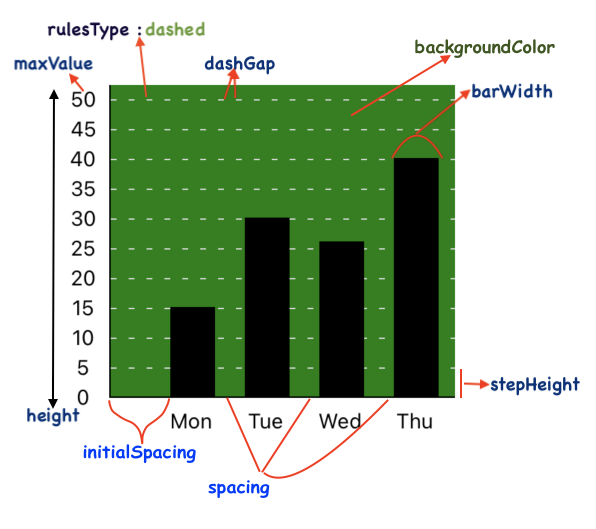

# Bar Chart Props



### Basic props

| Prop                         | Type                 | Description                                                                                                                                       | Default value       |
| ---------------------------- | -------------------- | ------------------------------------------------------------------------------------------------------------------------------------------------- | ------------------- |
| data                         | Array of barDataItem | An item object represents a bar in the bar chart. It is described in the next table.                                                              | \_                  |
| width                        | number               | Width of the Bar chart                                                                                                                            | width of the parent |
| height                       | number               | Height of the Bar chart (excluding the bottom label)                                                                                              | 200                 |
| onPress                      | Function             | Callback function called on press of a Bar (takes item and index as parameter)                                                                    | null                |
| onLongPress                  | Function             | Callback function called on long press of a Bar (takes item and index as parameter)                                                               | null                |
| onPressOut                   | Function             | Callback function called on press out of a Bar (takes item and index as parameter)                                                                | null                |
| focusBarOnPress              | boolean              | used to focus a bar on press by applying styles defined in focusedBarConfig                                                                       | false               |
| focusedBarConfig             | FocusedBarConfig     | styles for the focused bar including color, width, opacity, borderRadius etc                                                                      | \_                  |
| focusedBarIndex              | number               | index of the initially focused bar, works only when focusBarOnPress is true                                                                       | -1                  |
| maxValue                     | number               | Maximum value shown in the Y axis                                                                                                                 | 200                 |
| yAxisOffset                  | number               | Starting (minimum) value in the Y axis (value at the origin)                                                                                      | 0                   |
| mostNegativeValue            | number               | The most negative value shown in the Y axis (to be used only if the data set has negative values too)                                             | \_                  |
| noOfSections                 | number               | Number of sections in the Y axis                                                                                                                  | 10                  |
| noOfSectionsBelowXAxis       | number               | Number of sections in the Y axis below X axis (in case the data set has negative values too)                                                      | 0                   |
| stepValue                    | number               | Value of 1 step/section in the Y axis                                                                                                             | 20                  |
| stepHeight                   | number               | Height of 1 step/section in the Y axis                                                                                                            | 20                  |
| negativeStepValue            | number               | Value of 1 step/section in the Y axis for negative values (in the 4th quadrant)                                                                   | stepValue           |
| negativeStepHeight           | number               | Height of 1 step/section in the Y axis for negative values (in the 4th quadrant)                                                                  | stepHeight          |
| spacing                      | number               | Distance between 2 consecutive bars in the Bar chart                                                                                              | 20                  |
| backgroundColor              | ColorValue           | Background color of the Bar chart                                                                                                                 | \_                  |
| sectionColors                | ColorValue           | Background color of the horizontal sections of the chart                                                                                          | backgroundColor     |
| scrollref                    | any                  | ref object that can be used to control the horizontal ScrollView inside which the chart is rendered                                               | React.useRef()      |
| scrollToIndex                | number               | scroll to a particular index on chart load                                                                                                        | \_                  |
| disableScroll                | boolean              | To disable horizontal scroll                                                                                                                      | false               |
| showScrollIndicator          | boolean              | To show horizontal scroll indicator                                                                                                               | false               |
| indicatorColor               | String               | (iOS only) The color of the scroll indicators - ('black', 'white' or 'default')                                                                   | default             |
| nestedScrollEnabled          | boolean              | Useful when the chart is used inside a horizontal ScrollView (without this, the chart's scrolling is compromised)                                 | false               |
| showLine                     | boolean              | To show a Line chart over the Bar chart with the same data                                                                                        | false               |
| lineData                     | Array of items       | The data object for the line chart (use only when showLine is true). To hide any datapoint pass hideDataPoint prop as true in specific data item. | data                |
| lineConfig                   | lineConfigType       | Properties of the Line chart shown over the Bar chart (lineConfigType) is described below                                                         | defaultLineConfig   |
| lineData2                    | Array of items       | The data object for the second line chart (use only when showLine is true)                                                                        | \_                  |
| lineConfig2                  | lineConfigType       | Properties of the second Line chart shown over the Bar chart (lineConfigType) is described below                                                  | defaultLineConfig   |
| lineBehindBars               | boolean              | When set to true, the line chart will appear behind the Bars in case of overlap                                                                   | false               |
| autoShiftLabels              | boolean              | When set to true, automatically shifts the X axis labels for negative values                                                                      | false               |
| scrollToEnd                  | boolean              | When set to true, the chart automatically scrolls to the rightmost bar                                                                            | false               |
| scrollAnimation              | boolean              | When set to true, scroll animation is visible when the chart automatically scrolls to the rightmost bar                                           | true                |
| scrollEventThrottle          | number               | (only for iOS) see https://reactnative.dev/docs/scrollview#scrolleventthrottle-ios                                                                | 0                   |
| onScroll                     | Function             | callback function called when the chart is scrolled horizontally                                                                                  | \_                  |
| onMomentumScrollEnd          | Function             | callback function called when scroll is completed                                                                                                 | \_                  |
| initialSpacing               | number               | distance of the first bar from the Y axis                                                                                                         | 40                  |
| renderTooltip                | Function             | tooltip component appearing above the bar when it is pressed, takes item and index as parameters                                                  | null                |
| leftShiftForTooltip          | number               | The distance by which the tooltip component should shift towards left                                                                             | 0                   |
| leftShiftForLastIndexTooltip | number               | The distance by which the tooltip component of the last bar should shift towards left                                                             | 0                   |
| autoCenterTooltip            | boolean              | When set to true, automatically centers the tooltip                                                                                               | false               |
| adjustToWidth                | boolean              | When set to true, it auto-computes the barWidth and spacing to fit the chart in the available width / parentWidth                                 | false               |
| parentWidth                  | number               | The width of the parent View or the width that the chart should auto-fit into when `adjustToWidth` is true                                        | screenWidth         |

#### lineConfig

The `lineConfig` prop describes the properties of the line chart that is displayed when we set the `showLine` prop to true. The properties allowed by the lineConfig prop are-

```ts
type lineConfigType = {
  initialSpacing?: number;
  spacing?: number;
  curved?: boolean;
  curvature: number;
  curveType: CurveType; //CurveType is an enum defined below
  isAnimated?: boolean;
  delay?: number;
  thickness?: number;
  color?: ColorValue | String | any;
  hideDataPoints?: boolean;
  dataPointsShape?: String;
  dataPointsWidth?: number;
  dataPointsHeight?: number;
  dataPointsColor?: ColorValue | String | any;
  dataPointsRadius?: number;
  textColor?: ColorValue | String | any;
  textFontSize?: number;
  textShiftX?: number;
  textShiftY?: number;
  sfiftX?: number;
  shiftY?: number;
  startIndex?: number;
  endIndex?: number;
  showArrow?: boolean;
  arrowConfig?: arrowType;
  isSecondary?: boolean;
};
type arrowType = {
  length?: number;
  width?: number;
  strokeWidth?: number;
  strokeColor?: string;
  fillColor?: string;
  showArrowBase?: boolean;
};
```

CurveType -

```ts
enum CurveType {
  CUBIC,
  QUADRATIC,
}
```

The default value of the lineConfig object is -

```ts
defaultLineConfig = {
  initialSpacing: initialSpacing,
  curved: false,
  curvature: 0.2,
  curveType: CurveType.CUBIC,
  isAnimated: false,
  thickness: 1,
  color: 'black',
  hideDataPoints: false,
  dataPointsShape: 'circular',
  dataPointsWidth: 4,
  dataPointsHeight: 4,
  dataPointsColor: 'black',
  dataPointsRadius: 3,
  textColor: 'gray',
  textFontSize: 10,
  textShiftX: 0,
  textShiftY: 0,
  shiftY: 0,
  delay: 0,
  startIndex: 0,
  endIndex: lineData.length - 1,
  showArrow: false,
  arrowConfig: {
    length: 10,
    width: 10,
    strokeWidth: 1,
    strokeColor: 'black',
    fillColor: 'none',
    showArrowBase: true,
  },
  isSecondary: false,
};
```

#### FocusedBarConfig

```ts
type FocusedBarConfig = {
  color?: ColorValue; // default lightgreen
  sideColor?: ColorValue;
  topColor?: ColorValue;
  gradientColor?: ColorValue;
  width?: number;
  borderRadius?: number;
  roundedTop?: boolean;
  roundedBottom?: boolean;
  opacity?: number;
  barInnerComponent?: (item?: barDataItem, index?: number) => ReactNode;
};
```

---

**Alert!**\
These props are correlated:

1. maxValue
2. noOfSections
3. stepValue

They must follow the relation:

```ts
maxValue = noOfSections * stepValue;
```

So, all the three must be used together. Using any 1 or 2 of them may produce absurd results

---

### Combine Line Chart using `showLine`

You can add a line chart to your **`<BarChart/>`** component by passing the `showLine` prop.
The properties of this line chart can be controlled using the `lineConfig` prop which is an object. The `lineConfig` object is described below-

| Property         | Type       | Description                                                          | Default value                    |
| ---------------- | ---------- | -------------------------------------------------------------------- | -------------------------------- |
| initialSpacing   | number     | distance of the first data point from the Y axis                     | initialSpacing for the Bar Chart |
| curved           | boolean    | To show curved line joining the data points                          | false                            |
| isAnimated       | boolean    | To show animates Line Chart                                          | false                            |
| delay            | number     | Delay (in milliseconds) before starting the animation of the line    | 0                                |
| thickness        | number     | Thickness of the Line                                                | 1                                |
| color            | ColorValue | Color of the Line                                                    | 'black'                          |
| hideDataPoints   | boolean    | To hide data points along the Line chart                             | false                            |
| dataPointsShape  | String     | Shape of the data points (_'rectangular'_ or _'circular'_)           | 'circular'                       |
| dataPointsWidth  | number     | Width of data points (when data points' shape is rectangular)        | 4                                |
| dataPointsHeight | number     | Height of data points (when data points' shape is rectangular)       | 4                                |
| dataPointsColor  | ColorValue | Color of the data points                                             | 'black'                          |
| dataPointsRadius | number     | Radius of data points (when data points' shape is _circular_)        | 3                                |
| textColor        | ColorValue | Color of the dataPointText                                           | 'gray'                           |
| textFontSize     | number     | Font size of the dataPointText                                       | 10                               |
| textShiftX       | number     | To shift the dataPointText text horizontally                         | 0                                |
| textShiftY       | number     | To shift the dataPointText text vertically                           | 0                                |
| shiftY           | number     | To shift the Line chart up or down by the given quantity m           | 0                                |
| startIndex       | number     | Start index for data line (used to display data lines having breaks) | 0                                |
| endIndex         | number     | End index for data line (used to display data lines having breaks)   | lineData.length -1               |

---

### Item description (barDataItem)

| Key                        | Value type | Description                                                                           |
| -------------------------- | ---------- | ------------------------------------------------------------------------------------- |
| value                      | number     | Value of the item representing height of the bar                                      |
| barWidth                   | number     | Width of the bar                                                                      |
| onPress                    | function   | Function called on pressing the bar                                                   |
| onLongPress                | function   | Function called on long pressing the bar                                              |
| onPressOut                 | Function   | Callback function called on press out of a bar                                        |
| disablePress               | boolean    | Prop to disable the press action, defaults to false                                   |
| frontColor                 | ColorValue | Color of the bar                                                                      |
| sideColor                  | ColorValue | Color of the side view of the bar, only for 3 D                                       |
| sideWidth                  | number     | Width of the side view of the bar, only for 3 D                                       |
| topColor                   | ColorValue | Color of the top view of the bar, only for 3 D                                        |
| barStyle                   | object     | style object for the Bars                                                             |
| showGradient               | boolean    | Prop to enable linear gradient for the bar color, defaults to false                   |
| gradientColor              | ColorValue | Along with frontColor, this prop constitutes the 2 colors for gradient                |
| label                      | string     | Label text appearing below the bar (under the X axis)                                 |
| labelWidth                 | number     | Width of the Label text appearing below the bar (under the X axis)                    |
| labelTextStyle             | object     | Style object for the label text appearing below the bar                               |
| labelComponent             | Component  | Custom label component appearing below the bar                                        |
| secondaryLabel             | string     | Label text appearing above the secondary X-axis (at the top of the chart)             |
| secondaryLabelComponent    | Component  | Custom label component appearing above the secondary X-axis (at the top of the chart) |
| secondaryLabelTextStyle    | object     | Style object for the label text of secondary X-axis (at the top of the chart)         |
| labelsDistanceFromXaxis    | number     | Distance of the X Axis label from the X axis                                          |
| topLabelComponent          | Component  | Custom component appearing above the bar                                              |
| topLabelContainerStyle     | object     | Style object for the container of the custom component appearing above the bar        |
| cappedBars                 | boolean    | To show caps on the top of bar                                                        |
| capThickness               | number     | Thickness of the bar cap                                                              |
| capColor                   | ColorValue | Color of the bar cap                                                                  |
| capRadius                  | number     | Border radius of the bar cap                                                          |
| barBorderRadius            | number     | Border radius of the bar                                                              |
| barBorderTopLeftRadius     | number     | Top left border radius of the bar                                                     |
| barBorderTopRightRadius    | number     | Top right border radius of the bar                                                    |
| barBorderBottomLeftRadius  | number     | Bottom left border radius of the bar                                                  |
| barBorderBottomRightRadius | number     | Bottom right border radius of the bar                                                 |
| barMarginBottom            | number     | margin at the bottom of the bar (above X axis)                                        |
| spacing                    | number     | Distance of the next Bar from the currennt Bar                                        |
| barBackgroundPattern       | Component  | A svg component containing the background pattern for bars                            |
| patternId                  | String     | ID of the pattern component                                                           |
| leftShiftForTooltip        | number     | The distance by which the tooltip component should shift towards left                 |
| showXAxisIndex             | boolean    | show small graduation at the X axis for the corresponding bar                         |

---

### Axes and rules related props

| Prop                           | Type                      | Description                                                                                                    | Default value                |
| ------------------------------ | ------------------------- | -------------------------------------------------------------------------------------------------------------- | ---------------------------- |
| xAxisLength                    | number                    | X axis length                                                                                                  | width of the chart           |
| xAxisColor                     | ColorValue                | X axis color                                                                                                   | black                        |
| xAxisThickness                 | number                    | X axis thickness                                                                                               | 1                            |
| yAxisColor                     | ColorValue                | Y axis color                                                                                                   | black                        |
| yAxisThickness                 | number                    | Y axis thickness                                                                                               | 1                            |
| yAxisExtraHeight               | number                    | Extra length of Y axis at the top                                                                              | (height / 20)                |
| xAxisType                      | RuleType                  | solid or dotted/dashed                                                                                         | solid                        |
| yAxisLabelWidth                | number                    | Width of the Y axis Label container                                                                            | 35                           |
| yAxisTextStyle                 | object                    | Style object for the Y axis text style                                                                         | \_                           |
| yAxisTextNumberOfLines         | number                    | Number of lines for y axis label text                                                                          | 1                            |
| yAxisLabelContainerStyle       | object                    | Style object for the Y axis label container                                                                    | \_                           |
| trimYAxisAtTop                 | boolean                   | Removes the extra length of the Y axis from the top                                                            | false                        |
| horizontalRulesStyle           | object                    | Style object for the horizontal rules container                                                                | \_                           |
| showFractionalValues           | boolean                   | Allow fractional values for the Y axis label                                                                   | false                        |
| roundToDigits                  | number                    | Rounds the y axis values to given number of digits after decimal point                                         | 1                            |
| yAxisLabelPrefix               | String                    | The String prepended to the y axis label text (for example- '$')                                               | ''                           |
| yAxisLabelSuffix               | String                    | The String appended to the y axis label text                                                                   | ''                           |
| hideYAxisText                  | boolean                   | To hide Y axis label text                                                                                      | false                        |
| formatYLabel                   | (label: string) => string | a callback function that takes the label generated by the library and modifies it.                             | \_                           |
| yAxisSide                      | String                    | Tells which side of the chart, should the y axis be present, defaults to 'left'                                | 'left'                       |
| rulesLength                    | number                    | Length of the horizontal rules                                                                                 | width of the chart           |
| rulesColor                     | ColorValue                | Color of the horizontal rules                                                                                  | lightgray                    |
| rulesThickness                 | number                    | Thickness of the horizontal rules                                                                              | 1                            |
| hideRules                      | boolean                   | To hide the horizontal rules                                                                                   | false                        |
| rulesType                      | RuleType                  | solid or dotted/dashed                                                                                         | solid                        |
| dashWidth                      | number                    | width of each dash                                                                                             | 4                            |
| dashGap                        | number                    | gap between 2 dashes                                                                                           | 8                            |
| rulesConfigArray               | Array<RulesConfig>        | Array of rulesConfig objects, used to customise the properties (like color, type etc) of specific rules        | \_                           |
| showReferenceLine1             | boolean                   | show reference line                                                                                            | false                        |
| referenceLine1Config           | referenceConfigType       | properties of reference line like thickness, color etc (described below the table)                             | \_                           |
| referenceLine1Position         | number                    | position of reference line                                                                                     | containerHeight / 2          |
| showReferenceLine2             | boolean                   | show second reference line                                                                                     | false                        |
| referenceLine2Config           | referenceConfigType       | properties of reference line like thickness, color etc (described below the table)                             | \_                           |
| referenceLine2Position         | number                    | position of second reference line                                                                              | 3\*containerHeight / 2       |
| showReferenceLine3             | boolean                   | show third reference line                                                                                      | false                        |
| referenceLine3Config           | referenceConfigType       | properties of reference line like thickness, color etc (described below the table)                             | \_                           |
| referenceLine3Position         | number                    | position of third reference line                                                                               | containerHeight / 3          |
| referenceLinesOverChartContent | boolean                   | used to render the reference lines over the rest of the chart content.                                         | true                         |
| showVerticalLines              | boolean                   | To show vertical lines                                                                                         | false                        |
| verticalLinesColor             | ColorValue                | Color of the vertical lines                                                                                    | lightgray                    |
| verticallinesThickness         | number                    | Thickness of the vertical lines                                                                                | 1                            |
| verticalLinesHeight            | number                    | Height of the vertical lines                                                                                   | chart height                 |
| verticalLinesStrokeDashArray   | Array<number>             | Array of 2 numbers denoting the dashWidth and dashGap of the lines. Used to render dashed/dotted vertical line | ''                           |
| verticalLinesShift             | number                    | vertical lines are aligned with bars. Shift them left or right using +ve or -ve value of verticalLinesShift    | 0                            |
| verticalLinesZIndex            | number                    | Z index of the vertical lines                                                                                  | -1                           |
| noOfVerticalLines              | number                    | Number of vertical lines displayed                                                                             | data.length                  |
| verticalLinesSpacing           | number                    | Distance between consecutive vertical lines                                                                    | spacing                      |
| showXAxisIndices               | boolean                   | To show the pointers on the X axis                                                                             | false                        |
| xAxisIndicesHeight             | number                    | Height of the pointers on the X axis                                                                           | 2                            |
| xAxisIndicesWidth              | number                    | Width of the pointers on the X axis                                                                            | 4                            |
| xAxisIndicesColor              | ColorValue                | Color of the pointers on the X axis                                                                            | black                        |
| showYAxisIndices               | boolean                   | To show the pointers on the Y axis                                                                             | false                        |
| yAxisIndicesHeight             | number                    | Height of the pointers on the Y axis                                                                           | 2                            |
| yAxisIndicesWidth              | number                    | Width of the pointers on the Y axis                                                                            | 4                            |
| yAxisIndicesColor              | ColorValue                | Color of the pointers on the X axis                                                                            | black                        |
| yAxisLabelTexts                | Array<string>             | Array of label texts to be displayed along y axis                                                              | null                         |
| xAxisLabelTexts                | Array<string>             | Array of label texts to be displayed below x axis                                                              | null                         |
| xAxisLabelTextStyle            | object                    | Style of label texts to be displayed below x axis                                                              | null                         |
| rotateLabel                    | boolean                   | To rotate the X axis labels (by 60deg)                                                                         | false                        |
| hideAxesAndRules               | boolean                   | To hide axes, rules, labels altogether                                                                         | false                        |
| hideOrigin                     | boolean                   | To hide the y Axis label at origin (i.e. 0)                                                                    | false                        |
| labelWidth                     | number                    | Width of the Label text appearing below the bar (under the X axis)                                             | barWidth                     |
| labelsDistanceFromXaxis        | number                    | Distance of the X Axis label from the X axis                                                                   | 0                            |
| xAxisTextNumberOfLines         | number                    | Number of lines for x axis label text                                                                          | 1                            |
| xAxisLabelsHeight              | number                    | Height of X axis labels container                                                                              | xAxisTextNumberOfLines \* 18 |
| xAxisLabelsVerticalShift       | number                    | prop to adjust the vertical position of X axis labels (move X axis labels up or down)                          | 0                            |
| labelsExtraHeight              | number                    | used to display large rotated labels on X-axis (use this only when using the **rotateLabel** prop)             | 0                            |
| secondaryYAxis                 | secondaryYAxisType        | displays and controls the properties of the secondary Y axis on the right side                                 | null                         |
| secondaryData                  | Array of items            | the secondary data that will be rendered along the secondary Y axis                                            | undefined                    |
| secondaryXAxis                 | XAxisConfig               | properties of the secondary X-axis (appearing at the top of the chart)                                         | values of the primary X-axis |

**Note** If you are setting yAxisSide to 'right', make sure to specify the width of the chart, using the `width` prop.

```ts
type RuleType = 'solid' | 'dashed' | 'dotted';
```

```ts
type RulesConfig = {
  rulesLength?: number;
  rulesColor?: ColorValue;
  rulesThickness?: number;
  rulesType?: RuleType;
  dashWidth?: number;
  dashGap?: number;
};
```

ReferenceConfigType has following properties-

```ts
type referenceConfigType = {
  thickness: number;
  width: number;
  color: ColorValue | String | any;
  type: ruleTypes;
  dashWidth: number;
  dashGap: number;
  labelText: String;
  labelTextStyle: object;
  zIndex: number;
  stripBehindBars: boolean;
};
```

XAxisConfig has following properties-
```ts
type XAxisConfig {
  thickness?: number
  color?: ColorValue
  labelsDistanceFromXaxis?: number
  labelsHeight?: number
  labelsTextStyle?: any
  labelTexts?: string[]
}
```

---

## secondaryYAxis

Use this prop to render a secondary Y axis on the right side of the chart. **secondaryYAxis** is an object of type of **secondaryYAxisType** You can control the properties of secodary Y axis by passing an object of properties. Following is the type definition of the secondaryYAxisType object

```ts
type secondaryYAxisType = {
  noOfSections?: number,
  maxValue?: number,
  mostNegativeValue?: nuepValue?: number,
  stepHeight?: number,
  showFractionalValues?: boolean,
  roundToDigits?: number,

  showYAxisIndices?: boolean,
  yAxisIndicesHeight?: number,
  yAxisIndicesWidth?: number,
  yAxisIndicesColor?: ColorValue,

  yAxisSide?: yAxisSides,
  yAxisOffset?: number,
  yAxisThickness?: number,
  yAxisColor?: ColorValue,
  yAxisLabelContainerStyle?: any,
  yAxisLabelTexts: Array<string> | undefined,
  yAxisTextStyle?: any,
  yAxisTextNumberOfLines?: number,
  yAxisLabelWidth?: number,
  hideYAxisText?: boolean,
  yAxisLabelPrefix?: string,
  yAxisLabelSuffix?: string,
  hideOrigin?: boolean,
  formatYLabel?: (label: string) => string;
};
```

All the properties are optional. If you don't set a property in the **secondaryYAxis**, it takes the default values from the primary Y axis.

### Bar related props

| Prop                       | Type       | Description                                                                | Default value                    |
| -------------------------- | ---------- | -------------------------------------------------------------------------- | -------------------------------- |
| barWidth                   | number     | Width of the bar                                                           | 30                               |
| barStyle                   | object     | style object for the Bars                                                  | \_                               |
| isThreeD                   | boolean    | Prop to render 3 dimensional bars                                          | false                            |
| frontColor                 | ColorValue | Color of the bar                                                           | 'black' for 2D, '#C0CA3A' for 3D |
| sideColor                  | ColorValue | Color of the side view of the bar, only for 3 D                            | '#887A24'                        |
| topColor                   | ColorValue | Color of the top view of the bar, only for 3 D                             | '#D9E676'                        |
| sideWidth                  | number     | Width of the side view of the bar, only for 3 D                            | barWidth / 2                     |
| showGradient               | boolean    | Prop to enable linear gradient for the bar color                           | false                            |
| gradientColor              | ColorValue | Along with frontColor, gradientColor constitutes the 2 colors for gradient | white                            |
| roundedTop                 | boolean    | To show rounded top                                                        | white                            |
| roundedBottom              | boolean    | To show rounded bottom                                                     | white                            |
| activeOpacity              | number     | activeOpacity on pressing the bar                                          | 0.2                              |
| disablePress               | boolean    | Prop to disable the bar press action                                       | false                            |
| barBorderWidth             | number     | Border width of the bar                                                    | 0                                |
| barBorderColor             | ColorValue | Border color of the bar                                                    | 'gray'                           |
| barBorderRadius            | number     | Border radius of the bar                                                   | 0                                |
| barBorderTopLeftRadius     | number     | Top left border radius of the bar                                          | barBorderRadius \| 0             |
| barBorderTopRightRadius    | number     | Top right border radius of the bar                                         | barBorderRadius \| 0             |
| barBorderBottomLeftRadius  | number     | Bottom left border radius of the bar                                       | barBorderRadius \| 0             |
| barBorderBottomRightRadius | number     | Bottom right border radius of the bar                                      | barBorderRadius \| 0             |
| barMarginBottom            | number     | margin at the bottom of the bar (above X axis)                             | 0                                |
| barBackgroundPattern       | Component  | A svg component containing the background pattern for bars                 | \_                               |
| patternId                  | String     | ID of the pattern component                                                | \_                               |
| minHeight                  | number     | Minimum height of the Bars                                                 | 0                                |

---

### Animation related props

| Prop              | Type    | Description                                                            | Default value |
| ----------------- | ------- | ---------------------------------------------------------------------- | ------------- |
| isAnimated        | boolean | To show animates BarChart. Animation occurs onLoad and on value change | false         |
| animationDuration | number  | Duration of the animations                                             | 800           |
| animationEasing   | Easing  | Easing applied to the animation                                        | Easing.ease   |

**Alert!**\
While rendering an Animated Bar chart, y axis labels may not appear sometimes. This can be fixed using a key prop as shown -

```ts
<BarChart key={'xyz'} data={data} isAnimated />
```

---

### Pagination related props

| Prop             | Type     | Description                                                         | Default value |
| ---------------- | -------- | ------------------------------------------------------------------- | ------------- |
| onEndReached     | Function | Callback function called when the chart is scrolled upto end        | \_            |
| onStartReached   | Function | Callback function called when the chart is scrolled upto start      | \_            |
| endReachedOffset | number   | distance before end of scroll when onEndReached should be triggered | 80            |

---

### Bar related props for making Capped Bar chart

| Prop         | Type       | Description                     | Default value |
| ------------ | ---------- | ------------------------------- | ------------- |
| cappedBars   | boolean    | To show caps on the top of bars | false         |
| capThickness | number     | Thickness of the bar caps       | 6             |
| capColor     | ColorValue | Color of the bar caps           | gray          |
| capRadius    | number     | Border radius of the bar caps   | 0             |

---

## pointerConfig

pointerConfig is an object, when passed as a prop, creates a magical effect. It lets the user scroll over chart to move the pointer along the chart.
To know more about pointerConfig, see pointerConfig in the [Line chart props page](https://github.com/Abhinandan-Kushwaha/react-native-gifted-charts/blob/master/docs/LineChart/LineChartProps.md)

---

### Props for horizontal BarChart

| Prop             | Type    | Description                                                                                   | Default value |
| ---------------- | ------- | --------------------------------------------------------------------------------------------- | ------------- |
| horizontal       | boolean | Render horizontal BarChart                                                                    | false         |
| rtl              | boolean | Render the chart from right to left                                                           | false         |
| shiftX           | number  | Shift the chart towards left or right by given value (only in horizontal charts)              | 0             |
| shiftY           | number  | Shift the chart upwards or downwards by given value (only in horizontal charts)               | 0             |
| rotateYAxisTexts | number  | angle by which the Y axis label texts should rotate in horizontal charts                      | -90           |
| yAxisAtTop       | boolean | In horizontal BarCharts the Y axis appears at bottom by default. Set it to true for otherwise | false         |
| intactTopLabel   | boolean | To rotate the top label component to make it intact with the Bars                             | false         |

## Props for Stacked Bar Charts

#### To render stacked charts, you need to pass the prop stackData instead of data.

The structure of stackData is-

```ts
[
    {
      stacks:
        [
            {
                value: 10, color: 'red', onPres: someFunction
            },
            {
                value: 20, color: 'blue', marginBottom: 1, onPres: someFunction
            },
            ...
        ],
      label: 'Jan',
      ...otherProps,
    },
    {
      stacks:
        [
            {
                value: 8, color: 'red', onPres: someFunction
            },
            {
                value: 17, color: 'blue', marginBottom: 1, onPres: someFunction
            },
            ...
        ],
      label: 'Feb',
      ...otherProps,
    },
    ...
]
```

The stackData passed to the BarChart component is an array of objects.\
Each object contains a mandatory key named stacks.\
The value corresponding to the stacks key is an array of objects, each object representing a section of the stack.

| Prop                             | Type                  | Description                                                                                                               | Default value        |
| -------------------------------- | --------------------- | ------------------------------------------------------------------------------------------------------------------------- | -------------------- |
| stackData                        | Array of stack arrays | A stack array represents a stack of bars in the bar chart. It is described in the next table                              | false                |
| barBorderRadius                  | number                | Border radius of each bar of the stack                                                                                    | 0                    |
| barBorderTopLeftRadius           | number                | Top left border radius of each bar of the stack                                                                           | barBorderRadius \| 0 |
| barBorderTopRightRadius          | number                | Top right border radius of each bar of the stack                                                                          | barBorderRadius \| 0 |
| barBorderBottomLeftRadius        | number                | Bottom left border radius of each bar of the stack                                                                        | barBorderRadius \| 0 |
| barBorderBottomRightRadius       | number                | Bottom right border radius of each bar of the stack                                                                       | barBorderRadius \| 0 |
| stackBorderRadius                | number                | Border radius of the top and bottom bars of the stack                                                                     |
| stackBorderTopLeftRadius         | number                | Top left border radius of the top bar of the stack                                                                        |
| stackBorderTopRightRadius        | number                | Top right border radius of the top bar of the stack                                                                       |
| stackBorderBottomLeftRadius      | number                | Bottom left border radius of the bottom bar of the stack                                                                  |
| stackBorderBottomRightRadius     | number                | Bottom right border radius of the bottom bar of the stack                                                                 |
| autoShiftLabelsForNegativeStacks | boolean               | Whether the x axis labels should auto shift to a position below the bar, if the bar is under x-axis due to negative value |

**Note** The `frontColor` prop is replaced by `color` prop in Stacked Bar charts.

### Stack Array description

| Key                     | Value type                                                | Description                                                                  |
| ----------------------- | --------------------------------------------------------- | ---------------------------------------------------------------------------- |
| stacks array            | Array of stack items                                      | A stack is made of 1 or more objects of the type described in the next table |
| label                   | string                                                    | Label text appearing below the stack (under the X axis)                      |
| labelTextStyle          | Style object for the label text appearing below the stack |
| barWidth                | number                                                    |
| spacing                 | number                                                    |
| borderRadius            | number                                                    |
| borderTopLeftRadius     | number                                                    |
| borderTopRightRadius    | number                                                    |
| borderBottomLeftRadius  | number                                                    |
| borderBottomRightRadius | number                                                    |

A single stack item can be depicted as-


### Stack item description

| Key                     | Value type | Description                                                            |
| ----------------------- | ---------- | ---------------------------------------------------------------------- |
| value                   | number     | Value of the item representing height of the stack item                |
| color                   | ColorValue | Color of the stack item                                                |
| onPress                 | function   | Function called on pressing the stack item                             |
| onLongPress             | function   | Function called on long pressing the stack item                        |
| onPressOut              | Function   | Callback function called on press out of a bar                         |
| marginBottom            | number     | margin below a particular stack section                                |
| barBorderRadius         | number     | Border radius of a stack section                                       |
| borderTopLeftRadius     | number     | borderTopLeftRadius for a stack section                                |
| borderTopRightRadius    | number     | borderTopRightRadius for a stack section                               |
| borderBottomLeftRadius  | number     | borderBottomLeftRadius for a stack section                             |
| borderBottomRightRadius | number     | borderBottomRightRadius for a stack section                            |
| showGradient            | boolean    | Prop to enable linear gradient for the bar color, defaults to false    |
| gradientColor           | ColorValue | Along with frontColor, this prop constitutes the 2 colors for gradient |
| barWidth                | number     | Width of the bar                                                       |
| showXAxisIndex          | boolean    | show small graduation at the X axis for the corresponding stack        |

```

```
