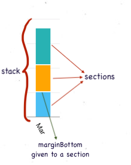

# Bar Chart Props

### Basic props

| Prop                | Type           | Description                                                                          | Default value       |
| ------------------- | -------------- | ------------------------------------------------------------------------------------ | ------------------- |
| data                | Array of items | An item object represents a bar in the bar chart. It is described in the next table. | \_                  |
| width               | number         | Width of the Bar chart                                                               | width of the parent |
| height              | number         | Height of the Bar chart (excluding the bottom label)                                 | 200                 |
| maxValue            | number         | Maximum value shown in the Y axis                                                    | 200                 |
| noOfSections        | number         | Number of sections in the Y axis                                                     | 10                  |
| stepValue           | number         | Value of 1 step/section in the Y axis                                                | 20                  |
| stepHeight          | number         | Height of 1 step/section in the Y axis                                               | 20                  |
| spacing             | number         | Distance between 2 consecutive bars in the Bar chart                                 | 20                  |
| backgroundColor     | ColorValue     | Background color of the Bar chart                                                    | \_                  |
| disableScroll       | Boolean        | To disable horizontal scroll                                                         | false               |
| showScrollIndicator | Boolean        | To show horizontal scroll indicator                                                  | false               |

---

**Alert!**\
These props are correlated:

1. maxValue
2. noOfSections
3. stepValue

They must follow the relation:

```js
maxValue = noOfSections * stepValue;
```

So, all the three must be used together. Using any 1 or 2 of them may produce absurd results

---

### Item description

| Key                    | Value type | Description                                                                    |
| ---------------------- | ---------- | ------------------------------------------------------------------------------ |
| value                  | number     | Value of the item representing height of the bar                               |
| barWidth               | number     | Width of the bar                                                               |
| onPress                | function   | Function called on pressing the bar                                            |
| disablePress           | Boolean    | Prop to disable the press action, defaults to false                            |
| frontColor             | ColorValue | Color of the bar                                                               |
| sideColor              | ColorValue | Color of the side view of the bar, only for 3 D                                |
| sideWidth              | number     | Width of the side view of the bar, only for 3 D                                |
| topColor               | ColorValue | Color of the top view of the bar, only for 3 D                                 |
| showGradient           | Boolean    | Prop to enable linear gradient for the bar color, defaults to false            |
| gradientColor          | ColorValue | Along with frontColor, this prop constitutes the 2 colors for gradient         |
| initialSpacing         | number     | distance of the first bar from the Y axis                                      |
| label                  | string     | Label text appearing below the bar (under the X axis)                          |
| labelWidth             | number     | Width of the Label text appearing below the bar (under the X axis)             |
| labelTextStyle         | object     | Style object for the label text appearing below the bar                        |
| labelComponent         | Component  | Custom label component appearing below the bar                                 |
| topLabelComponent      | Component  | Custom component appearing above the bar                                       |
| topLabelContainerStyle | object     | Style object for the container of the custom component appearing above the bar |
| yAxisLabelText         | string     | Y axis label text                                                              |
| cappedBars             | Boolean    | To show caps on the top of bar                                                 |
| capThickness           | number     | Thickness of the bar cap                                                       |
| capColor               | ColorValue | Color of the bar cap                                                           |
| capRadius              | number     | Border radius of the bar cap                                                   |
| barBorderRadius        | number     | Border radius of the bar                                                       |
| spacing                | number     | Distance of the next Bar from the currennt Bar                                 |

---

### Axes and rules related props

| Prop                   | Type       | Description                                                            | Default value |
| ---------------------- | ---------- | ---------------------------------------------------------------------- | ------------- |
| xAxisColor             | ColorValue | X axis color                                                           | black         |
| xAxisThickness         | number     | X axis thickness                                                       | 1             |
| yAxisColor             | ColorValue | Y axis color                                                           | black         |
| yAxisThickness         | number     | Y axis thickness                                                       | 1             |
| yAxisLabelWidth        | number     | Width of the Y axis Label container                                    | 35            |
| yAxisTextStyle         | object     | Style object for the Y axis text style                                 | \_            |
| showFractionalValues   | Boolean    | Allow fractional values for the Y axis label                           | false         |
| roundToDigits          | number     | Rounds the y axis values to given number of digits after decimal point | 1             |
| hideYAxisText          | Boolean    | To hide Y axis label text                                              | false         |
| rulesColor             | ColorValue | Color of the horizontal rules                                          | lightgray     |
| rulesThickness         | number     | Thickness of the horizontal rules                                      | 1             |
| hideRules              | Boolean    | To hide the horizontal rules                                           | false         |
| showVerticalLines      | Boolean    | To show vertical lines                                                 | false         |
| verticalLinesColor     | ColorValue | Color of the vertical lines                                            | lightgray     |
| verticallinesThickness | number     | Thickness of the vertical lines                                        | 1             |
| verticalLinesZIndex    | number     | Z index of the vertical lines                                          | -1            |
| showXAxisIndices       | Boolean    | To show the pointers on the X axis                                     | false         |
| xAxisIndicesHeight     | number     | Height of the pointers on the X axis                                   | 2             |
| xAxisIndicesWidth      | number     | Width of the pointers on the X axis                                    | 4             |
| xAxisIndicesColor      | ColorValue | Color of the pointers on the X axis                                    | black         |
| showYAxisIndices       | Boolean    | To show the pointers on the Y axis                                     | false         |
| yAxisIndicesHeight     | number     | Height of the pointers on the Y axis                                   | 2             |
| yAxisIndicesWidth      | number     | Width of the pointers on the Y axis                                    | 4             |
| yAxisIndicesColor      | ColorValue | Color of the pointers on the X axis                                    | black         |
| yAxisIndicesColor      | Boolean    | To hide axes, rules, labels altogether                                 | false         |
| rotateLabel            | Boolean    | To rotate the X axis labels (by 60deg)                                 | false         |
| hideOrigin             | Boolean    | To hide the y Axis label at origin (i.e. 0)                            | false         |
| labelWidth             | number     | Width of the Label text appearing below the bar (under the X axis)     | barWidth      |

---

### Bar related props

| Prop            | Type       | Description                                                                | Default value            |
| --------------- | ---------- | -------------------------------------------------------------------------- | ------------------------ |
| barWidth        | number     | Width of the bar                                                           | 30                       |
| isThreeD        | Boolean    | Prop to render 3 dimensional bars                                          | false                    |
| frontColor      | ColorValue | Color of the bar                                                           | black for 2D, red for 3D |
| sideColor       | ColorValue | Color of the side view of the bar, only for 3 D                            | red                      |
| sideWidth       | number     | Width of the side view of the bar, only for 3 D                            | red                      |
| topColor        | ColorValue | Color of the top view of the bar, only for 3 D                             | red                      |
| showGradient    | Boolean    | Prop to enable linear gradient for the bar color                           | false                    |
| gradientColor   | ColorValue | Along with frontColor, gradientColor constitutes the 2 colors for gradient | white                    |
| roundedTop      | Boolean    | To show rounded top                                                        | white                    |
| roundedBottom   | Boolean    | To show rounded bottom                                                     | white                    |
| activeOpacity   | number     | activeOpacity on pressing the bar                                          | 0.2                      |
| disablePress    | Boolean    | Prop to disable the bar press action                                       | false                    |
| barBorderRadius | number     | Border radius of the bar                                                   | 0                        |

---

### Animation related props

| Prop              | Type    | Description                                                           | Default value |
| ----------------- | ------- | --------------------------------------------------------------------- | ------------- |
| isAnimated        | Boolean | To show animates BarChart. Animation occurs onLoad and on valu change | false         |
| animationDuration | number  | Duration of the animations                                            | 800           |
| animationEasing   | Easing  | Easing applied to the animation                                       | Easing.ease   |

---

### Bar related props for making Capped Bar chart

| Prop         | Type       | Description                     | Default value |
| ------------ | ---------- | ------------------------------- | ------------- |
| cappedBars   | Boolean    | To show caps on the top of bars | false         |
| capThickness | number     | Thickness of the bar caps       | 6             |
| capColor     | ColorValue | Color of the bar caps           | gray          |
| capRadius    | number     | Border radius of the bar caps   | 0             |

---

### Props for horizontal BarChart

| Prop           | Type    | Description                                                                                   | Default value |
| -------------- | ------- | --------------------------------------------------------------------------------------------- | ------------- |
| horizontal     | Boolean | Render horizontal BarChart                                                                    | false         |
| yAxisAtTop     | Boolean | In horizontal BarCharts the Y axis appears at bottom by default. Set it to true for otherwise | false         |
| intactTopLabel | Boolean | To rotate the top label component to make it intact with the Bars                             | false         |

## Props for Stacked Bar Charts

#### To render stacked charts, you need to pass the prop stackData instead of data.

The structure of stackData is-

```js
[
    {
      stacks:
        [
            {
                value: 10, color: 'red', onPres: someFunction
            },
            {
                value: 20, color: 'blue', marginBottom: 1, onPres: someFunction
            },
            ...
        ],
      label: 'Jan',
      ...otherProps,
    },
    {
      stacks:
        [
            {
                value: 8, color: 'red', onPres: someFunction
            },
            {
                value: 17, color: 'blue', marginBottom: 1, onPres: someFunction
            },
            ...
        ],
      label: 'Feb',
      ...otherProps,
    },
    ...
]
```

The stackData passed to the BarChart component is an array of objects.\
Each object contains a mandatory key named stacks.\
The value corresponding to the stacks key is an array of objects, each object representing a section of the stack.

| Prop      | Type                  | Description                                                                                  | Default value |
| --------- | --------------------- | -------------------------------------------------------------------------------------------- | ------------- |
| stackData | Array of stack arrays | A stack array represents a stack of bars in the bar chart. It is described in the next table | false         |

### Stack Array description

| Key            | Value type                                                | Description                                                                  |
| -------------- | --------------------------------------------------------- | ---------------------------------------------------------------------------- |
| stacks array   | Array of stack items                                      | A stack is made of 1 or more objects of the type described in the next table |
| label          | string                                                    | Label text appearing below the stack (under the X axis)                      |
| labelTextStyle | Style object for the label text appearing below the stack |

A single stack item can be depicted as-



### Stack item description

| Key                     | Value type | Description                                             |
| ----------------------- | ---------- | ------------------------------------------------------- |
| value                   | number     | Value of the item representing height of the stack item |
| color                   | ColorValue | Color of the stack item                                 |
| onPress                 | function   | Function called on pressing the stack item              |
| marginBottom            | number     | margin below a particular stack section                 |
| barBorderRadius         | number     | Border radius of a stack section                        |
| borderTopLeftRadius     | number     | borderTopLeftRadius for a stack section                 |
| borderTopRightRadius    | number     | borderTopRightRadius for a stack section                |
| borderBottomLeftRadius  | number     | borderBottomLeftRadius for a stack section              |
| borderBottomRightRadius | number     | borderBottomRightRadius for a stack section             |

```

```
