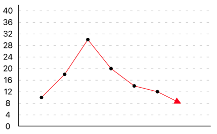
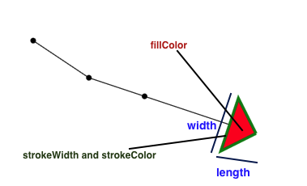
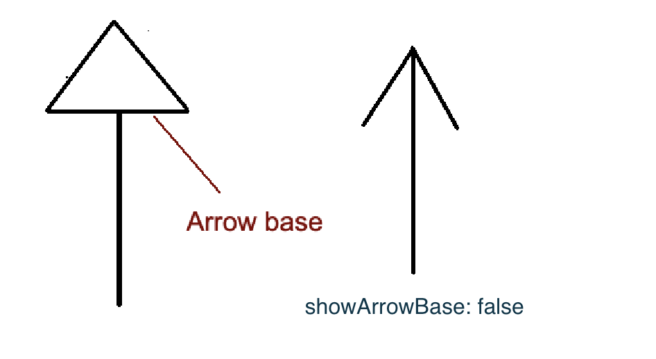
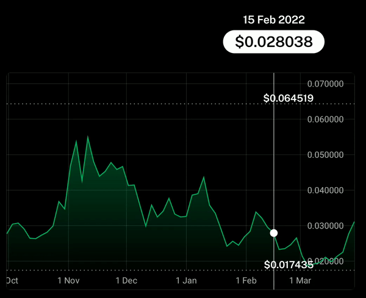
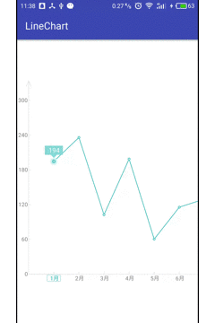

# Line Chart props

### Basic props

| Prop                               | Type                      | Description                                                                                                                                          | Default value                 |
| ---------------------------------- | ------------------------- | ---------------------------------------------------------------------------------------------------------------------------------------------------- | ----------------------------- |
| data                               | Array <lineDataItem>      | An item object represents a point in the line chart. It is described in the next table.                                                              | \_                            |
| data2                              | Array <lineDataItem>      | Second set of dataPoint for the second line                                                                                                          | \_                            |
| data3                              | Array <lineDataItem>      | Third set of dataPoint for the third line                                                                                                            | \_                            |
| data4                              | Array <lineDataItem>      | Fourth set of dataPoint for the fourth line                                                                                                          | \_                            |
| data5                              | Array <lineDataItem>      | Fifth set of dataPoint for the third line                                                                                                            | \_                            |
| dataSet                            | Array<DataSet>            | Array of data sets (used instead of using `data2`, `data3`, `data4` etc)                                                                             | \_                            |
| width                              | number                    | Width of the Bar chart                                                                                                                               | width of the parent           |
| height                             | number                    | Height of the Bar chart (excluding the bottom label)                                                                                                 | 200                           |
| overflowTop                        | number                    | Extra space at the top of the chart to make room for dataPointText                                                                                   | 0                             |
| overflowBottom                     | number                    | Extra space at the bottom of the chart to make room for dataPoints or dataPointText                                                                  | dataPointRadius               |
| maxValue                           | number                    | Maximum value shown in the Y axis                                                                                                                    | 200                           |
| mostNegativeValue                  | number                    | The most negative value shown in the Y axis (to be used only if the data set has negative values too)                                                | \_                            |
| noOfSections                       | number                    | Number of sections in the Y axis                                                                                                                     | 10                            |
| noOfSectionsBelowXAxis             | number                    | Number of sections in the Y axis below X axis (in case the data set has negative values too)                                                         | 0                             |
| stepValue                          | number                    | Value of 1 step/section in the Y axis                                                                                                                | 20                            |
| stepHeight                         | number                    | Height of 1 step/section in the Y axis                                                                                                               | 20                            |
| negativeStepValue                  | number                    | Value of 1 step/section in the Y axis for negative values (in the 4th quadrant)                                                                      | stepValue                     |
| negativeStepHeight                 | number                    | Height of 1 step/section in the Y axis for negative values (in the 4th quadrant)                                                                     | stepHeight                    |
| spacing                            | number                    | Distance between 2 consecutive points in the Line chart                                                                                              | 50                            |
| adjustToWidth                      | boolean                   | When set to true, it auto computes the spacing value to fit the Line chart in the available width                                                    | false                         |
| backgroundColor                    | ColorValue                | Background color of the Bar chart                                                                                                                    | \_                            |
| sectionColors                      | ColorValue                | Background color of the horizontal sections of the chart                                                                                             | backgroundColor               |
| customBackground                   | CustomBackground          | An object used to set a custom background component (See the properties of this object below)                                                        | \_                            |
| scrollref                          | any                       | ref object that can be used to control the horizontal ScrollView inside which the chart is rendered                                                  | React.useRef()                |
| scrollToIndex                      | number                    | scroll to a particular index on chart load                                                                                                           | \_                            |
| disableScroll                      | boolean                   | To disable horizontal scroll                                                                                                                         | false                         |
| showScrollIndicator                | boolean                   | To show horizontal scroll indicator                                                                                                                  | false                         |
| indicatorColor                     | String                    | (iOS only) The color of the scroll indicators - ('black', 'white' or 'default')                                                                      | default                       |
| nestedScrollEnabled                | boolean                   | Useful when the chart is used inside a horizontal ScrollView (without this, the chart's scrolling is compromised)                                    | false                         |
| isAnimated                         | boolean                   | To show animated Line or Area Chart. Animation occurs when the chart load for the first time                                                         | false                         |
| animateOnDataChange                | boolean                   | To show animation on change in data. A smooth transition takes place between the old and new line                                                    | false                         |
| onDataChangeAnimationDuration      | number                    | Duration (milliseconds) in which the transition animation takes place on a change in data                                                            | 400                           |
| renderDataPointsAfterAnimationEnds | boolean                   | to render the data points after the animation has ended. use if `onPress` or focusedDataPoint is used in multi-line animated charts (see note below) | false                         |
| onPress                            | Function                  | The callback function that handles the press event. `item` and `index` are received as props                                                         | \_                            |
| scrollToEnd                        | boolean                   | When set to true, the chart automatically scrolls to the rightmost data point                                                                        | false                         |
| scrollAnimation                    | boolean                   | When set to true, scroll animation is visible when the chart automatically scrolls to the rightmost data point                                       | true                          |
| scrollEventThrottle                | number                    | (only for iOS) see https://reactnative.dev/docs/scrollview#scrolleventthrottle-ios                                                                   | 0                             |
| onScroll                           | Function                  | callback function called when the chart is scrolled horizontally                                                                                     | \_                            |
| onScrollEndDrag                    | (event,direction) => void | callback function called when the chart is has finished scrolling. See Note below.                                                                   | \_                            |
| onMomentumScrollEnd                | Function                  | callback function called when scroll is completed                                                                                                    | \_                            |
| bounces                            | boolean                   | controls the bouncing effect of the Scrolling chart on iOS. See https://reactnative.dev/docs/scrollview#bounces-ios                                  |                               |
| overScrollMode                     | boolean                   | controls the bouncing effect of the Scrolling chart on Android. See https://reactnative.dev/docs/scrollview#overscrollmode-android                   |                               |
| initialSpacing                     | number                    | distance of the first data point from the Y axis                                                                                                     | 20                            |
| endSpacing                         | number                    | distance/padding left at the end of the line chart                                                                                                   | adjustWidth ? 0 : 20          |
| stepChart                          | boolean                   | If set true, renders a step chart                                                                                                                    | false                         |
| stepChart1                         | boolean                   | If set true, renders a step chart for 1st data set                                                                                                   | stepChart                     |
| stepChart2                         | boolean                   | If set true, renders a step chart for 2nd data set                                                                                                   | stepChart                     |
| stepChart3                         | boolean                   | If set true, renders a step chart for 3rd data set                                                                                                   | stepChart                     |
| stepChart4                         | boolean                   | If set true, renders a step chart for 4th data set                                                                                                   | stepChart                     |
| stepChart5                         | boolean                   | If set true, renders a step chart for 5th data set                                                                                                   | stepChart                     |
| edgePosition                       | EdgePosition              | Used only for stepCharts to specify the edge positions of the steps                                                                                  | EdgePosition.AFTER_DATA_POINT |
| onlyPositive                       | boolean                   | when this prop is truthy, it converts negative values to 0                                                                                           | false                         |
| onBackgroundPress                  | Function                  | Callback function called on pressing the chart body (outside of the are under chart in case of area charts)                                          | \_                            |

**Note (onScrollEndDrag) :** the `direction` can be `-1`(indicating scroll end to left hand side) or `1`(indicating scrol end to right hand side). You can customise the `endReachedOffset` to determine the offset from "end"

---

#### When to use `renderDataPointsAfterAnimationEnds`

`renderDataPointsAfterAnimationEnds` is useful _only_ for **animated multiline** in below 2 scenarios-

1. If you are using `onPress`.
2. If you are using `focusedDataPointLabelComponent`. In animated multiline charts, the focused label component might appear beneath some lines (while it is supposed to be rendered above every line/curve).
   To fix this layering issue, `renderDataPointsAfterAnimationEnds` can be useful. See https://github.com/Abhinandan-Kushwaha/react-native-gifted-charts/issues/1060#issuecomment-2792527440

```ts
enum EdgePosition {
  AFTER_DATA_POINT,
  BEFORE_DATA_POINT,
  AROUND_DATA_POINT,
}
```

### dataSet : Dynamic number of lines

Version `1.3.19` onwards, we support dynamic number of lines with the help of the `dataSet` prop. You can pass an array of data instead of using `data`, `data2`, `data3` etc.

```ts
type DataSet = {
  data: Array<lineDataItem>;
  zIndex?: number;
  thickness?: number;
  strokeDashArray?: Array<number>;
  areaChart?: boolean;
  stepChart?: boolean;
  startIndex?: number;
  endIndex?: number;
  color?: string;
  hideDataPoints?: boolean;
  dataPointsHeight?: number;
  dataPointsWidth?: number;
  dataPointsRadius?: number;
  dataPointsColor?: string;
  dataPointsShape?: string;
  startFillColor?: string;
  endFillColor?: string;
  startOpacity?: number;
  endOpacity?: number;
  textFontSize?: number;
  textColor?: string;
  showArrow?: boolean;
  arrowConfig?: arrowConfigType;
  curved?: boolean;
  curvature?: number;
  curveType?: CurveType;
  lineSegments?: Array<LineSegment>;
  isSecondary?: boolean;
  hidePointers?: boolean;
};
```

#### CustomBackground

```ts
type CustomBackground = {
  color?: ColorValue;
  component?: Function;
  horizontalShift?: number;
  verticalShift?: number;
  height?: number;
  width?: number;
  widthAdjustment?: number;
};
```

**Alert!**\
These props are correlated:

1. maxValue
2. noOfSections
3. stepValue

They must follow the relation:

```ts
maxValue = noOfSections * stepValue;
```

So, all the three must be used together. Using any 1 or 2 of them may produce absurd results

---

### Item description (lineDataItem)

| Key                            | Value type    | Description                                                                                                                          |
| ------------------------------ | ------------- | ------------------------------------------------------------------------------------------------------------------------------------ |
| value                          | number        | Value of the item representing representing its position                                                                             |
| onPress                        | function      | Function called on pressing the data point                                                                                           |
| label                          | string        | Label text appearing under the X axis                                                                                                |
| labelTextStyle                 | StyleProp<TextStyle>        | Style object for the label text appearing under the X axis                                                                           |
| labelComponent                 | Function      | custom label component appearing under the X axis                                                                                    |
| secondaryLabel                 | string        | Label text appearing above the secondary X-axis (at the top of the chart)                                                            |
| secondaryLabelComponent        | Component     | Custom label component appearing above the secondary X-axis (at the top of the chart)                                                |
| secondaryLabelTextStyle        | StyleProp<TextStyle>        | Style object for the label text of secondary X-axis (at the top of the chart)                                                        |
| yAxisLabelText                 | string        | Y axis label text                                                                                                                    |
| dataPointText                  | string        | Text appearing near the data points                                                                                                  |
| textShiftX                     | number        | To shift the dataPointText text horizontally                                                                                         |
| textShiftY                     | number        | To shift the dataPointText text vertically                                                                                           |
| textColor                      | ColorValue    | Color of the dataPointText                                                                                                           |
| textFontSize                   | number        | Font size of the dataPointText                                                                                                       |
| spacing                        | number        | Distance between 2 consecutive points in the Line chart                                                                              |
| dataPointHeight                | number        | Height of the data point (when data point's shape is rectangular)                                                                    |
| dataPointWidth                 | number        | Width of the data point (when data point's shape is rectangular)                                                                     |
| dataPointRadius                | number        | Radius of the data point (when data points' shape is circular)                                                                       |
| dataPointColor                 | ColorValue    | Color of the data point                                                                                                              |
| dataPointShape                 | string        | Shape of the data point (rectangular or circular) defaults to circular                                                               |
| hideDataPoint                  | boolean       | To hide the data point                                                                                                               |
| showVerticalLine               | boolean       | When set to true, a vertical line will be displayed along that data point                                                            |
| verticalLineUptoDataPoint      | boolean       | When set to true, it sets the height of the vertical line upto the corresponding data point                                          |
| verticalLineColor              | ColorValue    | Color of the vertical Line displayed along the data point                                                                            |
| verticalLineThickness          | number        | Thickness of the vertical Line displayed along the data point                                                                        |
| dataPointLabelWidth            | number        | width of the label shown beside a data point                                                                                         |
| dataPointLabelShiftX           | number        | horizontal shift of a label from its corresponding data point                                                                        |
| dataPointLabelShiftY           | number        | vertical shift of a label from its corresponding data point                                                                          |
| dataPointLabelComponent        | Function      | custom component rendered above a data point                                                                                         |
| focusedDataPointLabelComponent | Function      | custom component rendered above a data point only when focused/selected (when the user presses)                                      |
| showStrip                      | boolean       | To show a vertical strip along the data point (even if it's not focused/selected)                                                    |
| stripHeight                    | number        | Height of the vertical strip that becomes visible on pressing the corresponding area of the chart, or when showStrip is set to true  |
| stripWidth                     | number        | Width of the vertical strip that becomes visible on pressing the corresponding area of the chart, or when showStrip is set to true   |
| stripColor                     | ColorValue    | Color of the vertical strip that becomes visible on pressing the corresponding area of the chart, or when showStrip is set to true   |
| stripOpacity                   | number        | Opacity of the vertical strip that becomes visible on pressing the corresponding area of the chart, or when showStrip is set to true |
| stripStrokeDashArray           | Array<number> | Array of 2 numbers denoting the dashWidth and dashGap of the vertical strip                                                          |
| pointerShiftX                  | number        | Shifts the pointer for that item horizontally by given quantity (used only when pointerConfig prop is passed)                        |
| pointerShiftY                  | number        | Shifts the pointer for that item vertically by given quantity (used only when pointerConfig prop is passed)                          |
| hidePointer                    | boolean       | Used to hide the pointer for current item                                                                                            |

**Alert**\
When you are using the `dataPointLabelComponent`, make sure to provide the `dataPointsHeight` and `dataPointsWidth` values too (either in the corresponding item object, or directly as a props of the <LineChart> component). Otherwise the data points might appear shifted from their intended positions.

---

### Pagination related props

| Prop             | Type     | Description                                                         | Default value |
| ---------------- | -------- | ------------------------------------------------------------------- | ------------- |
| onEndReached     | Function | Callback function called when the chart is scrolled upto end        | \_            |
| onStartReached   | Function | Callback function called when the chart is scrolled upto start      | \_            |
| endReachedOffset | number   | distance before end of scroll when onEndReached should be triggered | 80            |

---

### Axes and rules related props

| Prop                           | Type                          | Description                                                                                                       | Default value                |
| ------------------------------ | ----------------------------- | ----------------------------------------------------------------------------------------------------------------- | ---------------------------- |
| xAxisLength                    | number                        | X axis length                                                                                                     | width of the chart           |
| xAxisColor                     | ColorValue                    | X axis color                                                                                                      | black                        |
| xAxisThickness                 | number                        | X axis thickness                                                                                                  | 1                            |
| xAxisType                      | RuleType                      | solid or dotted/dashed                                                                                            | solid                        |
| yAxisColor                     | ColorValue                    | Y axis color                                                                                                      | black                        |
| yAxisThickness                 | number                        | Y axis thickness                                                                                                  | 1                            |
| yAxisLabelWidth                | number                        | Width of the Y axis Label container                                                                               | 35                           |
| yAxisTextStyle                 | StyleProp<TextStyle>                        | Style object for the Y axis text style                                                                            | \_                           |
| yAxisTextNumberOfLines         | number                        | Number of lines for y axis label text                                                                             | 1                            |
| yAxisLabelContainerStyle       | StyleProp<ViewStyle>                        | Style object for the Y axis label container                                                                       | \_                           |
| trimYAxisAtTop                 | boolean                       | Removes the extra length of the Y axis from the top                                                               | false                        |
| yAxisExtraHeight               | number                        | Extra length of Y axis at the top                                                                                 | (height / 20)                |
| yAxisOffset                    | number                        | Starting value on Y Axis                                                                                          | 0                            |
| horizontalRulesStyle           | object                        | Style object for the horizontal rules container                                                                   | \_                           |
| showFractionalValues           | boolean                       | Allow fractional values for the Y axis label                                                                      | false                        |
| roundToDigits                  | number                        | Rounds the y axis values to given number of digits after decimal point                                            | 1                            |
| yAxisLabelPrefix               | String                        | The String prepended to the y axis label text (for example- '$')                                                  | ''                           |
| yAxisLabelSuffix               | String                        | The String appended to the y axis label text                                                                      | ''                           |
| hideYAxisText                  | boolean                       | To hide Y axis label text                                                                                         | false                        |
| formatYLabel                   | (label: string) => string     | a callback function that takes the label generated by the library and modifies it.                                | \_                           |
| yAxisSide                      | yAxisSides                    | Tells which side of the chart, should the y axis be present, defaults to yAxisSides.LEFT                          | yAxisSides.LEFT              |
| rulesLength                    | number                        | Length of the horizontal rules                                                                                    | width of the chart           |
| rulesColor                     | ColorValue                    | Color of the horizontal rules                                                                                     | lightgray                    |
| rulesThickness                 | number                        | Thickness of the horizontal rules                                                                                 | 1                            |
| hideRules                      | boolean                       | To hide the horizontal rules                                                                                      | false                        |
| rulesType                      | RuleType                      | solid or dotted/dashed                                                                                            | solid                        |
| dashWidth                      | number                        | width of each dash                                                                                                | 4                            |
| dashGap                        | number                        | gap between 2 dashes                                                                                              | 8                            |
| rulesConfigArray               | Array<RulesConfig>            | Array of rulesConfig objects, used to customise the properties (like color, type etc) of specific rules           | \_                           |
| showReferenceLine1             | boolean                       | show reference line                                                                                               | false                        |
| referenceLine1Config           | referenceConfigType           | properties of reference line like thickness, color etc (described below the table)                                | \_                           |
| referenceLine1Position         | number                        | position of reference line                                                                                        | containerHeight / 2          |
| showReferenceLine2             | boolean                       | show second reference line                                                                                        | false                        |
| referenceLine2Config           | referenceConfigType           | properties of reference line like thickness, color etc (described below the table)                                | \_                           |
| referenceLine2Position         | number                        | position of second reference line                                                                                 | 3\*containerHeight / 2       |
| showReferenceLine3             | boolean                       | show third reference line                                                                                         | false                        |
| referenceLine3Config           | referenceConfigType           | properties of reference line like thickness, color etc (described below the table)                                | \_                           |
| referenceLine3Position         | number                        | position of third reference line                                                                                  | containerHeight / 2          |
| referenceLinesOverChartContent | boolean                       | used to render the reference lines over the rest of the chart content.                                            | true                         |
| showVerticalLines              | boolean                       | To show vertical lines                                                                                            | false                        |
| verticalLinesUptoDataPoint     | boolean                       | To set the height of the vertical lines upto the corresponding data point                                         | false                        |
| verticalLinesColor             | ColorValue                    | Color of the vertical lines                                                                                       | lightgray                    |
| verticalLinesThickness         | number                        | Thickness of the vertical lines                                                                                   | 1                            |
| verticalLinesHeight            | number                        | Height of the vertical lines                                                                                      | chart height                 |
| verticalLinesStrokeDashArray   | Array<number>                 | Array of 2 numbers denoting the dashWidth and dashGap of the lines. Used to render dashed/dotted vertical line    | ''                           |
| verticalLinesShift             | number                        | vertical lines are aligned with data point. Shift them left or right using +ve or -ve value of verticalLinesShift | 0                            |
| verticalLinesZIndex            | number                        | Z index of the vertical lines                                                                                     | -1                           |
| noOfVerticalLines              | number                        | Number of vertical lines displayed                                                                                | data.length                  |
| verticalLinesSpacing           | number                        | Distance between consecutive vertical lines                                                                       | spacing                      |
| verticalLinesStrokeLinecap     | 'butt' \| 'round' \| 'square' | Linecap of the vertical lines (see `stroke-linecap` in svg)                                                       | 'butt'                       |
| showXAxisIndices               | boolean                       | To show the pointers on the X axis                                                                                | false                        |
| xAxisIndicesHeight             | number                        | Height of the pointers on the X axis                                                                              | 2                            |
| xAxisIndicesWidth              | number                        | Width of the pointers on the X axis                                                                               | 4                            |
| xAxisIndicesColor              | ColorValue                    | Color of the pointers on the X axis                                                                               | black                        |
| showYAxisIndices               | boolean                       | To show the pointers on the Y axis                                                                                | false                        |
| yAxisIndicesHeight             | number                        | Height of the pointers on the Y axis                                                                              | 2                            |
| yAxisIndicesWidth              | number                        | Width of the pointers on the Y axis                                                                               | 4                            |
| yAxisIndicesColor              | ColorValue                    | Color of the pointers on the X axis                                                                               | black                        |
| yAxisIndicesColor              | boolean                       | To hide axes, rules, labels altogether                                                                            | false                        |
| yAxisLabelTexts                | Array<string>                 | Array of label texts to be displayed along y axis                                                                 | null                         |
| xAxisLabelTexts                | Array<string>                 | Array of label texts to be displayed below x axis                                                                 | null                         |
| xAxisLabelTextStyle            | StyleProp<TextStyle>          | Style of label texts to be displayed below x axis                                                                 | null                         |
| xAxisTextNumberOfLines         | number                        | Number of lines for x axis label text                                                                             | 1                            |
| xAxisLabelsHeight              | number                        | Height of X axis labels container                                                                                 | xAxisTextNumberOfLines \* 18 |
| xAxisLabelsVerticalShift       | number                        | prop to adjust the vertical position of X axis labels (move X axis labels up or down)                             | 0                            |
| xAxisLabelsAtBottom            | boolean                       | places the x-axis labels at bottom of the chart, useful in charts involving -ve values (4th quadrant)             | false                        |
| rotateLabel                    | boolean                       | To rotate the X axis labels (by 60deg)                                                                            | false                        |
| hideOrigin                     | boolean                       | To hide the y Axis label at origin (i.e. 0)                                                                       | false                        |
| secondaryYAxis                 | secondaryYAxisType            | displays and controls the properties of the secondary Y axis on the right side                                    | null                         |
| secondaryData                  | Array of items                | the secondary data that will be rendered along the secondary Y axis                                               | undefined                    |
| secondaryLineConfig            | secondaryLineConfigType       | properties of the secondary data line (secondaryLineConfigType is described below)                                | values of primary Line       |
| secondaryXAxis                 | XAxisConfig                   | properties of the secondary X-axis (appearing at the top of the chart)                                            | values of the primary X-axis |

**Note** If you are setting yAxisSide to yAxisSide.RIGHT, make sure to specify the width of the chart, using the `width` prop

```ts
type RuleType = 'solid' | 'dashed' | 'dotted'; // can be imported from gifted-charts-core
```

```ts
type Linecap = 'butt' | 'square' | 'round'; // can be imported from gifted-charts-core
```

```ts
type RulesConfig = {
  rulesLength?: number;
  rulesColor?: ColorValue;
  rulesThickness?: number;
  rulesType?: RuleType;
  dashWidth?: number;
  dashGap?: number;
};
```

ReferenceConfigType has following properties-

```ts
type referenceConfigType = {
  thickness: number;
  width: number;
  color: ColorValue | String | any;
  type: ruleTypes;
  dashWidth: number;
  dashGap: number;
  labelText: String;
  labelTextStyle: StyleProp<TextStyle>;
  zIndex: number; // default 1
  resetPointerOnDataChange: boolean; // default true
};
```

XAxisConfig has following properties-

```ts
type XAxisConfig {
  thickness?: number
  color?: ColorValue
  labelsDistanceFromXaxis?: number
  labelsHeight?: number
  labelsTextStyle?: StyleProp<TextStyle>
  labelTexts?: string[]
}
```

---

## secondaryYAxis

Use this prop to render a secondary Y axis on the right side of the chart. **secondaryYAxis** is an object of type of **secondaryYAxisType** You can control the properties of secodary Y axis by passing an object of properties. Following is the type definition of the secondaryYAxisType object

```ts
type secondaryYAxisType = {
  noOfSections?: number;
  maxValue?: number;
  mostNegativeValue?: number;
  stepValue?: number;
  stepHeight?: number;
  showFractionalValues?: boolean;
  roundToDigits?: number;

  showYAxisIndices?: boolean;
  yAxisIndicesHeight?: number;
  yAxisIndicesWidth?: number;
  yAxisIndicesColor?: ColorValue;

  yAxisSide?: yAxisSides;
  yAxisOffset?: number;
  yAxisThickness?: number;
  yAxisColor?: ColorValue;
  yAxisLabelContainerStyle?: StyleProp<ViewStyle>;
  yAxisLabelTexts: Array<string> | undefined;
  yAxisTextStyle?: StyleProp<TextStyle>;
  yAxisTextNumberOfLines?: number;
  yAxisLabelWidth?: number;
  hideYAxisText?: boolean;
  yAxisLabelPrefix?: string;
  yAxisLabelSuffix?: string;
  hideOrigin?: boolean;
  formatYLabel?: (label: string) => string;
};
```

All the properties are optional. If you don't set a property in the **secondaryYAxis**, it takes the default values from the primary Y axis.

### secondaryData

We can render a chart with two lines/curves, one corresponding to the left Y axis and the other corresponding to the right Y axis. Here is an example-


Here we have a normal Y axis in orange color and an orange data line corresponding to it. Also the blue color Y axis on the right is the secondary Y axis and the blue line corresponds to to that axis.
This is achived by using the **secondaryYAxis** and the **secondaryData** props.

### secondaryLineConfig

Properties of the secondary like color, thickness, curve, strokeWidth, startIndex, endIndex can be controlled using **secondaryLineConfig**. Below is the list of properties with their types.

```ts
type secondaryLineConfigType = {
  zIndex?: number;
  curved?: boolean;
  curvature: number;
  curveType: CurveType; //CurveType is an enum defined below
  areaChart?: boolean;
  color?;
  ColorValue;
  thickness?: number;
  zIndex1?: number;
  strokeDashArray?: Array<number>;
  strokeLinecap?: Linecap;
  startIndex?: number;
  endIndex?: number;
  hideDataPoints?: boolean;
  dataPointsHeight?: number;
  dataPointsWidth?: number;
  dataPointsRadius?: number;
  dataPointsColor?: string;
  dataPointsShape?: string;
  showValuesAsDataPointsText?: boolean;
  startFillColor?: string;
  endFillColor?: string;
  startOpacity?: number;
  endOpacity?: number;
  textFontSize?: number;
  textColor?: string;
  showArrow?: boolean;
  arrowConfig?: arrowConfigType;
  spacing?: number;
};
```

CurveType -

```ts
enum CurveType {
  CUBIC,
  QUADRATIC,
}
```

All the properties of **secondaryLineConfig** are optional. Properties not provided in the secondaryLineConfig get their default values from the primary (or first) line.

### Line related props

| Prop                   | Type               | Description                                                                                                 | Default value                |
| ---------------------- | ------------------ | ----------------------------------------------------------------------------------------------------------- | ---------------------------- |
| curved                 | boolean            | To show curved line joining the data points                                                                 | false                        |
| curvature              | number             | A number between 0 to 1 that controls the curvature of the cubic bezier curve                               | 0.2                          |
| curveType              | CurveType          | Type of the curve- cubic or quadratic                                                                       | CurveType.CUBIC              |
| color                  | ColorValue         | Color of the lines joining the data points                                                                  | black                        |
| color1                 | ColorValue         | Color of the lines joining the first set of data points                                                     | color (from props)           |
| color2                 | ColorValue         | Color of the lines joining the second set of data points                                                    | color (from props)           |
| color3                 | ColorValue         | Color of the lines joining the third set of data points                                                     | color (from props)           |
| color4                 | ColorValue         | Color of the lines joining the fourth set of data points                                                    | color (from props)           |
| color5                 | ColorValue         | Color of the lines joining the fifth set of data points                                                     | color (from props)           |
| thickness              | number             | Thickness of the lines joining the data points                                                              | 2                            |
| thickness1             | number             | Thickness of the lines joining the first set of data points                                                 | thickness (from props)       |
| thickness2             | number             | Thickness of the lines joining the second set of data points                                                | thickness (from props)       |
| thickness3             | number             | Thickness of the lines joining the third set of data points                                                 | thickness (from props)       |
| thickness4             | number             | Thickness of the lines joining the fourth set of data points                                                | thickness (from props)       |
| thickness5             | number             | Thickness of the lines joining the fifth set of data points                                                 | thickness (from props)       |
| spacing1               | number             | Distance between 2 consecutive points in the first line                                                     | spacing (from props)         |
| spacing2               | number             | Distance between 2 consecutive points in the second line                                                    | spacing (from props)         |
| spacing3               | number             | Distance between 2 consecutive points in the third line                                                     | spacing (from props)         |
| spacing4               | number             | Distance between 2 consecutive points in the fourth line                                                    | spacing (from props)         |
| spacing5               | number             | Distance between 2 consecutive points in the fifth line                                                     | spacing (from props)         |
| zIndex1                | number             | zIndex of the lines joining the first set of data points                                                    | 0                            |
| zIndex2                | number             | zIndex of the lines joining the second set of data points                                                   | 0                            |
| zIndex3                | number             | zIndex of the lines joining the third set of data points                                                    | 0                            |
| zIndex4                | number             | zIndex of the lines joining the fourth set of data points                                                   | 0                            |
| zIndex5                | number             | zIndex of the lines joining the fifth set of data points                                                    | 0                            |
| strokeDashArray        | Array<number>      | Array of 2 numbers denoting the dashWidth and dashGap of the lines. Used to render dashed/dotted line chart | undefined                    |
| strokeDashArray1       | Array<number>      | Array of 2 numbers denoting the dashWidth and dashGap of line1. Used to render dashed/dotted line chart     | undefined OR strokeDashArray |
| strokeDashArray2       | Array<number>      | Array of 2 numbers denoting the dashWidth and dashGap of line2. Used to render dashed/dotted line chart     | undefined OR strokeDashArray |
| strokeDashArray3       | Array<number>      | Array of 2 numbers denoting the dashWidth and dashGap of line3. Used to render dashed/dotted line chart     | undefined OR strokeDashArray |
| strokeDashArray4       | Array<number>      | Array of 2 numbers denoting the dashWidth and dashGap of line4. Used to render dashed/dotted line chart     | undefined OR strokeDashArray |
| strokeDashArray5       | Array<number>      | Array of 2 numbers denoting the dashWidth and dashGap of line5. Used to render dashed/dotted line chart     | undefined OR strokeDashArray |
| strokeLinecap          | Linecap            | Linecap of the lines (see `stroke-linecap` in svg)                                                          | butt                         |
| strokeLinecap1         | Linecap            | Linecap of the first line (see `stroke-linecap` in svg)                                                     | strokeLinecap (from props)   |
| strokeLinecap2         | Linecap            | Linecap of the second line (see `stroke-linecap` in svg)                                                    | strokeLinecap (from props)   |
| strokeLinecap3         | Linecap            | Linecap of the third line (see `stroke-linecap` in svg)                                                     | strokeLinecap (from props)   |
| strokeLinecap4         | Linecap            | Linecap of the fourth line (see `stroke-linecap` in svg)                                                    | strokeLinecap (from props)   |
| strokeLinecap5         | Linecap            | Linecap of the fifth line (see `stroke-linecap` in svg)                                                     | strokeLinecap (from props)   |
| lineSegments           | Array<LineSegment> | Array of objects used to customize segments (parts) of line                                                 | \_                           |
| lineSegments2          | Array<LineSegment> | Array of objects used to customize segments (parts) of line2                                                | \_                           |
| lineSegments3          | Array<LineSegment> | Array of objects used to customize segments (parts) of line3                                                | \_                           |
| lineSegments4          | Array<LineSegment> | Array of objects used to customize segments (parts) of line4                                                | \_                           |
| lineSegments5          | Array<LineSegment> | Array of objects used to customize segments (parts) of line5                                                | \_                           |
| highlightedRange       | HighlightedRange   | renders the parts of lines lying in a given data range with a different style (color, thickness,type)       | \_                           |
| startIndex             | number             | Start index for data line (used to display data lines having breaks)                                        | 0                            |
| startIndex1            | number             | Start index for data line 1 (used to display data lines having breaks)                                      | 0                            |
| startIndex2            | number             | Start index for data line 2 (used to display data lines having breaks)                                      | 0                            |
| startIndex3            | number             | Start index for data line 3 (used to display data lines having breaks)                                      | 0                            |
| startIndex4            | number             | Start index for data line 4 (used to display data lines having breaks)                                      | 0                            |
| startIndex5            | number             | Start index for data line 5 (used to display data lines having breaks)                                      | 0                            |
| endIndex               | number             | End index for data line (used to display data lines having breaks)                                          | data.length -1               |
| endIndex1              | number             | End index for data line 1 (used to display data lines having breaks)                                        | data1.length -1              |
| endIndex2              | number             | End index for data line 2 (used to display data lines having breaks)                                        | data2.length -1              |
| endIndex3              | number             | End index for data line 3 (used to display data lines having breaks)                                        | data3.length -1              |
| endIndex4              | number             | End index for data line 4 (used to display data lines having breaks)                                        | data4.length -1              |
| endIndex5              | number             | End index for data line 5 (used to display data lines having breaks)                                        | data5.length -1              |
| lineGradient           | boolean            | this prop is used to render the line with a gradient blend of colors                                        | false                        |
| lineGradientComponent  | Function           | this prop defines the svg gradient that should be applied to the line (requires lineGradient to be truthy)  | null                         |
| lineGradientId         | string             | id of the <LinearGradient> (needed along with lineGradientComponent prop)                                   | \_                           |
| lineGradientDirection  | string             | 'vertical'/'horizontal'                                                                                     | 'vertical'                   |
| lineGradientStartColor | string             | Start gradient color for the line (requires lineGradient to be truthy)                                      | 'lightgreen'                 |
| lineGradientEndColor   | string             | End gradient color for the line (requires lineGradient to be truthy)                                        |                              |

### An example of lineGradientComponent

```ts
lineGradientId='ggrd' // lineGradientId is required while using lineGradientComponent
lineGradientComponent={()=>{
  return(
    <LinearGradient
      id="ggrd" // same as lineGradientId
      x1="0"
      y1="0"
      x2={'0'}
      y2={'1'}>
      <Stop
        offset="0"
        stopColor={'blue'}
      />
      <Stop
        offset="1"
        stopColor={'yellow'}
      />
    </LinearGradient>
  );
}}
```

**Note**
By default the gradient colors start and end within the range of the line displayed in the chart. <br />
If you want the gradient colors to start and end along the full length of the Y-axis, then you need to use the property `gradientUnits="userSpaceOnUse"` inside the `<LinearGradient>` tag. <br />
And also make sure to give x1, y1, x2 and y2 values as `"0%"` or `"100%"` instead of simply giving numerical `'0'` and `'1'`. <br />
See issue- https://github.com/Abhinandan-Kushwaha/react-native-gifted-charts/issues/251#issuecomment-3222828003

### LineSegment

```ts
type LineSegment = {
  startIndex: number; // required
  endIndex: number; // required
  color?: string | ColorValue;
  thickness?: number;
  strokeDashArray?: Array<number>;
};
```

---

## Interpolation

If some data items have `null` or `undefined` values, their values get auto-assigned by the library. This is done by interpolating. To stop this, set `interpolateMissingValues={false}`. When you set `interpolateMissingValues` to false, the nullish values will not be rendered, thus the line (or curve) will be broken into parts.

**Interpolation related props**

| Prop                           | Type    | Description                                                                                         | Default value |
| ------------------------------ | ------- | --------------------------------------------------------------------------------------------------- | ------------- |
| interpolateMissingValues       | boolean | auto-assigns values to data items that have nullish (`null` or `undefined`) values by interpolation | true          |
| showDataPointsForMissingValues | boolean | data points are hidden by default for interpolated values, to show them, use this props             | false         |
| extrapolateMissingValues       | boolean | auto-assigns values to data items that have nullish values in the start and end of chart            | true          |
| onlyPositive                   | boolean | when this prop is truthy, it converts negative values to 0 (possibly obtained by interpolation)     | false         |

**Note:** `extrapolateMissingValues` will NOT work if `interpolateMissingValues` is set to false. Extrapolation will work only if interpolation is enabled.

#### Interpolation strategy

If all values are nullish, render an empty chart. If all except one value is nullish, make all nullish values equal to the non-nullish value.<br />

otherwise<br />

If a value is nullish, we look at the previous and next numeric values.

1. If we have both, we find the slope between them and compute the missing values.
2. If we don't have any numeric values ahead, but we have numeric values in the previous section, we find the slope between the last two numeric values in the previous section and compute the remaining values. This will not work if `extrapolateMissingValues` is set to false.
3. If we don't have any numeric values in the previous section, but we have numeric values ahead, we find the slope between the next two numeric values in the ahead section and compute the remaining values. This will not work if `extrapolateMissingValues` is set to false.

---

### HighlightedRange

An example of **HighlightedRange** on Stack overflow- https://stackoverflow.com/questions/70406903/different-colors-line-chart-with-react-native-chart-kit

```ts
type HighlightedRange = {
  from: number;
  to: number;
  color?: string | ColorValue;
  thickness?: number;
  strokeDashArray?: Array<number>;
};
```

## The arrow

Some Line charts have an arrow at the end of the line. Here's an example-



To display the arrrow at the end of the line, just pass the `showArrows` or `showArrow{n}` prop.
The properties of the arrow can controlled with the `arrowConfig` prop.

### Understanding the arrow-



| Prop         | Type      | Description                                                                                            | Default value      |
| ------------ | --------- | ------------------------------------------------------------------------------------------------------ | ------------------ |
| showArrows   | boolean   | To show an arrow at the end of each data line                                                          | false              |
| arrowConfig  | arrowType | Object describing the properties of the arrows like length, width, strokeWidth, strokeColor, fillColor | defaultArrowConfig |
| showArrow1   | boolean   | To show an arrow at the end of the first data line                                                     | false              |
| arrowConfig1 | arrowType | Object describing the properties of the first arrow                                                    | defaultArrowConfig |
| showArrow2   | boolean   | To show an arrow at the end of the second data line                                                    | false              |
| arrowConfig2 | arrowType | Object describing the properties of the second arrow                                                   | defaultArrowConfig |
| showArrow3   | boolean   | To show an arrow at the end of the third data line                                                     | false              |
| arrowConfig3 | arrowType | Object describing the properties of the third arrow                                                    | defaultArrowConfig |
| showArrow4   | boolean   | To show an arrow at the end of the fourth data line                                                    | false              |
| arrowConfig4 | arrowType | Object describing the properties of the fourth arrow                                                   | defaultArrowConfig |
| showArrow5   | boolean   | To show an arrow at the end of the fifth data line                                                     | false              |
| arrowConfig5 | arrowType | Object describing the properties of the fifth arrow                                                    | defaultArrowConfig |

The `arrowConfig` has the properties allowed by the `arrowType`-

```ts
type arrowType = {
  length?: number;
  width?: number;
  strokeWidth?: number;
  strokeColor?: string;
  fillColor?: string;
  showArrowBase?: boolean;
};
```

The default values of these properties are-

```ts
defaultArrowConfig = {
  length: 10,
  width: 10,
  strokeWidth: thickness1,
  strokeColor: color1,
  fillColor: 'none',
  showArrowBase: true,
};
```

#### showArrowBase

The arrow base can be understood with the pic below-



The default value of `showArrowBase` is true. To fill the arrow with `fillColor`, it is mandatory to have `showArrowBase` true. The arrow can't be filled if it's baseless.

---

### Data points related props

| Prop                           | Type         | Description                                                                                                                        | Default value                             |
| ------------------------------ | ------------ | ---------------------------------------------------------------------------------------------------------------------------------- | ----------------------------------------- |
| hideDataPoints                 | boolean      | To hide data points                                                                                                                | false                                     |
| dataPointsHeight               | number       | Height of data points (when data points' shape is rectangular)                                                                     | 4                                         |
| dataPointsWidth                | number       | Width of data points (when data points' shape is rectangular)                                                                      | 4                                         |
| dataPointsRadius               | number       | Radius of data points (when data points' shape is circular)                                                                        | 3                                         |
| dataPointsColor                | ColorValue   | Color of the data points                                                                                                           | black                                     |
| dataPointsShape                | string       | Shape of the data points (_'rectangular'_ or _'circular'_)                                                                         | 'circular'                                |
| hideDataPoints1                | boolean      | To hide data points for the first set of data                                                                                      | false                                     |
| dataPointsHeight1              | number       | Height of data points for the first dataset (when data points' shape is rectangular)                                               | 4                                         |
| dataPointsWidth1               | number       | Width of data points for the first dataset (when data points' shape is rectangular)                                                | 4                                         |
| dataPointsRadius1              | number       | Radius of data points for the first dataset (when data points' shape is circular)                                                  | 3                                         |
| dataPointsColor1               | ColorValue   | Color of data points for the first dataset                                                                                         | black                                     |
| dataPointsShape1               | string       | Shape of data points for the first dataset                                                                                         | 'circular'                                |
| hideDataPoints2                | boolean      | To hide data points for the second set of data                                                                                     | false                                     |
| dataPointsHeight2              | number       | Height of data points for the second dataset (when data points' shape is rectangular)                                              | 4                                         |
| dataPointsWidth2               | number       | Width of data points for the second dataset (when data points' shape is rectangular)                                               | 4                                         |
| dataPointsRadius2              | number       | Radius of data points for the second dataset (when data points' shape is circular)                                                 | 3                                         |
| dataPointsColor2               | ColorValue   | Color of data points for the second dataset                                                                                        | blue                                      |
| dataPointsShape2               | string       | Shape of data points for the second dataset (_'rectangular'_ or _'circular'_)                                                      | 'circular'                                |
| hideDataPoints3                | boolean      | To hide data points for the third set of data                                                                                      | false                                     |
| dataPointsHeight3              | number       | Height of data points for the third dataset (when data points' shape is rectangular)                                               | 4                                         |
| dataPointsWidth3               | number       | Width of data points for the third dataset (when data points' shape is rectangular)                                                | 4                                         |
| dataPointsRadius3              | number       | Radius of data points for the third dataset (when data points' shape is circular)                                                  | 3                                         |
| dataPointsColor3               | ColorValue   | Color of data points for the third dataset                                                                                         | red                                       |
| dataPointsShape3               | string       | Shape of data points for the third dataset (_'rectangular'_ or _'circular'_)                                                       | 'circular'                                |
| hideDataPoints4                | boolean      | To hide data points for the fourth set of data                                                                                     | false                                     |
| dataPointsHeight4              | number       | Height of data points for the fourth dataset (when data points' shape is rectangular)                                              | 4                                         |
| dataPointsWidth4               | number       | Width of data points for the fourth dataset (when data points' shape is rectangular)                                               | 4                                         |
| dataPointsRadius4              | number       | Radius of data points for the fourth dataset (when data points' shape is circular)                                                 | 3                                         |
| dataPointsColor4               | ColorValue   | Color of data points for the fourth dataset                                                                                        | black                                     |
| dataPointsShape4               | string       | Shape of data points for the fourth dataset (_'rectangular'_ or _'circular'_)                                                      | 'circular'                                |
| hideDataPoints5                | boolean      | To hide data points for the fifth set of data                                                                                      | false                                     |
| dataPointsHeight5              | number       | Height of data points for the fifth dataset (when data points' shape is rectangular)                                               | 4                                         |
| dataPointsWidth5               | number       | Width of data points for the fifth dataset (when data points' shape is rectangular)                                                | 4                                         |
| dataPointsRadius5              | number       | Radius of data points for the fifth dataset (when data points' shape is circular)                                                  | 3                                         |
| dataPointsColor5               | ColorValue   | Color of data points for the fifth dataset                                                                                         | black                                     |
| dataPointsShape5               | string       | Shape of data points for the fifth dataset (_'rectangular'_ or _'circular'_)                                                       | 'circular'                                |
| dataPointLabelComponent        | Function     | custom label component rendered beside a data point                                                                                | \_                                        |
| focusedDataPointIndex          | number       | Index of the focused data point, works only when focusEnabled prop is used                                                         | \_                                        |
| focusedDataPointShape          | String       | Shape of the data points when focused due to press event                                                                           | item.dataPointsShape OR dataPointsShape   |
| focusedDataPointWidth          | number       | Width of the data points when focused due to press event                                                                           | item.dataPointsWidth OR dataPointsWidth   |
| focusedDataPointHeight         | number       | Height of the data points when focused due to press event                                                                          | item.dataPointsHeight OR dataPointsHeight |
| focusedDataPointColor          | ColorValue   | Color of the data points when focused due to press event                                                                           | item.dataPointsColor OR dataPointsColor   |
| focusedDataPointRadius         | number       | Radius of the data points when focused due to press event                                                                          | item.dataPointsRadius OR dataPointsRadius |
| focusedCustomDataPoint         | Function     | Custom data point when focused due to press event                                                                                  | item.customDataPoint OR customDataPoint   |
| focusedDataPointLabelComponent | Function     | custom label component rendered beside a data point only when focused/selected (when the user presses)                             | \_                                        |
| textColor                      | ColorValue   | Color of the dataPointText                                                                                                         | 'black'                                   |
| textFontSize                   | number       | Font size of the dataPointText                                                                                                     | \_                                        |
| textShiftX                     | number       | To shift the dataPointText text horizontally                                                                                       | 0                                         |
| textShiftY                     | number       | To shift the dataPointText text vertically                                                                                         | 0                                         |
| customDataPoint                | Function     | Callback function to render a custom component as data points. Make sure to pass the `dataPointsHeight` prop for proper alignment. | \_                                        |
| dataPointLabelWidth            | number       | width of the label shown beside a data point                                                                                       | 30                                        |
| dataPointLabelShiftX           | number       | horizontal shift of a label from its corresponding data point                                                                      | 0                                         |
| dataPointLabelShiftY           | number       | vertical shift of a label from its corresponding data point                                                                        | 0                                         |
| showValuesAsDataPointsText     | boolean      | When set to true, the data item value will be shown as a label text near data point                                                | false                                     |
| pointerColorsForDataSet        | ColorValue[] | When using pointers with dataSet, you can set pointer colors on each data line using this array                                    | \_                                        |

**Note** `customDataPoint` prop takes a callback function which accepts 2 parameters-

1. **item** (object in the data array at the index of the data point)
2. **index** (index of the data point)

**Note** When using `customDataPoint`, make sure to pass the custom point's height and using the props- `dataPointsHeight` and `dataPointsWidth`. Not passing these props might result in an improper alignment of the custom data points.

---

## pointerConfig

pointerConfig is an object, when passed as a prop, creates a magical effect. It lets the user scroll over chart to move the pointer along the chart. Here is an example-



To enable such kind of scroll effect, just pass the prop pointerConfig.
The pointerConfig object has following fields-

```ts
type Pointer = {
  height?: number; // default: 0
  width?: number; // default: 0
  radius?: number; // default: 5
  pointerColor?: ColorValue; // default: 'red'
  pointer1Color?: ColorValue; // default: 'red'
  pointer2Color?: ColorValue; // default: 'red'
  pointer3Color?: ColorValue; // default: 'red'
  pointer4Color?: ColorValue; // default: 'red'
  pointer5Color?: ColorValue; // default: 'red'
  secondaryPointerColor?: ColorValue; // default: 'red'
  pointerComponent?: Function; // callback function that takes 2 parameters- item,index.  default: null
  showPointerStrip?: boolean; // default: true
  pointerStripWidth?: number; // default: containerHeight
  pointerStripHeight?: number; // default: 1
  pointerStripColor?: ColorValue; // default: 'black'
  pointerStripUptoDataPoint?: boolean; // default: false
  pointerLabelComponent?: Function; // default: null
  stripOverPointer?: boolean; // default: false
  shiftPointerLabelX?: number; // default: 0
  shiftPointerLabelY?: number; // default: 0
  pointerLabelWidth?: number; // default: 20
  pointerLabelHeight?: number; // default: 20
  autoAdjustPointerLabelPosition?: boolean; // default: false
  pointerVanishDelay?: number; // default: 150
  activatePointersOnLongPress?: boolean; // default: false
  activatePointersInstantlyOnTouch?: boolean; // default: true
  activatePointersDelay?: number; // default: 150
  initialPointerIndex?: number; // default -1
  initialPointerAppearDelay?: number; // if isAnimated, then animationDuration, else 0
  persistPointer?: boolean; // false
  resetPointerIndexOnRelease?: boolean; // false
  hidePointer1?: boolean; // default: false
  hidePointer2?: boolean; // default: false
  hidePointer3?: boolean; // default: false
  hidePointer4?: boolean; // default: false
  hidePointer5?: boolean; // default: false
  hideSecondaryPointer?: boolean; // default: false
  strokeDashArray?: Array<number>;
  barTouchable?: boolean; //default : false (only applicable to bar charts having pointerConfig)
  pointerEvents?: 'box-none' | 'none' | 'box-only' | 'auto'; // default: "none
  dynamicLegendComponent?: Function; // default null
  dynamicLegendContainerStyle?: StyleProp<ViewStyle>; // default null
  horizontalStripConfig?: HorizontalStripConfig; // config for horizontal strip used for crosshair
  hidePointerForMissingValues?: boolean; // false
  hidePointerDataPointForMissingValues?: boolean; // unless explicitly specified, takes the value of hidePointerForMissingValues
  onTouchStart?: Function
  onTouchEnd?: Function
  onResponderGrant?: Function
  onResponderMove?: Function
  onResponderEnd?: Function
  onPointerEnter?: Function
  onPointerLeave?: Function
};
```

```ts
type HorizontalStripConfig = {
  thickness?: number; // default: pointerStripWidth
  length?: number; // default: width of the chart
  color?: ColorValue; // default: pointerStripColor
  strokeDashArray?: number[]; // default: pointerConfig.strokeDashArray
  horizontalStripUptoDataPoint?: boolean; // default: false
  labelComponent?: Function; // default: null
  labelComponentHeight?: number; // default: 30
  labelComponentWidth?: number;
};
```

The above properties can be understood with this labelled diagram-


**Note** If you are using the `pointerConfig` prop, the scroll will be disabled automatically. This is because, it's difficult to achive both scrolling line and scrolling pointer simultaneously. So if you want to retain the scroll behaviour even after passing the `pointerConfig` prop, then set the property `activatePointersOnLongPress` to true inside the pointerConfig object. This will make the pointers visible only after long press. So, before the long press, user can can scroll the line. Once long pressed, scrolling will be disabled until the release of the long press.
The duration after which a press event will be considered as long press can be controlled using the `activatePointersDelay` property inside the pointerConfig object. The default value of activatePointersDelay is 150.

The `strokeDashArray` property lets us render a dashed/dotted strip along the pointer.

#### pointerLabelComponent

`pointerLabelComponent` is a function that returns the component to be rendered as a Label. It takes 3 parameters -

1. an array of items
2. secondaryDataItem
3. pointerIndex

So, if there are multiple data arrays, the parameter `items` will have the data item corresponding to each data array. If the chart has secondaryData, the parameter `secondaryDataItem` will have the corresponding item from the secondaryData.

**Note** If you have a Pressable / Touchable item in your `pointerLabelComponent`, then you should set `pointerEvents` to **'auto'** inside the pointerConfig object.

#### getPointerProps

`getPointerProps` prop can be used to get the current pointer's index, x and y coordinate values. It is a callback function that accepts a single parameter which is an object. This object has following properties-

1. pointerIndex
2. pointerX
3. pointerY

When the chart is pressed, it returns the index of the data point pressed.<br/>
When the chart is scrolled after pressing, it returns the index of the data point currently focused.<br/>
When the chart is released, it returns the index -1.<br/>

#### pointerColorsForDataSet

When using pointers with dataSet, you can set pointer colors on each data line using the pointerColorsForDataSet which is an array of color values.

#### dynamicLegendComponent

`dynamicLegendComponent` is a property inside the **pointerConfig** prop, very similar to `pointerLabelComponent`, the only difference is that it is stationary whereas _pointerLabelComponent_ moves as the pointer moves. You can set the position of the `dynamicLegendComponent` using the **`dynamicLegendContainerStyle`** property in the _pointerConfig_ <br /> <br />
You are supposed to assign a callback function to `dynamicLegendComponent`. The callback function receives 2 parameters-

1. Array of currently selected items (in case you are rendering a single line, the array will have a single item)
2. Index of the selected item.
   <br />

**Note:** The legend component appears only as long as the pointer remains remains on the screen. To make the dynamic legend remain persistently on the screen, you can set the `persistPointer` property to true. The `initialPointerIndex` property can also be useful.

### onFocus and strip related props

Line or Area charts can be made interactive by allowing users to press on the chart and highlight that particular data point. For example-

  

To achieve this the `focusEnabled` props must be set to true. In addition, use below props like `focusedDataPointShape`, `focusedDataPointColor`, `focusedDataPointRadius` to focus the pressed data point. The prop `onFocus` can be used to pass a function that will be called when a data point is focused.

| Prop                      | Type          | Description                                                                                                                                   | Default value                             |
| ------------------------- | ------------- | --------------------------------------------------------------------------------------------------------------------------------------------- | ----------------------------------------- |
| focusEnabled              | boolean       | If set true, allows users to press on the chart and focuses the nearest data point (focus event can be then handled using the `onFocus` prop) | false                                     |
| onFocus                   | Function      | The callback function that handles the focus event. `item` and `index` are received as props                                                  | \_                                        |
| focusedDataPointIndex     | number        | Index of the focused data point, used to set initially focused data point and to override the focus behaviour on onFocus                      | \_                                        |
| showDataPointOnFocus      | boolean       | If set true, it shows the data point corresponding to the focused area of the chart                                                           | false                                     |
| showStripOnFocus          | boolean       | If set true, it shows a vertical strip corresponding to the focused area of the chart                                                         | false                                     |
| stripOverDataPoints       | boolean       | If set true, the vertical strip appears over the data points, else it appears beneath the data points                                         | false                                     |
| showTextOnFocus           | boolean       | If set true, it shows the data point text corresponding to the focused area of the chart                                                      | false                                     |
| showDataPointLabelOnFocus | boolean       | If set true, it shows the data point corresponding to the focused area of the chart                                                           | false                                     |
| stripHeight               | number        | Height of the vertical strip that becomes visible on pressing the corresponding area of the chart                                             | height of the data point                  |
| stripWidth                | number        | Width of the vertical strip that becomes visible on pressing the corresponding area of the chart                                              | 2                                         |
| stripColor                | ColorValue    | Color of the vertical strip that becomes visible on pressing the corresponding area of the chart                                              | 'orange'                                  |
| stripOpacity              | number        | Opacity of the vertical strip that becomes visible on pressing the corresponding area of the chart                                            | (startOpacity+endOpacity)/2               |
| stripStrokeDashArray      | Array<number> | Array of 2 numbers denoting the dashWidth and dashGap of the vertical strip                                                                   | \_                                        |
| stripStrokeDashArray      | Array<number> | Array of 2 numbers denoting the dashWidth and dashGap of the vertical strip                                                                   | \_                                        |
| unFocusOnPressOut         | boolean       | If set true, it unselects/unfocuses the focused/selected data point                                                                           | true                                      |
| delayBeforeUnFocus        | number        | Delay (in milliseconds) between the release of the press and ghe unfocusing of the data point                                                 | 300                                       |
| focusedDataPointShape     | String        | Shape of the data points when focused due to press event                                                                                      | item.dataPointsShape OR dataPointsShape   |
| focusedDataPointWidth     | number        | Width of the data points when focused due to press event                                                                                      | item.dataPointsWidth OR dataPointsWidth   |
| focusedDataPointHeight    | number        | Height of the data points when focused due to press event                                                                                     | item.dataPointsHeight OR dataPointsHeight |
| focusedDataPointColor     | ColorValue    | Color of the data points when focused due to press event                                                                                      | item.dataPointsColor OR dataPointsColor   |
| focusedDataPointRadius    | number        | Radius of the data points when focused due to press event                                                                                     | item.dataPointsRadius OR dataPointsRadius |
| focusedCustomDataPoint    | Function      | Custom data point when focused due to press event                                                                                             | item.customDataPoint OR customDataPoint   |
| focusTogether             | boolean       | In case of multi-line charts, Unless `focusTogether` is set to `false`, all the data points at the focused index get focused together         | true                                      |
| focusProximity            | number        | Sets the distance from a data point upto which a press event should result in focusing that data point                                        | Infinity                                  |

#### Example of onFocus :

```ts
onFocus={(item, index) => {
    Alert.alert(item.value)
}}
```

**Read more about `focus` here- [Focusing](../dev/LineChart//Focusing.md)**

**_Note_** Some props have been renamed in version `1.3.2`
Here is the list of prop names changed in version `1.3.2`-

| Prop name prior to version `1.3.2` | Prop name in and after `1.3.2`                                 |
| ---------------------------------- | -------------------------------------------------------------- |
| pressEnabled                       | focusEnabled                                                   |
| onPress                            | onFocus (onPress also exists but has diffferent functionality) |
| showDataPointOnPress               | showDataPointOnFocus                                           |
| showStripOnPress                   | showStripOnFocus                                               |
| showTextOnPress                    | showTextOnFocus                                                |

---

### Props for Area Chart

| Prop                   | Type                   | Description                                                                                             | Default value |
| ---------------------- | ---------------------- | ------------------------------------------------------------------------------------------------------- | ------------- |
| areaChart              | boolean                | If set true, renders area chart instead of line chart                                                   | false         |
| areaChart1             | boolean                | If set true, renders area chart for 1st data set instead of line chart                                  | areaChart     |
| areaChart2             | boolean                | If set true, renders area chart for 2nd data set instead of line chart                                  | areaChart     |
| areaChart3             | boolean                | If set true, renders area chart for 3rd data set instead of line chart                                  | areaChart     |
| areaChart4             | boolean                | If set true, renders area chart for 4th data set instead of line chart                                  | areaChart     |
| areaChart5             | boolean                | If set true, renders area chart for 5th data set instead of line chart                                  | areaChart     |
| startFillColor         | ColorValue             | Start gradient color for the area chart                                                                 | gray          |
| endFillColor           | ColorValue             | End gradient color for the area chart                                                                   | white         |
| startOpacity           | number                 | Start gradient opacity for the area chart                                                               | 1             |
| endOpacity             | number                 | End gradient opacity for the area chart                                                                 | 1             |
| startFillColor1        | ColorValue             | Start gradient color for the first dataset of the area chart                                            | gray          |
| endFillColor1          | ColorValue             | End gradient color for the first dataset of the area chart                                              | white         |
| startOpacity1          | number                 | Start gradient opacity for the first dataset of the area chart                                          | 1             |
| endOpacity1            | number                 | End gradient opacity for the first dataset of the area chart                                            | 1             |
| startFillColor2        | ColorValue             | Start gradient color for the second dataset of the area chart                                           | gray          |
| endFillColor2          | ColorValue             | End gradient color for the second dataset of the area chart                                             | white         |
| startOpacity2          | number                 | Start gradient color for the second dataset of the area chart                                           | 1             |
| endOpacity2            | number                 | End gradient opacity for the second dataset of the area chart                                           | 1             |
| startFillColor3        | ColorValue             | Start gradient color for the third dataset of the area chart                                            | gray          |
| endFillColor3          | ColorValue             | End gradient color for the third dataset of the area chart                                              | white         |
| startOpacity3          | number                 | Start gradient color for the third dataset of the area chart                                            | 1             |
| endOpacity3            | number                 | End gradient opacity for the third dataset of the area chart                                            | 1             |
| startFillColor4        | ColorValue             | Start gradient color for the fourth dataset of the area chart                                           | gray          |
| endFillColor4          | ColorValue             | End gradient color for the fourth dataset of the area chart                                             | white         |
| startOpacity4          | number                 | Start gradient color for the fourth dataset of the area chart                                           | 1             |
| endOpacity4            | number                 | End gradient opacity for the fourth dataset of the area chart                                           | 1             |
| startFillColor5        | ColorValue             | Start gradient color for the fifth dataset of the area chart                                            | gray          |
| endFillColor5          | ColorValue             | End gradient color for the fifth dataset of the area chart                                              | white         |
| startOpacity5          | number                 | Start gradient color for the fifth dataset of the area chart                                            | 1             |
| endOpacity5            | number                 | End gradient opacity for the fifth dataset of the area chart                                            | 1             |
| gradientDirection      | string                 | Direction of the gradient (_'horizontal'_ or _'vertical'_)                                              | 'vertical'    |
| areaGradientComponent  | Function               | this prop defines the svg gradient that should be applied to the area (requires areaChart to be truthy) | null          |
| areaGradientId         | string                 | id of the <LinearGradient> (needed along with areaGradientComponent prop)                               | \_            |
| onChartAreaPress       | Function               | Callback function called on pressing the chart area                                                     | \_            |
| intersectionAreaConfig | IntersectionAreaConfig | Config object that defines properties for intersection area of data and data2 (1st & 2nd areas)         | \_            |
| spreadAreaData         | Array<{lower: number; upper: number}> | Array of objects defining lower and upper bounds for each data point to create a spread/band area | \_            |
| spreadAreaColor        | ColorValue             | Color of the spread area/band                                                                           | 'lightgray'   |
| spreadAreaOpacity      | number                 | Opacity of the spread area/band                                                                         | 0.3           |

### IntersectionAreaConfig

See https://stackoverflow.com/questions/78435388/react-native-area-chart

```ts
type IntersectionAreaConfig {
  fillColor: ColorValue // default: 'white'
}
```
