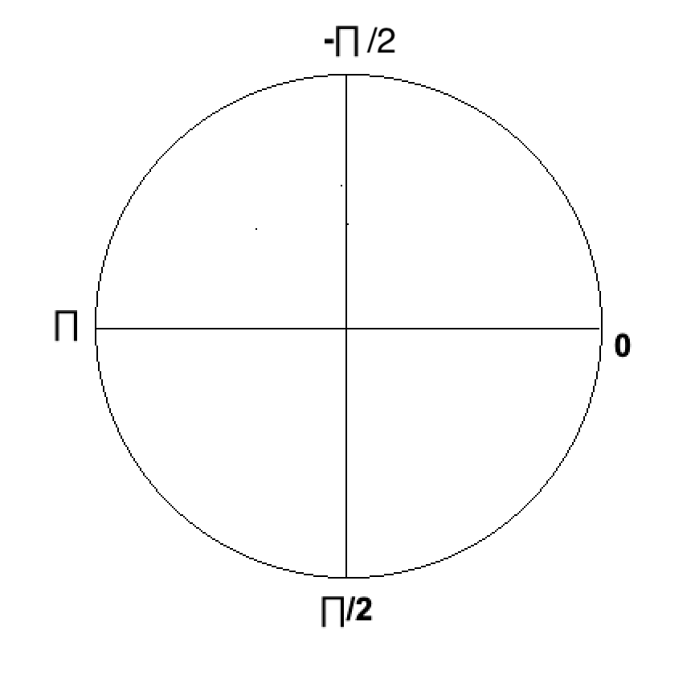

# Pie Chart props

| Prop                 | Type           | Description                                                                                               | Default value   |
| -------------------- | -------------- | --------------------------------------------------------------------------------------------------------- | --------------- |
| data                 | Array of items | An item object represents a section in the Pie chart. Descibed in the next table                          | \_              |
| radius               | number         | Radius of the Pie chart                                                                                   | 120             |
| initialAngle         | number         | Starting angle in radians (illustrated below this table)                                                  | 0               |
| isThreeD             | boolean        | If set to true, it rotates and translates the chart to give it a 3D effect                                | false           |
| showGradient         | boolean        | Prop to enable radial gradient for the Pie sections                                                       | false           |
| gradientCenterColor  | ColorValue     | Gradient color at the center of the Pie chart                                                             | 'white'         |
| onPress              | Function       | Callback function called on press of Pie sections (takes item and index as parameter)                     | null            |
| focusOnPress         | boolean        | When set to true, the pressed section of the Pie chart will have a bigger radius, hence appear focused    | false           |
| toggleFocusOnPress   | boolean        | When set to true, if the user presses an already focused pie section, it will be unfocused                | true            |
| extraRadiusForFocused | number        | Extra radius for the focused Pie section                                                                  | radius/10       |
| sectionAutoFocus     | boolean        | In case you don't want focusOnPress but want a particular section to autofocus, this prop will be needed  | false           |
| onLabelPress         | Function       | Callback function called on press of a Label (takes item and index as parameter)                          | onPress OR null |
| tiltAngle            | Angle in deg   | The angle by which the chart should be tilted                                                             | '55deg' for 3D charts, otherwise 0 |
| shadow               | boolean        | Shadow to the Pie chart, when set to true, it enhances the 3D effect                                      | false           |
| shadowColor          | ColorValue     | Color of the shadow                                                                                       | lightgray       |
| shadowWidth          | number         | Width of the shadow                                                                                       | radius\*4/3     |
| strokeWidth          | number         | Stroke (line) width for the Pie chart and its section                                                     | 0               |
| strokeColor          | ColorValue     | Stroke (line) color                                                                                       | gray            |
| backgroundColor      | ColorValue     | Background color of the container that contains the Pie chart                                             | white           |
| showText             | boolean        | When set to true, displays text on the Pie sections                                                       | false           |
| textColor            | ColorValue     | Color of the label texts                                                                                  | random colors   |
| textSize             | number         | Size of the label texts (max allowed: radius / 5)                                                         | 16              |
| fontStyle            | string         | Style of the text - 'normal', 'italic' or 'oblique'                                                       | 'normal'        |
| fontWeight           | string         | Weight of the text - 'bold', 'bolder', 'lighter', '100', '200' etc                                        | 'normal'        |
| font                 | string         | Font family of the text - 'Arial', 'Cursive', 'Comic Sans MS' etc                                         | 'Comic Sans MS' |
| showTextBackground   | boolean        | When set to true, displays background for text on the Pie sections                                        | false           |
| textBackgroundColor  | ColorValue     | Background color for the label texts                                                                      | white           |
| textBackgroundRadius | number         | Radius for the background of the text labels                                                              | textSize        |
| showValuesAsLabels   | boolean        | When set to true, the values of the Pie sections are displayed as labels                                  | false           |
| centerLabelComponent | Function       | Component to be rendered at the center of the Pie chart                                                   | \_              |
| semiCircle           | boolean        | When set to true, renders the Pie Chart in a semi-circle. donut semiCircle charts look like a speed-meter | false           |
| labelsPosition       | string         | Tells where inside the Pie sections should the labels be shown- 'onBorder', 'outward', 'inward' or 'mid'              | 'outward' for donut and semicircle charts, otherwise 'mid' |

#### initialAngle

The default value is 0. The angles are distributed differently from the usual coordinate system. It is illustrated below-

#### labelsPosition

labels can be positioned 'onBorder', 'outward', 'mid' or 'inward'. Here's a demonstration for each of them-
 
 

 
<i>onBorder</i>
  

 
<i>outward</i>
  

 
<i>mid</i>
  

 
<i>inward</i>
  

The default value for labelsPosition is 'mid'. In case of donut and semicircle charts the default value becomes 'outward'

 ---
 
### Item description

| Prop                 | Type       | Description                                                            |
| -------------------- | ---------- | ---------------------------------------------------------------------- |
| value                | number     | Value of the item, representing a section of the Pie chart             |
| shiftX               | number     | Translates (shifts) the particular section horizontally by given value |
| shiftY               | number     | Translates (shifts) the particular section vertically by given value   |
| shiftTextX           | number     | Translates (shifts) the position of label text horizontally            |
| shiftTextY           | number     | Translates (shifts) the position of label text vertically              |
| color                | ColorValue | Color (background color) of the section                                |
| text                 | string     | Label text for the sections                                            |
| textColor            | ColorValue | Color of the text (label) inside the section                           |
| textSize             | number     | Size of the text (label) inside the section                            |
| fontStyle            | string     | Style of the text - 'normal', 'italic' or 'oblique'                    |
| fontWeight           | string     | Weight of the text - 'bold', 'bolder', 'lighter', '100', '200' etc     |
| font                 | string     | Font family of the text - 'Arial', 'Cursive', 'Comic Sans MS' etc      |
| textBackgroundColor  | ColorValue | Background color for the label text                                    |
| textBackgroundRadius | number     | Radius for the background of the text label                            |
| labelPosition        | string     | Tells where inside the Pie sections should the labels be shown- 'onBorder', 'outward', 'inward' or 'mid' |
| onPress              | Function   | Callback function called on press of Pie sections (takes item and index as parameter)                    |
| onLabelPress         | Function   | Callback function called on press of a Label (takes item and index as parameter)                         |
| strokeWidth          | number     | Stroke (line) width for the Pie chart and its section                         |
| strokeColor          | ColorValue | Stroke (line) color                                                           |
| focused              | boolean    | When set to true, the section for that item is focused, sectionAutoFocus must be set true in order to use this property |

### Donut chart related props

| Prop                   | Type       | Description                                                       | Default value                        |
| ---------------------- | ---------- | ----------------------------------------------------------------- | ------------------------------------ |
| donut                  | boolean    | When set to true, renders a Donut chart (makes an inner ring)     | false                                |
| innerRadius            | number     | Radius of the inner ring                                          | radius/2                             |
| innerCircleColor       | ColorValue | Color of the inner ring                                           | white                                |
| innerCircleBorderWidth | number     | Stroke (border) width of the inner ring                           | props.innerCircleBorderColor ? 5 : 0 |
| innerCircleBorderColor | ColorValue | Stroke (border) color of the inner ring                           | gray                                 |
| shiftInnerCenterX      | number     | Shifts the inner ring horizontally to enhance the 3D effect       | 0                                    |
| shiftInnerCenterY      | number     | Shifts the inner ring vertically to enhance the 3D effect         | 0                                    |
| tilt                   | number     | The factor (between 0 annd 1) by which the chart should be tilted | if threeD then 0.5 else 1            |
