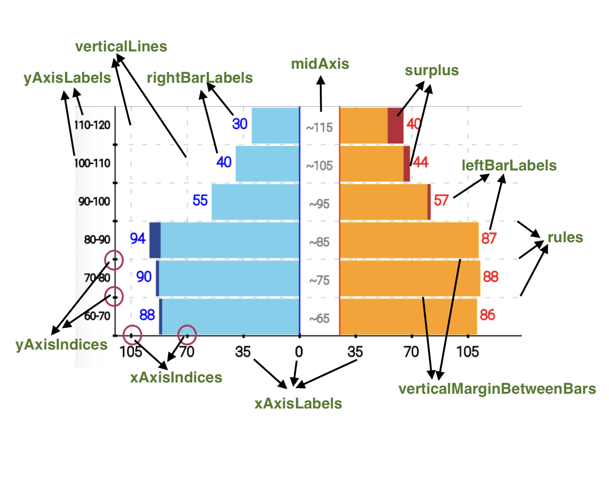

# Population Pyramid props



| Prop                         | Type                       | Description                                                                                                      | Default value            |
| ---------------------------- | -------------------------- | ---------------------------------------------------------------------------------------------------------------- | ------------------------ |
| height                       | number                     | height of chart body (excluding x-axis labels)                                                                   | 200                      |
| width                        | number                     | width of chart body                                                                                              | screen width             |
| data                         | Array<popnPyramidDataItem> | array of objects, each object is described by **popnPyramidDataItem**                                            | \_                       |
| hideRules                    | boolean                    | when set to true, hides horizontal rules (which are displayed in the background of the charts)                   | false                    |
| rulesThickness               | number                     | thickness of the horizontal rules                                                                                | 1                        |
| rulesColor                   | ColorValue                 | color of the horizontal rules                                                                                    | 'lightgray'              |
| rulesType                    | RuleTypes                  | type of the horizontal rules - SOLID or DASHED/DOTTED                                                            | DASHED                   |
| dashWidth                    | number                     | width of each dash in the horizontal rules                                                                       | 4                        |
| dashGap                      | number                     | gap between each dash in the horizontal rules                                                                    | 8                        |
| stepHeight                   | number                     | height of each step/horizontal section in the chart body                                                         | height/noOfSections      |
| verticalMarginBetweenBars    | number                     | self explanatory                                                                                                 | 1                        |
| hideYAxisText                | boolean                    | hide Y axis labels, when not set to true, a gap will be left to the left of the chart                            | false                    |
| yAxisLabelWidth              | number                     | self explanatory                                                                                                 | 35                       |
| yAxisColor                   | ColorValue                 | self explanatory                                                                                                 | 'black'                  |
| yAxisThickness               | number                     | self explanatory                                                                                                 | 1                        |
| yAxisStrokeDashArray         | Array<number>              | used to render a dashed or dotted Y axis line ([dashWidth,dashGap])                                              | \_                       |
| xAxisColor                   | ColorValue                 | self explanatory                                                                                                 | 'black'                  |
| xAxisThickness               | number                     | self explanatory                                                                                                 | 1                        |
| xAxisType                    | RuleTypes                  | type of X-axis- SOLID, DASHED or DOTTED                                                                          | DASHED                   |
| xAxisNoOfSections            | number                     | number of sections in X-axis (in both left and right parts)                                                      | 4                        |
| showXAxisIndices             | boolean                    | when set to true, shows small lines (indices) at each section of x-axis                                          | true                     |
| xAxisIndicesWidth            | number                     | width of x axis indices                                                                                          | 2                        |
| xAxisIndicesHeight           | number                     | height of x axis indices                                                                                         | 4                        |
| xAxisIndicesColor            | ColorValue                 | color of of x axis indices                                                                                       | 'black'                  |
| xAxisIndicesShiftY           | number                     | used to shift x axis indices downwards or upwards                                                                | 0                        |
| showXAxisLabelTexts          | boolean                    | self explanatory                                                                                                 | true                     |
| xAxisLabelFontSize           | number                     | self explanatory                                                                                                 | 12                       |
| xAxisLabelColor              | ColorValue                 | self explanatory                                                                                                 | 'black'                  |
| xAxisLabelFontStyle          | FontStyle                  | self explanatory                                                                                                 | 'normal'                 |
| xAxisLabelFontWeight         | FontWeight                 | self explanatory                                                                                                 | 1                        |
| xAxisLabelFontFamily         | string                     | self explanatory                                                                                                 | ''                       |
| xAxisLabelShiftX             | number                     | horizontally shifts the x axis labels by given value                                                             | 0                        |
| xAxisLabelShiftY             | number                     | vertically shifts the x axis labels by given value                                                               | 0                        |
| xAxisRoundToDigits           | number                     | number of decimal places upto which x axis labels will be displayed                                              | calculated based on data |
| xAxisLabelPrefix             | string                     | The String prepended to the x axis label text (for example- '$')                                                 | ''                       |
| xAxisLabelSuffix             | string                     | The String appended to the x axis label text                                                                     | ''                       |
| formatXAxisLabels            | (label: string) => string  | a callback function that takes the label generated by the library and modifies it                                | \_                       |
| showVerticalLines            | boolean                    | show vertical lines (similar to horiz rules) in background of the chart                                          | true                     |
| verticalLinesColor           | ColorValue                 | Color of the vertical lines                                                                                      | 'lightgray'              |
| verticalLinesThickness       | number                     | Thickness of the vertical lines                                                                                  | 1                        |
| verticalLinesType            | RuleTypes                  | SOLID or DASHED/DOTTED                                                                                           | DASHED                   |
| verticalLinesStrokeDashArray | Array<number>              | used to render dashed or dotted vertical lines ([dashWidth,dashGap])                                             | [4,8]                    |
| noOfSections                 | number                     | Number of sections (and horiz rules) in the Y axis                                                               | data.length              |
| barsMapToYAxisSections       | boolean                    | this prop tells whether the number of sections in the Y axis is equal to the length of data array                | true                     |
| showYAxisIndices             | boolean                    | when set to true, shows small lines (indices) at each section of y-axis                                          | false                    |
| yAxisIndicesWidth            | number                     | width of y axis indices                                                                                          | 2                        |
| yAxisIndicesHeight           | number                     | height of y axis indices                                                                                         | 4                        |
| yAxisIndicesColor            | ColorValue                 | color of of x axis indices                                                                                       | 'black'                  |
| yAxisLabelColor              | ColorValue                 | color of of x axis label text                                                                                    | 'black'                  |
| yAxisLabelFontSize           | number                     | font size of of of x axis label text                                                                             | 12                       |
| yAxisLabelTextMarginRight    | number                     | space left between the y axis labels and the y axis line                                                         | 4                        |
| yAxisLabelTexts              | Array<string>              | An array of string labels to be rendered as Y axis labels (top to bottom)                                        | \_                       |
| yAxisLabelFontStyle          | FontStyle                  | self explanatory                                                                                                 | 'normal'                 |
| yAxisLabelFontWeight         | FontWeight                 | self explanatory                                                                                                 | 1                        |
| yAxisLabelFontFamily         | string                     | self explanatory                                                                                                 | ''                       |
| showValuesAsBarLabels        | boolean                    | when set to true, displays the left and right values as labels beside the respective bars                        | false                    |
| showMidAxis                  | boolean                    | when set to true, displays an axis in the mid - between the left and right halves of the pyramid                 | false                    |
| midAxisThickness             | number                     | thickness of the mid axis lines                                                                                  | 1                        |
| midAxisLabelWidth            | number                     | width of the mid axis                                                                                            | 35                       |
| midAxisColor                 | ColorValue                 | color of the mid axis lines                                                                                      | 'black'                  |
| midAxisLeftColor             | ColorValue                 | color of the left mid axis line                                                                                  | 'black'                  |
| midAxisRightColor            | ColorValue                 | color of the right mid axis line                                                                                 | 'black'                  |
| midAxisStrokeDashArray       | Array<number>              | used to render dashed or dotted mid axis lines ([dashWidth,dashGap])                                             | \_                       |
| midAxisLabelFontSize         | number                     | self explanatory                                                                                                 | 12                       |
| midAxisLabelColor            | ColorValue                 | self explanatory                                                                                                 | 'black'                  |
| midAxisLabelFontStyle        | FontStyle                  | self explanatory                                                                                                 | 'normal'                 |
| midAxisLabelFontWeight       | FontWeight                 | self explanatory                                                                                                 | 1                        |
| midAxisLabelFontFamily       | string                     | self explanatory                                                                                                 | ''                       |
| barLabelWidth                | number                     | width of the labels displayed behind the bars (both left and right bars)                                         | \_                       |
| barLabelFontSize             | number                     | font size of the labels displayed behind the bars (both left and right bars)                                     | \_                       |
| barLabelColor                | ColorValue                 | color of the of the labels displayed behind the bars (both left and right bars)                                  | \_                       |
| barLabelFontStyle            | FontStyle                  | font style of the labels displayed behind the bars (both left and right bars)                                    | \_                       |
| barLabelFontWeight           | FontWeight                 | font weight of the labels displayed behind the bars (both left and right bars)                                   | \_                       |
| barLabelFontFamily           | string                     | font family of the labels displayed behind the bars (both left and right bars)                                   | \_                       |
| leftBarLabelWidth            | number                     | width of the labels displayed behind the left bars                                                               | 30                       |
| leftBarLabelFontSize         | number                     | font size of the labels displayed behind the left bars                                                           | 12                       |
| leftBarLabelColor            | ColorValue                 | color of the labels displayed behind the left bars                                                               | 'black'                  |
| leftBarLabelFontStyle        | FontStyle                  | font style of the labels displayed behind the left bars                                                          | 'normal'                 |
| leftBarLabelFontWeight       | FontWeight                 | font weight of the labels displayed behind the left bars                                                         | 1                        |
| leftBarLabelFontFamily       | string                     | font family of the labels displayed behind the left bars                                                         | '                        |
| leftBarLabelShift            | number                     | value by which the left bar labels should be shifted horizontally (kind of margin b/w label and bar)             | 0                        |
| leftBarLabelPrefix           | string                     | The String prepended to the left bar label text (for example- '$')                                               | ''                       |
| leftBarLabelSuffix           | string                     | The String appended to the left bar label text                                                                   | ''                       |
| rightBarLabelWidth           | number                     | width of the labels displayed behind the right bars                                                              | 30                       |
| rightBarLabelFontSize        | number                     | font size of the labels displayed behind the right bars                                                          | 12                       |
| rightBarLabelColor           | ColorValue                 | color of the labels displayed behind the right bars                                                              | 'black'                  |
| rightBarLabelFontStyle       | FontStyle                  | font style of the labels displayed behind the right bars                                                         | 'normal'                 |
| rightBarLabelFontWeight      | FontWeight                 | font weight of the labels displayed behind the right bars                                                        | 1                        |
| rightBarLabelFontFamily      | string                     | font family of the labels displayed behind the right bars                                                        | ''                       |
| rightBarLabelShift           | number                     | value by which the right bar labels should be shifted horizontally (kind of margin b/w label and bar)            | 0                        |
| rightBarLabelPrefix          | string                     | The String prepended to the right bar label text (for example- '$')                                              | ''                       |
| rightBarLabelSuffix          | string                     | The String appended to the right bar label text                                                                  | ''                       |
| formatBarLabels              | (label: string) => string  | a callback function that takes the label generated by the library and modifies it                                | \_                       |
| leftBarColor                 | ColorValue                 | color of the bars displayed in the left half of the pyramid                                                      | 'skyblue'                |
| rightBarColor                | ColorValue                 | color of the bars displayed in the right half of the pyramid                                                     | 'orange'                 |
| leftBarBorderColor           | ColorValue                 | border color of the bars displayed in the left half of the pyramid                                               | 'blue'                   |
| rightBarBorderColor          | ColorValue                 | border color of the bars displayed in the right half of the pyramid                                              | 'red'                    |
| barBorderWidth               | number                     | boder width of the bars (both left and right bars)                                                               | 0                        |
| leftBarBorderWidth           | number                     | boder width of the bars displayed in the left half of the pyramid                                                | 0                        |
| rightBarBorderWidth          | number                     | boder width of the bars displayed in the right half of the pyramid                                               | 0                        |
| barBorderRadius              | number                     | boder radius of the bars                                                                                         | 0                        |
| leftBarBorderRadius          | number                     | boder width of the bars displayed in the left half of the pyramid                                                | 0                        |
| rightBarBorderRadius         | number                     | boder width of the bars displayed in the right half of the pyramid                                               | 0                        |
| onLeftPress                  | (item, index) => void      | Callback function called when a left bar is pressed. Takes 2 params- item and index.                             | \_                       |
| onRightPress                 | (item, index) => void      | Callback function called when a right bar is pressed. Takes 2 params- item and index.                            | \_                       |
| allCornersRounded            | boolean                    | when set to true, border radius will apply to all the four corners of the bars, else applied only on outer edges | false                    |
| showSurplus                  | boolean                    | shows surplus values on the edges in highlighted colors (extra width of the bigger bar is highlighted )          | false                    |
| showSurplusLeft              | boolean                    | shows surplus values on the left edges in highlighted colors (extra width of the bigger bar is highlighted )     | \_                       |
| showSurplusRight             | boolean                    | shows surplus values on the right edges in highlighted colors (extra width of the bigger bar is highlighted )    | \_                       |
| leftSurplusColor             | ColorValue                 | highlight color of the left surplus                                                                              | '#334790'                |
| leftSurplusBorderColor       | ColorValue                 | border color of the left surplus                                                                                 | 'blue'                   |
| rightSurplusColor            | ColorValue                 | highlight color of the right surplus                                                                             | '#AC343C'                |
| rightSurplusBorderColor      | ColorValue                 | border color of the right surplus                                                                                | 'red'                    |
| leftSurplusBorderWidth       | number                     | border width of the left surplus                                                                                 | 0                        |
| rightSurplusBorderWidth      | number                     | border width of the right surplus                                                                                | 0                        |

# popnPyramidDataItem

Each object in the data array is of `popnPyramidDataItem` type. Only these 2 properties are mandatory- `left` and `right`, all other properties are optional. <br/>
Notice that many properties are present in both data objects as well as separate props. The property is first searched in the data objects. If not found, it is searched in the props. If not found found in props, the default value is applied, as listed in the table above.

```ts
type popnPyramidDataItem = {
  left: number;
  right: number;
  leftBarColor?: ColorValue;
  rightBarColor?: ColorValue;
  leftBarBorderColor?: ColorValue;
  rightBarBorderColor?: ColorValue;
  barBorderWidth?: number;
  leftBarBorderWidth?: number;
  rightBarBorderWidth?: number;
  barBorderRadius?: number;
  leftBarBorderRadius?: number;
  rightBarBorderRadius?: number;

  barLabelWidth?: number;
  barLabelFontSize?: number;
  barLabelColor?: ColorValue;
  barLabelFontStyle?: FontStyle;
  barLabelFontWeight?: FontWeight;
  barLabelFontFamily?: string;

  leftBarLabel?: string;
  leftBarLabelWidth?: number;
  leftBarLabelFontSize?: number;
  leftBarLabelColor?: ColorValue;
  leftBarLabelFontStyle?: FontStyle;
  leftBarLabelFontWeight?: FontWeight;
  leftBarLabelFontFamily?: string;
  leftBarLabelShift?: number;

  rightBarLabel?: string;
  rightBarLabelWidth?: number;
  rightBarLabelFontSize?: number;
  rightBarLabelColor?: ColorValue;
  rightBarLabelFontStyle?: FontStyle;
  rightBarLabelFontWeight?: FontWeight;
  rightBarLabelFontFamily?: string;
  rightBarLabelShift?: number;

  yAxisLabel?: string;
  midAxisLabel?: string;
  midAxisLabelFontSize?: number;
  midAxisLabelColor?: ColorValue;
  midAxisLabelFontStyle?: FontStyle;
  midAxisLabelFontWeight?: FontWeight;
  midAxisLabelFontFamily?: string;

  showSurplus?: boolean;
  showSurplusLeft?: boolean;
  showSurplusRight?: boolean;
  leftSurplusColor?: ColorValue;
  leftSurplusBorderColor?: ColorValue;
  rightSurplusColor?: ColorValue;
  rightSurplusBorderColor?: ColorValue;
  leftSurplusBorderWidth?: number;
  rightSurplusBorderWidth?: number;
};
```
