# Bar charts architecture

The code for the `<BarChart>` component is written in the `BarChart/index.ts` file. This file prepares the chart content and returns it wrapped in a component named **`<BarAndLineChartsWrapper>`**  
BarAndLineChartsWrapper is a common component for all types of Bar and Line charts. It takes the chart-content (bar or stacked bar) and adds to it the common elements like the X and Y axes, the background and rules etc.
It accepts a prop named `renderChartContent` which renders the actual chart.  

The architecture of Line chart can be understood with the below image-

