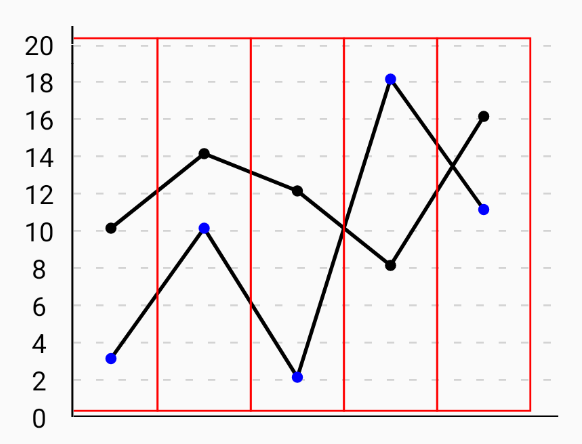

## Focusing

A data point can be focused using the `focusEnabled` prop.
A focused data point can have a different color, shape and size using the props (or properties of data items)- 
1. focusedDataPointShape
2. focusedDataPointColor
3. focusedDataPointRadius
4. focusedDataPointWidth
5. focusedDataPointHeight

When `focusEnabled` prop is `true`, on pressing anywhere on the chart body, the data point nearest to the pressed point gets focused. We can also set the distance from a data point upto which a press event should result in focusing that data point using the prop `focusProximity`.

The data point remains in focused state till a given duration using the `delayBeforeUnFocus` prop which takes the focus duration in milliseconds, the default value being 300.
To let the focus events to persist forever, the `unFocusOnPressOut` prop can be set to `false`, the default value being true.

## Multi-line scenario

When more than one lines are rendered using `dataSet` or `data2`, `data3`... or `secondaryData`, then a press event selects the neares data point's index and sets that index as focused. This results in focusing the data points at that index from each data array. This means all the vertically aligned points will be focused simultaneously. To disable this behaviour, and focus only one point at a a time, we can set the `focusTogether` prop to `false`, default being true.

### How does focus work

Focusing has been implemented in a rather hacky manner.
We are rendering `n` rectangles (using `<Rect>` from svg) where `n` is the size of the longest data arry amongst all data arrays. So, the entire chart width is divided into `n` rectangles. When a press event occurs, one of the rectangles is pressed and its index is saved in the `selectedIndex` state variable. Unless `focusTogether` is set to `false`, all the data points lying in the selected rectangle get focused together.

The logic to set/unset the selected index is written a function named `renderDataPoints` which is called for each individual line. So if we have `n` data arrays or `n` arrays in the `dataSet`, then `renderDataPoints` is called `n` times. This means that each red color rectangle we see in the above chart will be rendered `n` times (which is absurd and inefficient). To avoid this redundancy, we use the variable named **`selectedLineNumber`** and make sure that this logic runs only for the last data array. See the condition- `key === lastLineNumber - 1`
