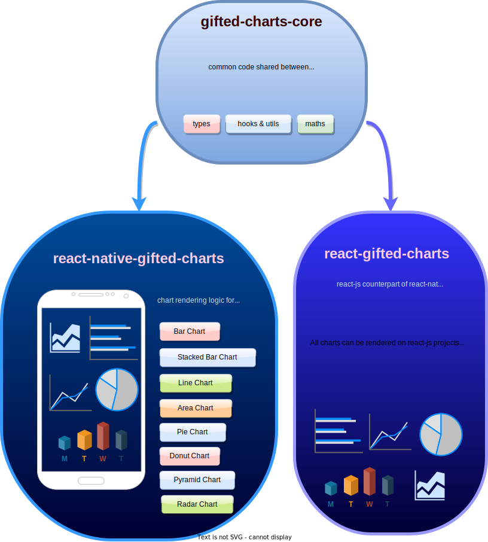

## Introduction

<b><i>Simplicity is the key to elegance.</i></b>

Gifted-charts is popular mainly because it offers great charting power in a **simple** and **intuitive** manner. The components exposed by the library are just like any React-native element accepting props for customisation. 

It has a refined fusion of native UI elements and SVG, harnessing seamless animations and interactions from native components while employing SVG for chart rendering.
Complex charts with enormous features and interactions can be built using this library with great ease.

## [Gifted charts core](https://github.com/Abhinandan-Kushwaha/gifted-charts-core)

It contains mathematical logic and type definitions for gifted-charts.

### Why a separate library to handle maths and types?

To make the common logic reusable in both react-native and react-js.

Within a few months of the library's cuccess, the community expressed a clear desire to extend the library's compatibility to ReactJS for web applications, marking the inception of the next chapter: [react-gifted-charts](https://github.com/Abhinandan-Kushwaha/react-gifted-charts).

To leverage the existing infrastructure and logic from _react-native-gifted-charts_, I abstracted the mathematical and logical components into a separate library named [gifted-charts-core](https://www.npmjs.com/package/gifted-charts-core). This core functionality could now serve both React and React Native environments. Additionally, I ensured that the code for rendering charts on the web should be the same as that of mobile applications.

### Design docs of different chart components- 

1. **[Bar Chart](BarChart/index.md)**
2. **[Line Chart](LineChart/index.md)**
2. **[Pie Chart](PieChart/index.md)**
