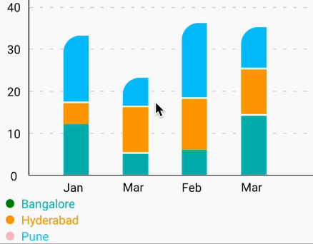

## 🎉 1.4.64

### 🐛 Bug fixes

1. Fixed the issue- "Pie - Donut inner view absorbs onPress events on pie". See https://github.com/Abhinandan-Kushwaha/react-native-gifted-charts/issues/1131

2. Fixed the issue- "PieChart does not render when all values are zero". See https://github.com/Abhinandan-Kushwaha/react-native-gifted-charts/issues/1137

3. Fixed the issue- "`negativeStepValue` does not reflect". See https://github.com/Abhinandan-Kushwaha/react-native-gifted-charts/issues/1107


---

---

---

## 🎉 1.4.63

### 🐛 Bug fixes

1. Fixed the issue- "pointerConfig and pointerLabelComponent doesn't work properly with Stacked Bar Chart". <br />
Thanks to [Anna Conti](https://github.com/94Conti) for her PR - https://github.com/Abhinandan-Kushwaha/react-native-gifted-charts/pull/1123 <br />
See https://github.com/Abhinandan-Kushwaha/react-native-gifted-charts/issues/1117

2. Fixed the issue- "`trimYAxisAtTop` not working for LineChartBicolor. See https://github.com/Abhinandan-Kushwaha/react-native-gifted-charts/discussions/1125

3. Added `yAxisExtraHeightAtTop` to LineChartBiColor (earlier it was available only to Bar and Line charts).

### 🔨 Refactor

Added types to **style** related props. Thanks to [Seyed Mostafa Hasani](https://github.com/seyedmostafahasani) for his PRs-
- https://github.com/Abhinandan-Kushwaha/gifted-charts-core/pull/87
- https://github.com/Abhinandan-Kushwaha/gifted-charts-core/pull/89
- https://github.com/Abhinandan-Kushwaha/react-native-gifted-charts/pull/1119

---

---

---

# 🎉 1.4.62

## ✨ Features added-

   1. Added support for spread (or ranged) area chart using the props `spreadAreaData`, `spreadAreaColor` and `spreadAreaOpacity`. Thanks to [Sadat Taseen](https://github.com/sttaseen) and [TirelessDev](https://github.com/TirelessDev) for their PR - https://github.com/Abhinandan-Kushwaha/react-native-gifted-charts/pull/1104 <br />
See https://github.com/Abhinandan-Kushwaha/react-native-gifted-charts/issues/1093 <br />
See this Stackoverflow question- https://stackoverflow.com/questions/65683564/fusioncharts-area-range-graph-with-line


## 🐛 Bug fixes

1. Fixed the issue- `endIndex` `startIndex` not working properly for area chart gradient. <br />
Thanks to [Anna Conti](https://github.com/94Conti) for her PR - https://github.com/Abhinandan-Kushwaha/react-native-gifted-charts/pull/1110 <br />
See https://github.com/Abhinandan-Kushwaha/react-native-gifted-charts/issues/1105

2. Added uniqueId for LineChart area gradient to fix issue in web - multiple color gradients. <br />
Thanks to [Anna Conti](https://github.com/94Conti) for her PR - https://github.com/Abhinandan-Kushwaha/react-native-gifted-charts/pull/1108

3. Removed background pattern margin (of 1 px). <br />
Thanks to [Christoph](https://github.com/christophby) for his PR - https://github.com/Abhinandan-Kushwaha/react-native-gifted-charts/pull/1113

4. Changed the default value of `labelsPositionOffset` from 5 to 0 (in gifted-charts-core), to fix the issue - "RadarChart labels don't work on small numbers". <br />
See https://github.com/Abhinandan-Kushwaha/react-native-gifted-charts/issues/1094 

---

---

---

## 🎉 1.4.61

Added support for multi-focus and multi-highlight in Bar charts. `focusedBarIndex` and `highlightedBarIndex` now accept `number` as well as `array of numbers`. This allows multiple bars to be focused or highlighted at the same time.<br />
See- https://github.com/Abhinandan-Kushwaha/react-native-gifted-charts/issues/1083 <br />
Tons of thanks to [Shubham Pawar](https://github.com/shubham-cpp) for his PRs- https://github.com/Abhinandan-Kushwaha/react-native-gifted-charts/pull/1084 and https://github.com/Abhinandan-Kushwaha/gifted-charts-core/pull/83

---

---

---

## 🎉 1.4.60

### ✨ Features added-

1. Added the prop `onScrollEndDrag` to Bar (and stacked bar), Line and Area charts. Thanks to [Shubham Pawar](https://github.com/shubham-cpp) for his PR https://github.com/Abhinandan-Kushwaha/react-native-gifted-charts/pull/1068 <br /> issue link- https://github.com/Abhinandan-Kushwaha/react-native-gifted-charts/issues/1067

2. Added the props `bounces` and `overScrollMode` to Bar (and stacked bar), Line and Area charts. These props will help control the bouncing effect on iOS and Android respectively. See https://github.com/Abhinandan-Kushwaha/react-native-gifted-charts/issues/1073
<br />
To know more about `bounces` and `overScrollMode`, please go through the official react-native docs here- https://reactnative.dev/docs/scrollview#bounces-ios and https://reactnative.dev/docs/scrollview#overscrollmode-android

---

---

---

## 🎉 1.4.59

## ✨ Features added-

1. Added the prop `onBackgroundPress` to Bar and Stacked Bar charts. This will help ufocus/unselect after focusing/selecting a Bar. See https://github.com/Abhinandan-Kushwaha/react-native-gifted-charts/discussions/1057#discussioncomment-12746091 and https://github.com/Abhinandan-Kushwaha/react-native-gifted-charts/issues/634#issuecomment-2782249676

2. Added the params- `item` and `index` to the `pointerComponent` property of the `pointerConfig` prop. See https://github.com/Abhinandan-Kushwaha/react-native-gifted-charts/issues/1055

### 🐛 Bug fixes

1. Fixed the issue - Line chart with curveType quadratic crashes if `animateOnDataChange` is true and the changed data is of a different length. See https://github.com/Abhinandan-Kushwaha/react-native-gifted-charts/issues/984 and https://github.com/Abhinandan-Kushwaha/react-native-gifted-charts/issues/1026#issuecomment-2700094459

2. Fixed the issue - `focusedCustomDataPoint` not rendering for focused data, (when both customDataPoint and focusedCustomDataPoint are used together)

3. Made the props `pieInnerComponentHeight` and `pieInnerComponentWidth` functional. Earlier they were defined but were not effective. Thanks to [Benjamin Beau](http://github.com/benjamin-beau) fro his PR - https://github.com/Abhinandan-Kushwaha/react-native-gifted-charts/pull/1045

---

---

---

# 🎉 1.4.58

## ✨ Features added-

1. In Donut charts, the `centerLabelComponent` callback now accepts index parameter. Initially index is -1. On pressing any pie slice, it is set to the pressed slice's index. This fixes- https://github.com/Abhinandan-Kushwaha/react-native-gifted-charts/issues/994#issuecomment-2662597863
2. Added the props `focusedDataPointLabelComponent` and `dataPointLabelComponent` to LineCharts. Eearlier configurable only inside the data array, now it can be passed directly as a prop.
3. Added the prop `xAxisLabelsAtBottom` to Bar, Stacked bar, line and Area charts. See https://github.com/Abhinandan-Kushwaha/react-native-gifted-charts/issues/1015#issuecomment-2680863441

## 🐛 Bug fixes

1. Fixed the issue- "Pie charts showing log `showTooltip-----> undefined`" See https://github.com/Abhinandan-Kushwaha/react-native-gifted-charts/issues/1020
2. Fixed the issue- "Pressing on the X-axis label not triggering the respective tooltip in Stack Bar chart". See https://github.com/Abhinandan-Kushwaha/react-native-gifted-charts/issues/1010
3. Fixed the issue- "Pointer jumping when spacing is less and user scrolls at the left end of the chart towards Y-axis". See https://github.com/Abhinandan-Kushwaha/react-native-gifted-charts/issues/410
4. Fixed the issue - "`xAxisLabelsVerticalShift` does not work with Line and Area charts".

---

---

---

# 🎉 1.4.57

## ✨ Features added-

1. Added the prop `edgesPressable` to Pie charts. Ususally the entire slice of the Pie chart is pressable, but when a slice is foused, it becomes larger. In that case the extra length of the slice protruding out of the chart is unpressable. To make that extra length also pressable, we can use the `edgesPressable` prop. If `edgesPressable` is set to true, the edges of the pie will be pressable, but you may need to press twice for focus- once for unfocusing the already focused pie and then for focusing the new pie. This prop was added after fixing the issue- "Can't select other Pie slices by just one press event". See https://github.com/Abhinandan-Kushwaha/react-native-gifted-charts/issues/994.

## 🐛 Bug fixes

1. Fixed the iussue- "Pointer and strip not showing immediately on bar press". See https://github.com/Abhinandan-Kushwaha/react-native-gifted-charts/issues/1002

2. Fixed the issue- "LineChart 1st data point shows pointer label on the most top side of the datapoint if initial data value is 0". See https://github.com/Abhinandan-Kushwaha/react-native-gifted-charts/issues/1003

3. Fixed the issue- "`dynamicLegendComponent` doesn't show actual values from data when used with `yAxisOffset`". See https://github.com/Abhinandan-Kushwaha/react-native-gifted-charts/discussions/1000#discussioncomment-12208608

4. Fixed the issue- "donut PieChart not showing tooltip correctly". See https://github.com/Abhinandan-Kushwaha/react-native-gifted-charts/issues/983

---

---

---

# 🎉 1.4.56

## ✨ Features added-

### 1. Highlight



Added the feature to highlight a particular Bar, Bar-section (in stacked Bar chart) or Line in Bar charts using the below props-

- highlightEnabled
- highlightedBarIndex
- lowlightOpacity
- stackHighlightEnabled
- highlightedStackIndex

The above chart is rendered using the `stackHighlightEnabled` and `highlightedStackIndex` props.

#### 2. Added the below props to Bar charts (earlier available only for Line charts)-

- onTouchStart
- onTouchEnd
- onResponderGrant
- onResponderMove
- onResponderEnd
- onPointerEnter
- onPointerLeave

## 🐛 Bug fixes

1. Fixed the issue- "Dataset Lines rendering incorrectly when lengths don't match". See https://github.com/Abhinandan-Kushwaha/react-native-gifted-charts/issues/975
2. Fixed the issue- "`onPress` for Pie charts on web not working on large screens. See https://github.com/Abhinandan-Kushwaha/react-native-gifted-charts/issues/969#issuecomment-2601506090
3. Fixed the issue- "onFocus callback always receives last line". Thanks to [brimby](https://github.com/brimby) for his PR- https://github.com/Abhinandan-Kushwaha/react-native-gifted-charts/pull/1068
https://github.com/Abhinandan-Kushwaha/gifted-charts-core/pull/73
4. Fixed the issue- "`focusProximity` not working for `dataSets`." See https://github.com/Abhinandan-Kushwaha/gifted-charts-core/pull/73#issuecomment-2614202997

---

---

---

## 🎉 1.4.55

### ✨ Features added-

1. Added the below properties to the `pointerConfig` prop in Line/Area charts, all of which are callback functions. See https://github.com/Abhinandan-Kushwaha/react-native-gifted-charts/issues/968

- onTouchStart
- onTouchEnd
- onResponderGrant
- onResponderMove
- onResponderEnd
- onPointerEnter
- onPointerLeave

### 🐛 Bug fixes

1. Fixed the issue - Pie chart onPress, focusOnPress event is not working on expo web. See https://github.com/Abhinandan-Kushwaha/react-native-gifted-charts/issues/969 and https://github.com/Abhinandan-Kushwaha/react-native-gifted-charts/issues/800

2. Fixed the issue- Unable to use the Gifted Charts Pointer within a React Native Tab View (using `onTouchStart` and `onTouchEnd` in the **pointerConfig** object). See https://github.com/Abhinandan-Kushwaha/react-native-gifted-charts/issues/968

---

---

---

## 🎉 1.4.54

### ✨ Features added-

1. Added `strokeLinecap` to Line charts to support `'butt' | 'square' | 'round'` linecaps. See https://github.com/Abhinandan-Kushwaha/react-native-gifted-charts/issues/961 <br />
   Following props have been added-

- strokeLinecap
- strokeLinecap1
- strokeLinecap2
- strokeLinecap3
- strokeLinecap4
- strokeLinecap5
- Added the `strokeLinecap` property in `secondaryLineConfig` and in the items of `dataSet` array

2. Added support for animation in `Radar` charts. Following props have been added-

- isAnimated
- animationDuration (default 800)
- animateTogether (default false)
- Added the `isAnimated` and `animationDuration` properties in the objects of `polygonConfigArray`

---

---

---

## 🎉 1.4.53

Upgraded `gifted-charts-core` version to `0.1.55`, had accidentally pushed the previous version with faulty version `0.1.54` of `gifted-charts-core`

---

---

---

## 🎉 1.4.52

### ✨ Features added-

1. Added support for multi-radar charts using the prop `dataSet` in place of `data`. **dataSet** is a 2D array while **data** is 1D. Added the below props to the `<RadarChart>` component-

- dataLabelsArray
- polygonConfigArray
- dataLabelsConfigSet

### 🐛 Bug fixes

1. Fixed the issue - "Line Chart with line segments doesn't work when enabling `stepChart`". See https://github.com/Abhinandan-Kushwaha/react-native-gifted-charts/issues/950
2. Fixed the dataPointLabelComponent width issue. See https://github.com/Abhinandan-Kushwaha/react-native-gifted-charts/issues/955
3. Fixed the issue - "LineChart - Strip not showing after certain x datapoints, using data prop" Thanks to [Lucas Brumatti](https://github.com/lucasBruma) for his PR - https://github.com/Abhinandan-Kushwaha/react-native-gifted-charts/pull/954
4. Fixed the issue- "ExtrapolateMissingValues bug depending on line direction". See https://github.com/Abhinandan-Kushwaha/react-native-gifted-charts/issues/953

---

---

---

# 🎉 1.4.51

## ✨ Features added-

Added support for **Radar charts** using `<RadarChart>` component. See [Radar chart props](https://github.com/Abhinandan-Kushwaha/react-native-gifted-charts/blob/master/docs/RadarChart/RadarChartProps.md)

---

---

---

## 🎉 1.4.50

### 🐛 Bug fixes

1. Fixed issue with **tooltips** in Bar and Stacked Bar charts.
2. Fixed issue with `customDataPoint`, `dataPointLabelComponent` and `focusedDataPointLabelComponent` in Line/Area charts and enhanced the **focus** related functionality.

### 🔨 Refactor

1. Moved **tooltip** related logic to _gifted-charts-core_
2. Moved **focus** related logic for Line/Area charts to _gifted-charts-core_
3. Exported a few more types from _gifted-charts-core_ and exposed them from _react-native-gifted-charts_

---

---

---

## 🎉 1.4.49

### ✨ Features added-

1. Added the prop `renderDataPointsAfterAnimationEnds` to Line/Area charts to render the data points after the animation has ended. This flag can be helpful if `onPress` does not work in case of multi-line animated charts. See https://github.com/Abhinandan-Kushwaha/react-native-gifted-charts/issues/921 <br /><br/>
This prop is also useful if you are using `focusedDataPointLabelComponent` in **animated multiline** charts. In animated multiline charts, the focused label component might appear beneath some lines (while it is supposed to be rendered above every line/curve).
To fix this layering issue, `renderDataPointsAfterAnimationEnds` can be useful. See https://github.com/Abhinandan-Kushwaha/react-native-gifted-charts/issues/1060#issuecomment-2792527440 

### 🐛 Bug fixes

1. Fixed the issue- "getPointerProps starts from 0 index, regardless of where you press and drag on the LineChart". See https://github.com/Abhinandan-Kushwaha/react-native-gifted-charts/issues/937
2. Fixed the issue- "Unable to use multi onPress in LineChart". See https://github.com/Abhinandan-Kushwaha/react-native-gifted-charts/issues/921 and https://github.com/Abhinandan-Kushwaha/react-native-gifted-charts/issues/570
3. Fixed the issue- "LineChart 1st data point does not show pointer label if initialSpacing={0}". See https://github.com/Abhinandan-Kushwaha/react-native-gifted-charts/issues/925

## 🔨 Refactor

Made the `value` property of data items optional for Bar and Line/Area charts. Added null safety types for internal calculations, while the `<BarChart>` and `<LineChart>` components exposed by the library will be capable of accepting null/undefined values as data items, internally it will be conerted to respective nullSafe type after handling the null values (by interpolatio or replacing with 0).
Below are the exposed types and their corresponding null afe types-

| Chart Type               | Type of `data` prop | Corresponding null safe type |
| ------------------------ | ------------------- | ---------------------------- |
| BarChart                 | barDataItem[]       | barDataItemNullSafe[]        |
| LineChart                | lineDataItem[]      | lineDataItemNullSafe[]       |
| LineChart with `dataSet` | DataSet[]           | DataSetNullSafe[]            |

This refactor fixes the below type-related issues-

1. https://github.com/Abhinandan-Kushwaha/react-native-gifted-charts/issues/787
2. https://github.com/Abhinandan-Kushwaha/react-native-gifted-charts/issues/781

---

---

---

# 🎉 1.4.48

## ✨ Features added-

1. Added support for `barMarginBottom` to stacked bar charts. See https://github.com/Abhinandan-Kushwaha/react-native-gifted-charts/issues/126#issuecomment-2475778997
2. Added the prop `customBackground` to Bar, Line, Area charts. `customBackground` is an object with following keys (All of which are optional). See https://github.com/Abhinandan-Kushwaha/react-native-gifted-charts/issues/790

#### CustomBackground

```ts
type CustomBackground = {
  color?: ColorValue;
  component?: Function;
  horizontalShift?: number;
  verticalShift?: number;
  height?: number;
  width?: number;
  widthAdjustment?: number;
};
```

3. Added the props- `focusTogether` and `focusProximity` to Line and Area charts to control the focus behaviour. See https://github.com/Abhinandan-Kushwaha/react-native-gifted-charts/issues/910
4. BarChart lineConfig with strokeDashArray support. See https://github.com/Abhinandan-Kushwaha/react-native-gifted-charts/issues/927
5. Added the property `resetPointerIndexOnRelease` inside `pointerConfig` to set pointerIndex to -1 upon releasing the pointer. Default value is `false`. See https://github.com/Abhinandan-Kushwaha/react-native-gifted-charts/issues/854
6. Added the property `activatePointersInstantlyOnTouch` inside `pointerConfig` whose default value is `true`. When set to false, the pointer will be activated not instantly after touch, but on dragging after touch. See https://github.com/Abhinandan-Kushwaha/react-native-gifted-charts/discussions/934

## 🐛 Bug fixes

1. Fixed the issue- `barMarginBottom` not working for Bar charts.
2. Fixed issue with X-axis label position in stacked bar charts with negative values.
3. Some fix about vertical lines in Line charts.
4. Fixed the issue- "LineChart - Strip and Points not showing beyond x index 0 for DataSet". See https://github.com/Abhinandan-Kushwaha/react-native-gifted-charts/issues/911
5. Fixed the issue- "hidePointer doesn't work". See https://github.com/Abhinandan-Kushwaha/react-native-gifted-charts/issues/932
6. Fixed the issue- "Custom Data Point in wrong position with non-uniform spacing on data in LineChart" See https://github.com/Abhinandan-Kushwaha/react-native-gifted-charts/issues/923
7. Fixed the issue- "extrapolateMissingValues not working with dataSet". See https://github.com/Abhinandan-Kushwaha/react-native-gifted-charts/issues/916
8. Fixed the issue- "The first property setting of BarChart/LineChart RulesConfigArray does not take effect". See https://github.com/Abhinandan-Kushwaha/react-native-gifted-charts/issues/893
9. Fixed the issue- "areaChart2, areaChart3, areaChart4... props not working". See https://github.com/Abhinandan-Kushwaha/react-native-gifted-charts/issues/892
10. Fixed the issue- "overflowTop parameter behaviour & verticalLinesHeight". See https://github.com/Abhinandan-Kushwaha/react-native-gifted-charts/issues/884
11. Fixed the issue- "Text formatting for labels not working for the focused Pie". See https://github.com/Abhinandan-Kushwaha/react-native-gifted-charts/issues/886
12. Fixed the issue- "PieChart focused Pie label styling does not work properly". See https://github.com/Abhinandan-Kushwaha/react-native-gifted-charts/issues/886
13. Fixed the issue- "Custom data points are not shown on web". See https://github.com/Abhinandan-Kushwaha/react-native-gifted-charts/issues/889

---

---

---

# 🎉 1.4.47

## ✨ Features added-

1. Added the properties `hidePointerForMissingValues` and `hidePointerDataPointForMissingValues` to the **PointerConfig** object. In case there are data items with missing/undefined/null values the library interpolates those values. But if you don't want the pointer to be displayed for such values, you can set the `hidePointerForMissingValues` property to true. Its default value is false. When `hidePointerForMissingValues` is set to true, `hidePointerDataPointForMissingValues` automatically becomes true, unless otherwise specified. See https://github.com/Abhinandan-Kushwaha/react-native-gifted-charts/issues/881

## 🐛 Bug fixes

1. The vertical strips shown by using the `showStrip` property were always shown over the data points, but now they will be shown beneath the data points. This behaviour can be reversed by using the `stripOverDataPoints` prop.

---

---

---

## 🎉 1.4.46

Added the prop named `stripOverDataPoints` to Line charts. If set true, the vertical strip appears over the data points, else it appears beneath the data points. See https://github.com/Abhinandan-Kushwaha/react-native-gifted-charts/issues/877

---

---

---

# 🎉 1.4.45

## ✨ Features added-

1. Added the property `horizontalStripConfig` inside the `pointerConfig` to create **crosshair** effect.

## 🐛 Bug fixes

1. Fixed the issue- "PieChart is not displayed if there is a huge difference between several values". See https://github.com/Abhinandan-Kushwaha/react-native-gifted-charts/issues/874
2. Fixed the issue- "App crashes when extrapolateMissingValue is set to false and only the last value is defined". See https://github.com/Abhinandan-Kushwaha/react-native-gifted-charts/issues/871
3. Fixed the issue- Population pyramid chart with a mid axis has misaligned X-axis labels.
4. Fixed the issue- Line chart's line is misaligned if dataPointsRadius is large.

---

---

---

# 🎉 1.4.44

## ✨ Features added-

1. Added support for different spacing for each line in Line/Area charts. Added the props `spacing1`, `spacing2`, `spacing3`... See https://github.com/Abhinandan-Kushwaha/react-native-gifted-charts/discussions/858
2. Added support for different spacing for each data point in a line in Line/Area charts. Added the `spacing` property inside the objects of the `data` and `dataSet` arrays.
3. Added the tooltip feature in Pie/Donut charts using the `showTooltip` prop.

## 🐛 Bug fixes

1. Fixed the issue- "yAxisOffset does not work with stackData". See https://github.com/Abhinandan-Kushwaha/react-native-gifted-charts/issues/862
2. Fixed the issue- `zIndex` not working for Lines/Curves of the Line/Area charts.
3. Used scrollAnimation when scrolling to a given index using the `scrollToIndex` prop. See https://github.com/Abhinandan-Kushwaha/react-native-gifted-charts/issues/859<br />
   Thanks to [dannybit](https://github.com/dannybit) for his PR- https://github.com/Abhinandan-Kushwaha/react-native-gifted-charts/pull/860

---

---

---

## 🎉 1.4.43

1. Added `onLeftPress` and `onRightPress` props to Population charts. See https://github.com/Abhinandan-Kushwaha/react-native-gifted-charts/discussions/855
2. Fix BarChart crash when maxValue is 0. Thanks to [sakisdog](https://github.com/sakisdog) for the PR- https://github.com/Abhinandan-Kushwaha/gifted-charts-core/pull/55

---

---

---

# 🎉 1.4.42

## ✨ Features added-

1. Added 185 screenshot tests to avoid regressions and make the library pixel perfect. See https://abhinandan-kushwaha.github.io/TestingCharts/ss-test/test.html
2. Added animation to bar charts when the width of bar changes, earlier animation worked only on height change.

## 🐛 Bug fixes

1. Fixed the issue- Crash on passing empty data to Bar charts. See https://github.com/Abhinandan-Kushwaha/react-native-gifted-charts/issues/851
2. Fixed the issue- Line & area charts with `pointerConfig` blink when `animateOnDataChange` is true. See https://github.com/Abhinandan-Kushwaha/react-native-gifted-charts/issues/849
3. Fixed the issue- `animateOnDataChange` does not work when yAxisOffset is set. See https://github.com/Abhinandan-Kushwaha/react-native-gifted-charts/issues/853
4. Fixed the issue- Right side y-Axis not working in `<LineChartBiColor>`. See https://github.com/Abhinandan-Kushwaha/react-native-gifted-charts/issues/847
5. Fixed all issues with yAxisSide='right' and secondary Y-axis alignment. Wrote thorough screenshot tests relates to Axes and labels.

---

---

---

## 🎉 1.4.41

Fixed the x-axis alignment issue for animated gradient Bar charts when using `xAxisLabelsVerticalShift`. Also fixed the extra space at bottom when using `xAxisLabelsVerticalShift`.<br />
See https://github.com/Abhinandan-Kushwaha/react-native-gifted-charts/issues/842

---

---

---

# 🎉 1.4.40

## ✨ Features added-

Added the properties `dynamicLegendComponent` and `dynamicLegendContainerStyle` inside the **_pointerConfig_** object. <br />
<br />

**dynamicLegendComponent** is a property inside the **pointerConfig** prop, very similar to `pointerLabelComponent`, the only difference is that it is stationary whereas _pointerLabelComponent_ moves as the pointer moves. You can set the position of the _dynamicLegendComponent_ using the **`dynamicLegendContainerStyle`** property inside _pointerConfig_ <br /> <br />
You are supposed to assign a callback function to **dynamicLegendComponent**. The callback function receives 2 parameters-

1.  Array of currently selected items (in case you are rendering a single line, the array will have a single item)
2.  Index of the selected item.
    <br />

**Note:** The legend component appears only as long as the pointer remains remains on the screen. To make the dynamic legend remain persistently on the screen, you can set the `persistPointer` property to true. The `initialPointerIndex` property can also be useful.

## 🐛 Bug fixes

1. Fixed the issue- `autoShiftLabels` not working properly. See https://gifted-charts.web.app/barchart/#xAxisShift

2. Fixed the issue- "Bar alignment issue when using the `labelsExtraHeight` prop." See https://github.com/Abhinandan-Kushwaha/react-native-gifted-charts/issues/839

---

---

---

# 🎉 1.4.39

## 🐛 Bug fixes

1. Fixed the issue- "onPress pressing/focusing wrong Pie section". It fixes these issues-

   1. https://github.com/Abhinandan-Kushwaha/react-native-gifted-charts/issues/832
   2. https://github.com/Abhinandan-Kushwaha/react-native-gifted-charts/issues/297
   3. https://github.com/Abhinandan-Kushwaha/react-native-gifted-charts/issues/812 <br/>
      As a part of this fix, removed `onLabelPress` which is still there in types, but will not be functional. Will try to restore it in future.

2. Fixed the issue- "Line charts crash if data is an empty array." See https://github.com/Abhinandan-Kushwaha/react-native-gifted-charts/issues/707

---

---

---

# 🎉 1.4.38

Fixed the issue- "Line chart inside Bar chart misaligned if data contains -ve values"

---

---

---

# 🎉 1.4.37

### 🐛 Bug fixes

1. Fixed the issue- "Line charts crashing with error `Cannot read property 'isSecondary' of null`. See https://github.com/Abhinandan-Kushwaha/react-native-gifted-charts/issues/831

2. Fixed the issue- "Animations not working for Line charts. See https://github.com/Abhinandan-Kushwaha/react-native-gifted-charts/issues/833"

---

---

---

# 🎉 1.4.36

Fixed the issue- "secondary Y-axis offset is not getting considered in the Line chart rendered inside Bar chart using `showLine` and `lineConfig = {{ isSecondary: true }}`."

---

---

---

# 🎉 1.4.35

## ✨ Features added-

1. Added support for secondary Bars using the property `isSecondary: true` inside the objects of data array. Available in both Bar and Stacked bar charts. See https://github.com/Abhinandan-Kushwaha/react-native-gifted-charts/discussions/828 <br />
   Also, **removed** the redundant `secondaryData` prop from Bar charts.

2. Auto-compute the params for the secondary Y-axis based on the secondary data range. Applicable for both Bar and Line/Area charts.

These features were implemented with a considerable amount of refactor which I hope will fix several issues related to secondary data and negative secondary Y axis.

---

---

---

# 🎉 1.4.34

## ✨ Features added-

1. Added the prop `extrapolateMissingValues` to Line and Area charts to enable/disable the extrapolation of nullish values at the start and end of the chart. The default value of `extrapolateMissingValues` is true. <br />
   Note that extrapolation will not work if `interpolateMissingValues` is set to false. Extrapolation works only if interpolation is enabled. See https://github.com/Abhinandan-Kushwaha/react-native-gifted-charts/issues/821

2. Added the feature to auto scale the Y-axis and auto compute the value of `roundToDigits` based on the range of values in the data or dataSet. See https://github.com/Abhinandan-Kushwaha/react-native-gifted-charts/issues/825

## 🐛 Bug fixes

1. Fixed the issue- "Y-Axis is not showing the labels correctly if we use the prop `yAxisLabelTexts` and have only one Y-axis (primary or secondary) with a negative value." See https://github.com/Abhinandan-Kushwaha/react-native-gifted-charts/issues/814#issuecomment-2337412896

2. Fixed the issue- "null value in pointerLabelComponent inside pointerConfig". The pointer label was having undefined value for a few milliseconds after unfocus. See https://github.com/Abhinandan-Kushwaha/react-native-gifted-charts/issues/752

3. Fixed the issue- Data line is being rendered a little below the x-axis. See https://github.com/Abhinandan-Kushwaha/react-native-gifted-charts/discussions/824#discussioncomment-10600782

---

---

---

# 🎉 1.4.33

## 🐛 Bug fixes

1. Fixed the issue- Secondary Y-axis labels misaligned for negative part (4th quadrant) and `yAxisLabelTexts` not working properly in the Secondary Y-axis. See https://github.com/Abhinandan-Kushwaha/react-native-gifted-charts/issues/814#issuecomment-2330782150

2. Fixed the issue- app crashes with interpolateMissingValues=false and areaChart=true. See https://github.com/Abhinandan-Kushwaha/react-native-gifted-charts/issues/805

---

---

---

# 🎉 1.4.32

## 🐛 Bug fixes

1. Fixed the issue- topLabel component not displayed for animated stacked Bar charts. See https://github.com/Abhinandan-Kushwaha/react-native-gifted-charts/issues/813

2. Fixed the issue- Line in Bar chart not shifted downwards in case the Bar chart has negative values too. See https://github.com/Abhinandan-Kushwaha/react-native-gifted-charts/issues/814

3. Fixed the issue- Secondary Y axis labels incorrect when `yAxisLabelTexts` prop is used. See https://github.com/Abhinandan-Kushwaha/react-native-gifted-charts/issues/814

4. Fixed the issue- If both the first and the last pie sections are on pole, then the external labels overlap. See https://github.com/Abhinandan-Kushwaha/react-native-gifted-charts/issues/806#issuecomment-2325420569

5. Fixed the issue- Pattern inside Bars not displayed. See https://github.com/software-mansion/react-native-svg/issues/2437#issuecomment-2327155553

6. Fixed the issue- animation not working for simple 2d Bar charts.

---

---

---

# 🎉 1.4.31

## ✨ Features added-

1. Pointer lines will now be displayed in both positive and negative values of the Line and Area charts (1st and 4th quadrant). See https://github.com/Abhinandan-Kushwaha/react-native-gifted-charts/issues/799

2. Added the property `avoidOverlappingOfLabels` to the prop `labelLineConfig` for Pie and donut charts. The default being true, it auto shifts overlapping external labels in Pie charts rendered using `showExternalLabels` and `externalLabelComponent`. See https://github.com/Abhinandan-Kushwaha/react-native-gifted-charts/issues/801
   **Note:** Only the labels overlapping near the poles (at the top and bottom) will be auto-shifted. Auto-shifting can be disabled by setting `avoidOverlappingOfLabels: false` inside the `labelLineConfig` object.

## 🐛 Bug fixes

1. Fixed the issue- Vertical lines displayed using the `showVerticalLines` prop are incomplete in Bar and Line charts when run on web (using Expo). See https://github.com/Abhinandan-Kushwaha/react-native-gifted-charts/issues/794

2. Fixed the issue- Line chart is shifted up and some data cannot be displayed (on web using Expo). See https://github.com/Abhinandan-Kushwaha/react-native-gifted-charts/issues/778

3. Fixed the issue- Focused section always getting the color of the 1st section on web (using Expo) See https://github.com/Abhinandan-Kushwaha/react-native-gifted-charts/issues/800#issuecomment-2313079219

---

---

---

# 🎉 1.4.30

## ✨ Features added-

`animateOnDataChange` now works evevn if the lehgth of data array is changed. Earlier it worked for data changes with same length and threw error on changing the length of data array.<br />
See- https://github.com/Abhinandan-Kushwaha/react-native-gifted-charts/issues/791 <br/>
This is solved by adding dummy points to the data having lesser number of points. Dummy points are added carefully using the `pointsWithPaddedRepititions` util function from gifted-charts-core.

---

---

---

# 🎉 1.4.29

## ✨ Features added-

1. The prop `topLabelTextStyle` now works for stacked Bar charts just like it used to work for simple Bar charts. See https://github.com/Abhinandan-Kushwaha/react-native-gifted-charts/issues/446#issuecomment-2269078504

2. Secondary Y axis with negative values in secondary data or dataSet with `isSecondary: true` sets are now supported. Independent height, stepHeight, stepValue, mostNegativeValue, noOfSectionsBelowXAxis for primary and secondary Y-axes below origin supported.

## 🐛 Bug fixes

Fixed the issue- Negative steps and values in in second y axis are incorrect position. See https://github.com/Abhinandan-Kushwaha/react-native-gifted-charts/issues/775

## 🔨 Refactor

1. Removed unnecessary interpolation for animations in Line charts.

2. Passed `containerHeightIncludingBelowXAxis` to the `renderChartContent` method from the `BarAndLineChartsWrapper` component. This will ensure a consistent value of containerHeightIncludingBelowXAxis.

3. Updated the util (`maxAndMinUtil`) to compute the value of `minItem` in case of `roundToDigits:true` in gifted-charts-core.

4. Moved the computation of below variables from `getHorizSectionVals` to `useBarAndLineChartsWrapper` in gifted-charts-core.

   1. secondaryMaxItem
   2. secondaryMinItem
   3. secondaryStepValue
   4. secondaryNegativeStepValue
   5. secondaryNoOfSectionsBelowXAxis

---

---

---

# 🎉 1.4.28

## ✨ Features added-

1. Added the prop `referenceLinesOverChartContent` to Line and Area charts (earlier available for Bar charts only). See https://github.com/Abhinandan-Kushwaha/react-native-gifted-charts/issues/761

2. Added support for external Labels in Pie and Donut charts. See https://github.com/Abhinandan-Kushwaha/react-native-gifted-charts/issues/763 <br />
   It uses the below props-
   1. `showExternalLabels` (boolean)
   2. `labelLineConfig` (object of LabelLineConfig type)
   3. `externalLabelComponent` (svg component for label, a callback function with 2 parameters- item and index)

The `labelLineConfig` prop is an object of `LabelLineConfig` type described below-

```ts
type LabelLineConfig = {
  length?: number; // default 10
  tailLength?: number; // default 8
  color?: ColorValue; // default 'black'
  thickness?: number; // default 1
  labelComponentWidth?: number; // default 20
  labelComponentHeight?: number; // default 10
  labelComponentMargin?: number; // default 4
};
```

## 🔨 Refactor

Renamed the `extraRadiusForFocused` to `extraRadius` in Pie and Donut charts.

---

---

---

# 🎉 1.4.27

Accidentally pushed with a minor bug. Don't use this version!! Use `1.4.28` or newer versions.

---

---

---

# 🎉 1.4.26

## ✨ Features added-

Added the property `hidePointers` to the objects of the `dataSet` array. This will let us hide the pointers for individual sets.<br />
Also, we can now add the property `hidePointer` inside individual data items of any dataSet.<br />
See https://github.com/Abhinandan-Kushwaha/react-native-gifted-charts/issues/755

## 🐛 Bug fixes

1. Fixed the issue- `areaChart` given in dataSet array of line chart doesn't work. See https://github.com/Abhinandan-Kushwaha/react-native-gifted-charts/issues/758
2. Fixed the issue- Crash when I click to datapoint doesn't have any value. See https://github.com/Abhinandan-Kushwaha/react-native-gifted-charts/issues/757

---

---

---

# 🎉 1.4.25

## ✨ Features added-

Added the prop `intersectionAreaConfig` that defines properties for intersection area of data and data2 (1st & 2nd areas). See https://stackoverflow.com/questions/78435388/react-native-area-chart

## 🐛 Bug fixes

Fixed the issue- `pointerLabelComponent`'s second parameter (representing secondaryItem) is undefined. See https://github.com/Abhinandan-Kushwaha/react-native-gifted-charts/issues/752

## 🔨 Refactor

Reused `activatePointers` function, thus removing many lines of repetitive code in the LineChart component.

---

---

---

# 🎉 1.4.24

## ✨ Features added-

1. Line charts can now have data arrays of different lengths. This means that data, data2, data3 don't need to be of same length. Same applies to the sets of dataSet.

2. Added the prop `labelWidth` to stacked Bar charts. Thanks to **Nathan Karmer** for his PR- https://github.com/Abhinandan-Kushwaha/react-native-gifted-charts/pull/748

## 🐛 Bug fixes

1. Fixed the issue- Datapoint in secondary lines are incorrect position in pointerConfig. See https://github.com/Abhinandan-Kushwaha/react-native-gifted-charts/issues/749

2. Fixed the issue- Data points visible even if an area chart is hidded under some other area chart.

3. Fixed the issue- Crash due to replacing `findLastIndex` with `slice().reverse().findIndex` in gifted-charts-core. I was reversing only the array and forgot to reverse the index. Thanks to **dumihi313** for his PR- https://github.com/Abhinandan-Kushwaha/gifted-charts-core/pull/37

---

---

---

# 🎉 1.4.23

## ✨ Features added-

1. Added `pointerIndex` to the parameter list of `pointerLabelComponent`. This will help conditionally format the pointerLabelComponent based on pointerIndex.<br />
   `pointerLabelComponent` now accepts 3 parameters- `items`, `secondaryDataItem` and `pointerIndex`.
   One use case would be to position the first and last pointerLabelComponents such that they don't overflow the chart area.<br />
   See https://stackoverflow.com/questions/78472182/changer-pointerlable-style-on-a-certain-index-in-react-native-gifted-chart-linec

2. Refactored the `animateOnDataChange` for Line and Area charts to make the animation smooth. `animateOnDataChange` is now suppported for curved charts as well! See https://stackoverflow.com/questions/78546970/react-native-gifted-charts-not-animating-on-data-change

## 🔨 Refactor

In [gifted-charts-core](https://github.com/Abhinandan-Kushwaha/gifted-charts-core), replaced `findLastIndex()` with `slice().reverse().findIndex()`.<br />
See the issue- https://github.com/Abhinandan-Kushwaha/gifted-charts-core/issues/31 and its fix PR- https://github.com/Abhinandan-Kushwaha/gifted-charts-core/pull/33

---

---

---

# 🎉 1.4.22 Mega Release ⭐️

## ✨ Features added-

1. Added the prop `verticalLinesStrokeLinecap` to Bar and Line charts that takes the values `'butt'`, `'round'` and `'square'` (`'butt'` being the default). See the `stroke-linecap` property in svg.

## 🔨 Refactor

The library now ships js binary obtained after compiling using babel. This should fix all `typescript` issues like these-

1. https://github.com/Abhinandan-Kushwaha/react-native-gifted-charts/issues/722
2. https://github.com/Abhinandan-Kushwaha/react-native-gifted-charts/issues/691
3. https://github.com/Abhinandan-Kushwaha/react-native-gifted-charts/issues/651
4. https://github.com/Abhinandan-Kushwaha/react-native-gifted-charts/issues/625
5. https://github.com/Abhinandan-Kushwaha/react-native-gifted-charts/issues/546
6. https://github.com/Abhinandan-Kushwaha/react-native-gifted-charts/issues/473

**Note:** Since we are now shipping compiled js, you may need to install the **[gifted-charts-core](https://www.npmjs.com/package/gifted-charts-core)** dependency.

### PR- https://github.com/Abhinandan-Kushwaha/react-native-gifted-charts/pull/736 and https://github.com/Abhinandan-Kushwaha/react-native-gifted-charts/pull/737

---

---

---

# 🎉 1.4.21

Accidentally pushed the build folder (dist) without type declarations. Don't use this version!! Use `1.4.22` or newer versions.

---

---

---

# 🎉 1.4.20

## ✨ Features added-

Added the following properties in the `lineConfig` prop for Bar charts (to control the line rendered inside Bar charts using the `showLine` prop) -

```ts
focusEnabled?: boolean;
focusedDataPointColor?: ColorValue;
focusedDataPointRadius?: number;
focusedDataPointIndex?: number;
```

See https://github.com/Abhinandan-Kushwaha/react-native-gifted-charts/issues/729

---

---

---

# 🎉 1.4.19

## ✨ Features added-

1. Added the prop `stripStrokeDashArray` to support dotted and dashed vertical strips in Line and Area charts. See https://github.com/Abhinandan-Kushwaha/react-native-gifted-charts/issues/611
2. Added the properties `barBorderWidth` and `barBorderColor` to data items in Bar charts. Earlier these properties could only be passed directly as props. But now, they can be passed to individual data items as well. See https://github.com/Abhinandan-Kushwaha/react-native-gifted-charts/issues/580

## 🐛 Bug fixes

1. Fixed the issue- Y-axis indices are not properly aligned with rule lines. See https://github.com/Abhinandan-Kushwaha/react-native-gifted-charts/issues/577

---

---

---

# 🎉 1.4.18

## ✨ Features added-

1. Added the prop `secondaryXAxis` to render an additional X axis at the top of the chart.

The labels to be displayed along the secondary X-axis can be passed in these 2 ways-

1.  Through the property named `secondaryLabel` in the data array
2.  Through the property named `labelTexts` in the `secondaryXAxis` prop.

The `secondaryXAxis` props accepts an object of the following type-

```ts
XAxisConfig {
  thickness?: number
  color?: ColorValue
  labelsDistanceFromXaxis?: number
  labelsHeight?: number
  labelsTextStyle?: any
  labelTexts?: string[]
}
```

See https://github.com/Abhinandan-Kushwaha/react-native-gifted-charts/issues/642

2. Added the properties `secondaryLabel`, `secondaryLabelComponent` and `secondaryLabelTextStyle` to the data items of Bar and Line charts.

## 🐛 Bug fixes

1. Fixed the issue- Bar chart does not update on changing data values. (Only animated Bar charts used to update). See https://github.com/Abhinandan-Kushwaha/react-native-gifted-charts/issues/643

---

---

---

# 🎉 1.4.17

## ✨ Features added-

1. Added the prop `autoCenterTooltip` to auto-center the tooltip for Bar charts. See https://github.com/Abhinandan-Kushwaha/react-native-gifted-charts/issues/713 <br />

2. Added the prop `nestedScrollEnabled` to Bar and Line charts. It is useful when the chart is used inside a horizontal ScrollView as without this, the chart's scrolling is compromised. Thanks to **Guilherme Pellegrini Coelho** for his PR https://github.com/Abhinandan-Kushwaha/react-native-gifted-charts/pull/640

3. Added the props `onChartAreaPress` and `onBackgroundPress` for Line and Area charts. See https://github.com/Abhinandan-Kushwaha/react-native-gifted-charts/issues/634

## 🐛 Bug fixes

1. Fixed the issue- Line chart crashing when using `dataSet` and `pointerConfig` together. See https://github.com/Abhinandan-Kushwaha/react-native-gifted-charts/issues/708

2. Fixed the issue- Values in `pointerLabelComponent` are wrong when using `yAxisOffset`. See https://github.com/Abhinandan-Kushwaha/react-native-gifted-charts/issues/645

3. Fixed the issue "A props object containing a "key" prop is being spread into JSX" (in react 18.3 onwards) See https://github.com/Abhinandan-Kushwaha/react-native-gifted-charts/issues/646

4. Fixed the issue- Horizontal bar tooltip not rotated. See https://github.com/Abhinandan-Kushwaha/react-native-gifted-charts/issues/672

5. Fixed the issue- In secoundry Y-axis, hideOrigin doesn't work correctly (hides the top Y-label instead of bottom) See https://github.com/Abhinandan-Kushwaha/react-native-gifted-charts/issues/704

6. Fixed the issue- LineChart does not recognize sectionColors parameter. See https://github.com/Abhinandan-Kushwaha/react-native-gifted-charts/issues/715

---

---

---

# 🎉 1.4.16

## ✨ Features added-

1. Added the prop `focusedPieIndex` to Pie charts used to set initially focused pie and to override the focus behaviour on `onPress`. See https://github.com/Abhinandan-Kushwaha/react-native-gifted-charts/issues/702

## 🐛 Bug fixes

1. Fixed the issue- Line inside Bar chart with secondary y-axis is misaligned. Fix taken from [this patch-package](https://github.com/Abhinandan-Kushwaha/gifted-charts-core/issues/4). See https://github.com/Abhinandan-Kushwaha/react-native-gifted-charts/issues/543

2. Fixed the issue- When using LineChart with specifying both dataSet and pointerConfig, "Cannot read property 'value' of undefined" error occurs. See https://github.com/Abhinandan-Kushwaha/react-native-gifted-charts/issues/673

3. Fixed the issue- y-axis labels misaligned for right-side y-axis when passing an `endSpacing` value. Fixed this by rectifying the calculation of `totalWidth` in gifted-charts-core.

---

---

---

# 🎉 1.4.15

## ✨ Features added-

1. Added the props `negativeStepValue` and `negativeStepHeight` to control the value and height of 1 step/section in the Y axis for negative values (in the 4th quadrant). See https://github.com/Abhinandan-Kushwaha/react-native-gifted-charts/issues/686 (Supported in both- Bar and Line charts, but currently functional in Bar charts only)

2. Added the prop `sectionColors` to set the background color of the horizontal sections of the chart. It is an array of ColorValues (or strings denoting colors). So, each section can have a different background color now. See https://github.com/Abhinandan-Kushwaha/react-native-gifted-charts/issues/547

## 🐛 Bug fixes

1. Fixed the issue- y-axis gets distorted for large negative values. Y-axis below origin will now have adequate number of sections instead of the default 10 sections. See https://github.com/Abhinandan-Kushwaha/react-native-gifted-charts/issues/685
2. Fixed the issue- Bars slightly below the rules. See https://github.com/Abhinandan-Kushwaha/react-native-gifted-charts/issues/670#issuecomment-2183338829 (Issue was there only in non-gradient Bar chart)

---

---

---

# 🎉 1.4.14

## ✨ Features added-

1. Added the prop `focusedBarIndex` to Bar charts used to set initially focused bar and to override the focus behaviour on `onPress`. See https://github.com/Abhinandan-Kushwaha/react-native-gifted-charts/issues/675
2. Added the prop `labelsDistanceFromXaxis` to shift the X-axis labels vertically up or down from their original position (that is just below the x axis). This prop will be very useful in case of Stacked Bar charts having both +ve and -ve values in the same stack. See https://github.com/Abhinandan-Kushwaha/react-native-gifted-charts/issues/678
3. Added the prop `autoShiftLabelsForNegativeStacks` to stacked Bar charts and its default value is `true`. It is used to decide whether the X-axis labels should appear just under the negative bar (in case of Stacked Bar charts having both +ve and -ve values in the same stack), or whether they all should appear in one single line. See https://github.com/Abhinandan-Kushwaha/react-native-gifted-charts/issues/678

## 🐛 Bug fixes

1. Fixed the issue- Y-axis under the X-axis has one less section than expected. See https://github.com/Abhinandan-Kushwaha/react-native-gifted-charts/issues/676

---

---

---

# 🎉 1.4.13

## ✨ Features added-

1. Added the prop `focusedDataPointIndex` to Line charts used to set initially focused data point and to override the focus behaviour on `onFocus`. See https://github.com/Abhinandan-Kushwaha/react-native-gifted-charts/issues/680

## 🐛 Bug fixes

1. Fixed the issue- data points getting cropped in non-scrollable fixed width Line and Area charts. See- https://github.com/Abhinandan-Kushwaha/react-native-gifted-charts/issues/623 and https://github.com/Abhinandan-Kushwaha/react-native-gifted-charts/issues/681
2. Fixed the issue- yAxisLabelTexts not working (showing NaN as labels) See https://github.com/Abhinandan-Kushwaha/react-native-gifted-charts/issues/22#issuecomment-2192243599

---

---

---

# 1.4.12

Accidental release, please don't use this version.

---

---

---

# 🎉 1.4.11

## ✨ Features added-

1. Added the props `adjustToWidth` and `parentWidth` to Bar chart. See https://github.com/Abhinandan-Kushwaha/react-native-gifted-charts/issues/660
2. Added the prop `showDataPointLabelOnFocus` to Line / Area charts to show dataPointLabel (tooltip) on the focused data point. See https://github.com/Abhinandan-Kushwaha/react-native-gifted-charts/issues/664

## 🐛 Bug fixes

1. Fixed the issue- Bar chart with pointerConfig breaks with negative values. See https://github.com/Abhinandan-Kushwaha/react-native-gifted-charts/issues/654
2. Fixed the issue- When using dataSet, only one pointer is displayed on the line chart. Also added the prop `pointerColorsForDataSet`. See https://github.com/Abhinandan-Kushwaha/react-native-gifted-charts/issues/610
3. Fixed issue with pointers on secondary data line not displaying at proper position (earlier they were all displayed at x-axis)
4. Removed the wrong prop name `pieInnerComponent` in PieChartPro and replaced it with the correct name- `centerLabelComponent`

---

---

---

# 🎉 1.4.10

## ✨ Features added-

Added the prop `onMomentumScrollEnd` to Bar and Line charts. It can be used to fire an event when scroll is completed. See https://github.com/Abhinandan-Kushwaha/react-native-gifted-charts/issues/601

---

---

---

# 🎉 1.4.9

## ✨ Features added-

1. Added support for multiple lines corresponding to secondary y-axis. Now we can add the property `isSecondary` inside the objects of the `dataSet` array. When using isSecondary, make sure to pass the `secondaryYAxis` prop. See https://github.com/Abhinandan-Kushwaha/react-native-gifted-charts/issues/586

2. Added support for <b>`ring`</b> Pie charts. Just pass the prop `ring` in the `<PieChartPro>` component to make a ring like Pie chart. See https://github.com/Abhinandan-Kushwaha/react-native-gifted-charts/issues/584

3. Added support for `pieInnerComponent` to `<PieChartPro>`

---

---

---

# 🎉 1.4.8 Mega Release ⭐️

## ✨ Features added-

### Animation in Pie and donut charts using the **`<PieChartPro>`** component. See https://github.com/Abhinandan-Kushwaha/react-native-gifted-charts/issues/555

### Curved paths (border-radius) in donut sections supported using the **`<PieChartPro>`** component. See https://github.com/Abhinandan-Kushwaha/react-native-gifted-charts/issues/554

### Support for expo gradient, thanks to onyx-flame for his PR https://github.com/Abhinandan-Kushwaha/react-native-gifted-charts/pull/571

## 🐛 Bug fixes

1. refactors and adjustments related to xAxisThickness and yAxisOffset. See https://github.com/Abhinandan-Kushwaha/react-native-gifted-charts/issues/574

---

---

---

# 🎉 1.4.7

## 🐛 Bug fixes

1. Fixed the issue - `animateOnDataChange` skipping the initial render, thus rendering an empty chart. See https://github.com/Abhinandan-Kushwaha/react-native-gifted-charts/issues/537
2. Fixed the issue - `yAxisOffset` not working with `dataSet` in Line (and Area) charts.

---

---

---

# 🎉 1.4.6

## ✨ Features added-

1. Added the properties `shiftTextBackgroundX` and `shiftTextBackgroundY` to data items of Pie (and donut) charts. If we pass `shiftTextX`, the background will also shift (because the library assigns a default value of shiftTextBackgroundX = shiftTextX). This can be _overridden_ by manually passing **shiftTextBackgroundX**. Same applies to `shiftTextBackgroundY`

## 🐛 Bug fixes

1. Fixed the issue- _"shiftTextX not working to focused section of the Pie (and donut) charts"_ Thanks to **YASH-TRONX** for his PR https://github.com/Abhinandan-Kushwaha/react-native-gifted-charts/pull/534
2. Fixed the issue- **line inside Bar (combined chart) getting cropped from right side in case of _secondary_** See https://github.com/Abhinandan-Kushwaha/react-native-gifted-charts/issues/532
   This actually got fixed in the core library (version 0.0.16). Here I just had to use the latest version of _gifted-charts-core_

---

---

---

# 🎉 1.4.5

## ✨ Features added-

1. Added the prop `onScroll` to Bar, Stacked Bar, Line and Area charts. It is a callback function that takes _event_ as a parameter.
2. Added the props `paddingHorizontal` and `paddingVertical` to Pie (and Donut) charts. This will be useful to accomodate _"onBorder"_ labels. See https://github.com/Abhinandan-Kushwaha/react-native-gifted-charts/discussions/528

## 🐛 Bug fixes

Fixed issue with `barInnerComponent` for Bar charts that don't have gradient. See https://github.com/Abhinandan-Kushwaha/react-native-gifted-charts/issues/500#issuecomment-1920895288

---

---

---

# 🎉 1.4.4

## ✨ Features added-

Added the prop `onPressOut` to Bar and Stacked Bar charts. See https://github.com/Abhinandan-Kushwaha/react-native-gifted-charts/issues/523

## 🐛 Bug fixes

Fixed issue with `noOfSectionsBelowXAxis` not taking the value 0 for Line charts. See https://github.com/Abhinandan-Kushwaha/react-native-gifted-charts/issues/526

---

---

---

# 🎉 1.4.3

## ✨ Features added-

1. Added `interpolation` to Line charts. These props can be used to control interpolation- `interpolateMissingValues`, `showDataPointsForMissingValues` and `onlyPositive`. See **[Interpolation in Line chart docs](https://github.com/Abhinandan-Kushwaha/react-native-gifted-charts/blob/master/docs/LineChart/LineChartProps.md#interpolation)**
2. Added `BEFORE_DATA_POINT` to `EdgePosition` enum for step charts, and renamed the `AT_DATA_POINT` EdgePosition to `AFTER_DATA_POINT`. The default EdgePosition is `AFTER_DATA_POINT`.

## 🐛 Bug fixes

1. Fixed the issue- _"topLabelComponent not visible for bar charts"_. See https://github.com/Abhinandan-Kushwaha/react-native-gifted-charts/issues/519
2. Fixed RTL issue in pagination. Thanks to Houssem-Eddine Kellou for his PR https://github.com/Abhinandan-Kushwaha/gifted-charts-core/pull/3

---

---

---

# 🎉 1.4.2

## ✨ Features added-

Added the props `focusBarOnPress` and `focusedBarConfig` to Bar charts. Using these, we can focus or highlight a bar on press. See https://github.com/Abhinandan-Kushwaha/react-native-gifted-charts/issues/512

## 🐛 Bug fixes

1. Fixed issues with `stepValue`, `noOfSections` and `maxValue`. See https://github.com/Abhinandan-Kushwaha/react-native-gifted-charts/issues/511
2. Fixed issue with pagination, (isCloseToStart not returning true) PR https://github.com/Abhinandan-Kushwaha/gifted-charts-core/pull/2 by **Houssem-Eddine Kellou**

## 🔨 Refactor

Moved `gifted-charts-core` to dependency and put the 3rd party libraries into devDependency. PR https://github.com/Abhinandan-Kushwaha/react-native-gifted-charts/pull/514 by **Armon Raphiel**

---

---

---

## 🎉 1.4.1

Exported `ruleTypes` which was missed in version `1.4.0`

---

# 🎉 1.4.0 Mega Release ⭐️

## 📣 This release contains a huge refactor. 🔨 We have now moved most of the logic and maths (including utils, constatnts and types) to our newly launched library named [gifted-charts-core](https://www.npmjs.com/package/gifted-charts-core)

This helped in-

1. Segragating UI and logic
2. Modularity and code re-usability
3. We are very soon going to launch a library for **web** named `react-gifted-charts`❤️ With this we will be able to render charts in **react** using exactly the same code we use in react-native-gifted-charts!
<p>
This huge refactor might have introduced some bugs. Please bear with us.🙏<br/>
To avoid this in future mega releases, I am going to add thorough tests in the next release.
<br /><br/>
We will soon release version 2.0 after adding all types and unit tests for each component!!
</p>

## ✨ Features added-

1. Added support for **Pagination** using the props `onEndReached`, `onStartReached` and `endReachedOffset`. Thanks to Houssem-Eddine Kellou who added this feature through his PR- https://github.com/Abhinandan-Kushwaha/react-native-gifted-charts/pull/504. Pagination is now supported for Bar, Stack, Line and Area charts!

2. Added the prop `onLongPress` to Bar and Stacked Bar charts. See https://github.com/Abhinandan-Kushwaha/react-native-gifted-charts/issues/506

---

---

---

# 🎉 1.3.33

## ✨ Features added-

1. Added the prop `barInnerComponent` to Bar and Stacked Bar charts. `barInnerComponent` can also be passed as a property inside the data items. See https://github.com/Abhinandan-Kushwaha/react-native-gifted-charts/issues/500

2. Added the prop `pieInnerComponent` to Pie and Donut charts. `pieInnerComponent` can also be passed as a property inside the data items. See https://github.com/Abhinandan-Kushwaha/react-native-gifted-charts/issues/500

3. Exported the following types from `react-native-gifted-charts`-
<ul>
   <li>barDataItem</li>
   <li>stackDataItem</li>
   <li>BarChartPropsType</li>
   <li>StackedBarChartPropsType</li>
   <li>pieDataItem</li>
   <li>PieChartPropsType</li>
   <li>lineDataItem</li>
   <li>bicolorLineDataItem</li>
   <li>LineChartPropsType</li>
   <li>LineChartBicolorPropsType</li>
   <li>popnPyramidDataItem</li>
   <li>PopulationPyramidPropsType</li>
</ul>

## 🔨 Refactor

1. Moved types to `'.\types.ts` files for each type of chart and gave proper names to types.

---

---

---

# 🎉 1.3.32

🐛 Minor bug fixes with `initialSpacing` for Line inside Bar charts (combined Bar and Line charts).

---

---

---

# 🎉 1.3.31

## 🐛 Bug fixes

1. Fixed issue with onPress not working on elements just above the chart. See https://github.com/Abhinandan-Kushwaha/react-native-gifted-charts/issues/497 <br/>
   It was an issue with the <ScrollView> of the chart overflowing and overlapping in case stepHeight was large.

2. Fixed the issue- `showStripOnFocus`: height of strip becomes smaller when using `overflowTop`.

---

---

---

# 🎉 1.3.30

## 🐛 Bug fixes

1. Fixed issue with `pointerEvent value: box-none` in Pie charts. See https://github.com/Abhinandan-Kushwaha/react-native-gifted-charts/issues/491 and https://github.com/Abhinandan-Kushwaha/react-native-gifted-charts/issues/472
2. Fixed issue with `data3` and `data4` in Line charts. See https://github.com/Abhinandan-Kushwaha/react-native-gifted-charts/issues/490
3. Fixed issue- strip not visible for Line and Area charts having `pointerConfig` with `pointerLabelComponent`.

---

---

---

# 🎉 1.3.29 Major release

## ✨ Features added-

1. Added support for **Population Pyramid** charts!! See **[Population Pyramid props](../docs/PopulationPyramid/PopulationPyramid.md)**
2. Pointer labels will now be rendered on top of the rest of the chart content. Earlier, reference lines sometimes used to appear over the pointer lables, this has been fixed now.
3. Added the prop `referenceLinesOverChartContent` for Bar charts.

## 🐛 Bug fixes

1. Fixed the issue- LineChart having a single data item and using the prop `adjustToWidth` caused crashes. See https://github.com/Abhinandan-Kushwaha/react-native-gifted-charts/issues/484
2. Fixed issue with data point label getting cropperd. See https://github.com/Abhinandan-Kushwaha/react-native-gifted-charts/issues/486
3. Fixed the issue- Reference line overlapping the tooltip. See https://github.com/Abhinandan-Kushwaha/react-native-gifted-charts/issues/476

---

---

---

# 🎉 1.3.28

🐛 Minor bug fixes with `pointerEvents` in Pie charts and `yAxisExtraHeight` with `pointerLabelComponent` in Bar and Line charts. See https://github.com/Abhinandan-Kushwaha/react-native-gifted-charts/issues/472 and https://github.com/Abhinandan-Kushwaha/react-native-gifted-charts/issues/467#issuecomment-1860907963

---

---

---

# 🎉 1.3.27

## ✨ Features added-

1. Added support for mix of positive + negative values in Stacked Bar charts. Thanks to Christoph who added this feature through his PR- https://github.com/Abhinandan-Kushwaha/react-native-gifted-charts/pull/470
2. Added the prop `yAxisExtraHeight` for extra length of Y axis at the top. Default value is 1/20th of the chart height.
3. Added the prop `inwardExtraLengthForFocused`. This allows us to render donut charts whose focused section grows inwards. See https://github.com/Abhinandan-Kushwaha/react-native-gifted-charts/issues/325

## 🐛 Bug fixes

1. Earlier, charts used to have an extra length of Y axis equal to `sectionHeight/2` at the top. Due to this, charts' height used to change along with `sectionHeight`. Fixed this by making the default value of `yAxisExtraHeight` to a constant value which equals 1/20th of the chart height. See https://github.com/Abhinandan-Kushwaha/react-native-gifted-charts/issues/467
2. Fixed the issue with `getPointerProps` which threw a warning - `Cannot update a component (xxx) while rendering a different component (yyy)`. See https://github.com/facebook/react/issues/22633

---

---

---

# 🎉 1.3.26

🐛 Minor bug fixes with `stripΒehindBars` and `initialPointerIndex` for Bar charts. See https://github.com/Abhinandan-Kushwaha/react-native-gifted-charts/issues/410#issuecomment-1849747263 and https://github.com/Abhinandan-Kushwaha/react-native-gifted-charts/issues/410#issuecomment-1849757216

---

---

---

# 🎉 1.3.25

## ✨ Features added-

1. Added the property `zIndex` to `referenceLine1Config`, `referenceLine2Config` and `referenceLine3Config`. See https://github.com/Abhinandan-Kushwaha/react-native-gifted-charts/issues/310

2. Added `stripBehindBars` property to `pointerConfig` for Bar charts. See https://github.com/Abhinandan-Kushwaha/react-native-gifted-charts/issues/410#issuecomment-1833514034

3. Added the `trimYAxisAtTop` prop for Bar and Line charts. See https://github.com/Abhinandan-Kushwaha/react-native-gifted-charts/issues/461

4. `showValuesAsTopLabel` now shows the sum of stack item values at top of each stack. See https://github.com/Abhinandan-Kushwaha/react-native-gifted-charts/issues/446

5. Added the property `resetPointerOnDataChange` to `pointerConfig` for Line charts. The default value of `resetPointerOnDataChange` is true. See https://github.com/Abhinandan-Kushwaha/react-native-gifted-charts/issues/456

## 🐛 Bug fixes

1. Fixed issue with `overflowTop`. See https://github.com/Abhinandan-Kushwaha/react-native-gifted-charts/issues/453#issuecomment-1847832747

2. Fixed issue with `stackBorderRadius`. See https://github.com/Abhinandan-Kushwaha/react-native-gifted-charts/issues/354#issuecomment-1829504196 and https://github.com/Abhinandan-Kushwaha/react-native-gifted-charts/issues/354#issuecomment-1849032349

---

---

---

# 🎉 1.3.24

## ✨ Features added-

1. Added `pointerConfig` support to Stacked Bar charts.

2. Added `barBorderWidth` and `barBorderColor` to Bar charts.

3. Added separate `spacing` for Line charts inside BarCharts. The line rendered in a Bar chart can have its own `spacing` value independent from the spacing of the bars. It can be set using the `spacing` property in the `lineConfig` object.

4. Added these props to apply border radius to Stacked Bar charts-
<ul>
   <li> stackBorderRadius </li>
   <li> stackBorderTopLeftRadius </li>
   <li> stackBorderTopRightRadius </li>
   <li> stackBorderBottomLeftRadius </li>
   <li> stackBorderBottomRightRadius </li>
</ul>

## 🐛 Bug fixes

1. Fixed the issue - initial pointer appearing at top for the second data line. See https://github.com/Abhinandan-Kushwaha/react-native-gifted-charts/issues/453

## 🔨 Refactor

Merged `ThreeDBar` and `AnimatedBar` codes to make a single file named `AnimatedThreeDBar`

---

---

---

# 🎉 1.3.23

## ✨ Features added-

1. Added the props- `showValuesAsTopLabel`, `topLabelContainerStyle` and `topLabelTextStyle` to **Bar** charts. See https://github.com/Abhinandan-Kushwaha/react-native-gifted-charts/issues/99#issuecomment-1824418965

2. Added the prop `highlightedRange` to render the parts of lines lying in a given data range with a different style (color, thickness,type). See https://stackoverflow.com/questions/70406903/different-colors-line-chart-with-react-native-chart-kit

```ts
type HighlightedRange = {
  from: number;
  to: number;
  color?: string | ColorValue;
  thickness?: number;
  strokeDashArray?: Array<number>;
};
```

3. Added the property `pointerEvents` to the `pointerConfig` object. If you have a Pressable / Touchable item in your `pointerLabelComponent`, then you should set `pointerEvents` to **'auto'** inside the pointerConfig object. See https://github.com/Abhinandan-Kushwaha/react-native-gifted-charts/issues/447

## 🐛 Bug fixes

1. Fixed the issue - Unwanted Spacing below the charts.See https://github.com/Abhinandan-Kushwaha/react-native-gifted-charts/issues/448

---

---

---

### Versions `1.3.20` and `1.3.21` and `1.3.22` were mistakes and reverts...

---

---

---

# 🎉 1.3.19

## ✨ Features added-

1. Added support for dynamic number of lines with the help of the `dataSet` prop. We can now pass an array of data instead of using `data`, `data2`, `data3` etc.
2. Added property `formatYLabel` to the `secondaryYAxis`, so we can now format the labels of the secondary Y-Axis using `formatYLabel`. See https://github.com/Abhinandan-Kushwaha/react-native-gifted-charts/issues/442

## 🐛 Bug fixes

1. Fixed issue with Pie charts having all zero values. See https://github.com/Abhinandan-Kushwaha/react-native-gifted-charts/issues/443

---

---

---

# 🎉 1.3.18

## ✨ Features added-

1. Added support for line segments in Line and Area charts. See https://github.com/Abhinandan-Kushwaha/react-native-gifted-charts/issues/432#issuecomment-1818308273
2. Added support for 2 line charts inside Bar chart using the `lineData2` and `lineConfig2` props. See https://github.com/Abhinandan-Kushwaha/react-native-gifted-charts/issues/440

## 🐛 Bug fixes

1. Fixed issue with step chart edge position. Added a prop named `edgePosition`. See https://github.com/Abhinandan-Kushwaha/react-native-gifted-charts/issues/438

---

---

---

# 🎉 1.3.17

## ✨ Features added-

1. Added support for Step charts. To render a step chart, just pass the prop `stepChart` to the `<LineChart>` component. <br />
   See https://github.com/Abhinandan-Kushwaha/react-native-gifted-charts/issues/438 <br/>

2. Added the properties- `initialPointerIndex`, `initialPointerAppearDelay`, and `persistPointer` to the `pointerConfig` object. See https://github.com/Abhinandan-Kushwaha/react-native-gifted-charts/issues/427

3. Added support for customizing individual / specific rules in charts using the prop `rulesConfigArray`.
   See https://github.com/Abhinandan-Kushwaha/react-native-gifted-charts/issues/432#issuecomment-1817965308

4. Added 2 new props- `xAxisLabelsHeight` and `xAxisLabelsVerticalShift`. Here's a brief description of the use case of these props-
<p>
The height of X axis labels container is computed automatically. Sometimes you may need to explicitly provide the height of X-axis labels container. An example case is when the font size of label texts is large. Use the `xAxisLabelsHeight`` prop if the labels appear cropped from bottom.

_Note- Using the `xAxisLabelsHeight` prop may shift the X axis labels up or down, making the label text overlap with the chart content. In such a case you can use the `xAxisLabelsVerticalShift`` prop to adjust the vertical position of X axis labels._

See https://github.com/Abhinandan-Kushwaha/react-native-gifted-charts/issues/433
</b>

## 🐛 Bug fixes

1. Fixed issue- Pie charts get distorted when one value is non-zero and rest values are zero. See https://github.com/Abhinandan-Kushwaha/react-native-gifted-charts/issues/436

2. Fixed issue with programmatically changing focus does in Pie and Donut charts. See https://github.com/Abhinandan-Kushwaha/react-native-gifted-charts/issues/428

---

---

---

# 🎉 1.3.16

🐛 A minor bug fix. See https://github.com/Abhinandan-Kushwaha/react-native-gifted-charts/issues/422#issuecomment-1788316137

---

---

---

# 🎉 1.3.15

🐛 A minor bug fix. See https://github.com/Abhinandan-Kushwaha/react-native-gifted-charts/issues/424

---

---

---

# 🎉 1.3.14

## ✨ Features added-

1. Added support for Multicolor Line charts. See https://github.com/Abhinandan-Kushwaha/react-native-gifted-charts/issues/251 <br/>
   These props will help to render multicolor line-

```js
lineGradient?: boolean;
lineGradientComponent?: () => any;
lineGradientId?: string;
lineGradientDirection?: string;
lineGradientStartColor?: string;
lineGradientEndColor?: string;
```

See https://github.com/Abhinandan-Kushwaha/react-native-gifted-charts/blob/master/docs/LineChart/LineChartProps.md#line-related-props

2. Added support for custom gradient in area charts using the props `areaGradientComponent` and `areaGradientId`

## 🐛 Bug fixes

1. Fixed issue- pointerConfig on Bar chart was jaggy

---

---

---

# 🎉 1.3.13

## ✨ Features added-

1. Added the `formatYLabel` prop. The user can now pass a callback function that takes the label generated by the library and modifies it. The modified label returned by the callback function will be finally rendered along the Y-axis. See https://github.com/Abhinandan-Kushwaha/react-native-gifted-charts/issues/22

## 🐛 Bug fixes

1. Fixed the issue where tooltip was not rendered in Bar charts that use `showLine` prop. Also, bars were not clickable with `showLine` and `lineBehindBars={false}`. See https://github.com/Abhinandan-Kushwaha/react-native-gifted-charts/issues/411

---

---

---

# 🎉 1.3.12

## ✨ Features added-

1. Added **pointerConfig** behaviour to Bar charts. See https://github.com/Abhinandan-Kushwaha/react-native-gifted-charts/issues/410

## 🐛 Bug fixes

1. Fixed issue with `pointerConfig`. See https://github.com/Abhinandan-Kushwaha/react-native-gifted-charts/issues/177
2. Added types to util functions. See https://github.com/Abhinandan-Kushwaha/react-native-gifted-charts/issues/379

---

---

---

# 🎉 1.3.11

## 🐛 Bug fixes

1. Fixed some typescript issues. See https://github.com/Abhinandan-Kushwaha/react-native-gifted-charts/issues/269#issuecomment-1753162473
2. Fixed issue with the 4th curve of curved area charts. See https://github.com/Abhinandan-Kushwaha/react-native-gifted-charts/discussions/402
3. Fixed https://github.com/Abhinandan-Kushwaha/react-native-gifted-charts/issues/406

---

---

---

# 🎉 1.3.10

## 🐛 Bug fixes

Fixed issue where a zero value was omitted in Pie chart. See https://github.com/Abhinandan-Kushwaha/react-native-gifted-charts/issues/401

---

---

---

# 🎉 1.3.9

## 🐛 Bug fixes

1. `focusedDataPointLabelComponent` now appears above other UI elements, as it is now given a zIndex of 1000. See https://github.com/Abhinandan-Kushwaha/react-native-gifted-charts/issues/396
2. Fixed issue with the position of verticalLines when `hideYAxisText` is set to true.

## 🔨 Refactor

1. replaced `JSON.parse(JSON.stringify())` with custom deepClone method (added in utils). It fixed this issue- https://github.com/Abhinandan-Kushwaha/react-native-gifted-charts/issues/397

---

---

---

# 🎉 1.3.8

## ✨ Features added-

1. Added the property named `isSecondary` in the `lineConfig` object see https://github.com/Abhinandan-Kushwaha/react-native-gifted-charts/issues/392
2. Replaced the prop `verticalLinesType` with `verticalLinesStrokeDashArray`

## 🐛 Bug fixes

Fixed issue with secondary Y axis position (it was shifting towards right earlier)

---

---

---

# 🎉 1.3.7

## ✨ Features added-

1. Added the prop `scrollEventThrottle` (only for iOS) see https://reactnative.dev/docs/scrollview#scrolleventthrottle-ios - default value is 0
2. exposed secondaryDataItem in pointerLabelComponent see https://github.com/Abhinandan-Kushwaha/react-native-gifted-charts/issues/388

## 🐛 Bug fixes

Fixed issue with `adjustToWidth` (Now if you pass the `adjustToWidth` prop, your chart will take the screen width automatically)

---

---

---

# 🎉 1.3.6

## ✨ Features added-

1. secondary Y axis for charts with negative values
2. Line chart inside stacked bar chart

## 🔨 Refactor

`minValue` is now renamed to `mostNegativeValue` to avoid confusion

## 🐛 Bug fixes

1. Fixed issue with `roundToDigits` for Y axis labels. Now we add trailing 0s after decimal point if needed. So if the Y axis label is 1.5 and we have `roundToDigits={2}`, then the label rendered will be 1.50
2. Fixed Y axis label issue which displayed NaN as a label when we used `yAxisOffset` and `yAxisLabelTexts` props together.

---

---

---

# 🎉 1.3.5

🐛 Minor bug fixes

---

---

---

# 🎉 1.3.4 Major release

## ✨ Features added-

### 1. Y axis on both sides

Added the `secondaryYAxis` prop to render a secondary Y axis on the right side of the chart. Earliear we were able to render the Y axis either on the left or on the right side, not both.

### 2. secondaryData and secondaryLineConfig (in Line and Area charts)

In addition to data2, data3, etc, now we have the `secondaryData` prop. This is done to reference the second line to the secondary Y axis.

### 3. scrollRef

In Bar, Line and Area charts, we can access the ScrollView using the `scrollRef` prop. You just need to create a ref using React.useRef() and pass it into the scrollRef prop. The most common use of scrollRef is to scroll to a given position, and to fire the scroll on an event like a button press.

### 4. scrollToIndex

In Bar, Line and Area charts, we can scroll to any given index using the `scrollToIndex` prop.

### 5. RTL horizontal charts

To render a horizontal Bar chart from right to left, pass the `rtl` prop along with the `horizontal` prop.

### 6. curveType and curvature

Now, we support 2 types of curves-

1. Cubic bezier curve
2. Quadratic bezier curve

The default curveType is cubiz bezier curve. To change it to quadratic, pass the prop `curveType={CurveType.QUADRATIC}`<br />
<br/>
`curvature` takes a value between 0 and 1. The default curvature value is `0.2`<br/>
curvature works only for cubic bezier curves. When curvature value is 0, the curve becomes straight line.

### 7. showValuesAsDataPointsText

In Line and area charts, we can pass the `showValuesAsDataPointsText` prop to display the value of the data points.

### 8. Animation in stacked Bar chart

The `isAnimated` prop is now supported in stacked bar charts.

### 9. endSpacing

Similar to the `initialSpacing` we now have a prop named `endSpacing` as well.

### 10. overflowBottom

Similar to the `overflowTop` we now have a prop named `overflowBottom` as well, but it makes sense only for line and area charts. It gives extra space at the bottom of the chart to make room for dataPoints or dataPointText.

## 🐛 Fixes

### 1. Support for expo ❤️

The library used to break when used in an expo project. This was perhaps due to version conflicts in react-native-svg. We have now moved both `react-native-svg` and `react-native-linear-gradient` to peer dependencies. This should hopefully fix the issues with expo.

### 2. Fixed the issue with pointerConfig being jaggy on Android

`autoAdjustPointerLabelPosition` is now false by default. This should make the Area and Line charts with pointerConfig smooth on Android.
